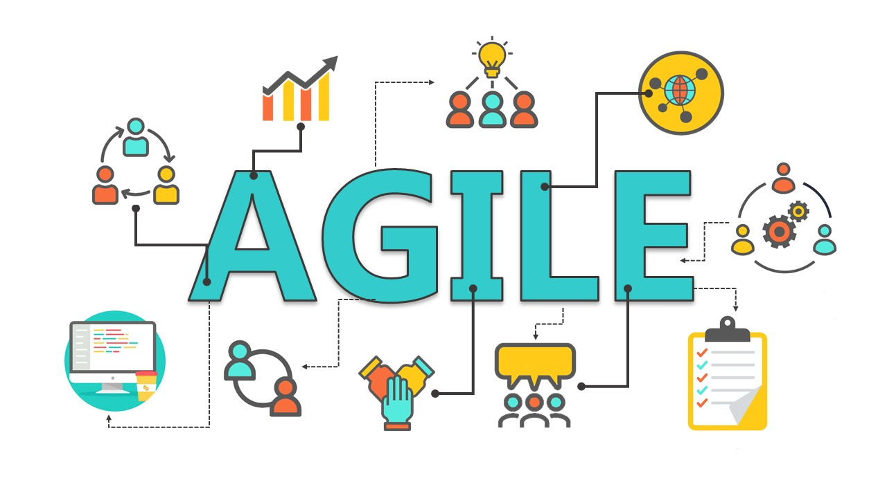

# Welcome to the Agile documentation!

This is a collection of document about Agile in general but in particular about Scrum, Kanban and Extreme Programming (XP). At the moment, I don't talk about other framework like SAFe, Kata, DAD or LeSS.

I'm putting together this documentation to help me and my teams to understand this methodologies better and create a reference and resources for everybody.

> [!TIP]
> If you read this guide from a mobile device, the best way is to change the orientation to **Landscape**.

The GitHub Pages is available [here](https://agile.puresourcecode.com/). If you want to collaborate in this documentation, the repository is on [GitHub](https://github.com/erossini/agile).

This site was created using [**Docsify**](https://docsify.js.org), which is an open source documentation site generator, and imported in GitHub page. This site was created with the template from [**PureSourceCode.com**](https://www.puresourcecode.com/).