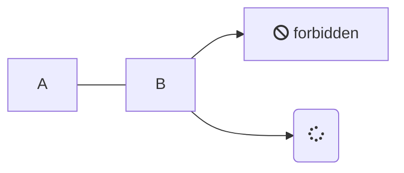
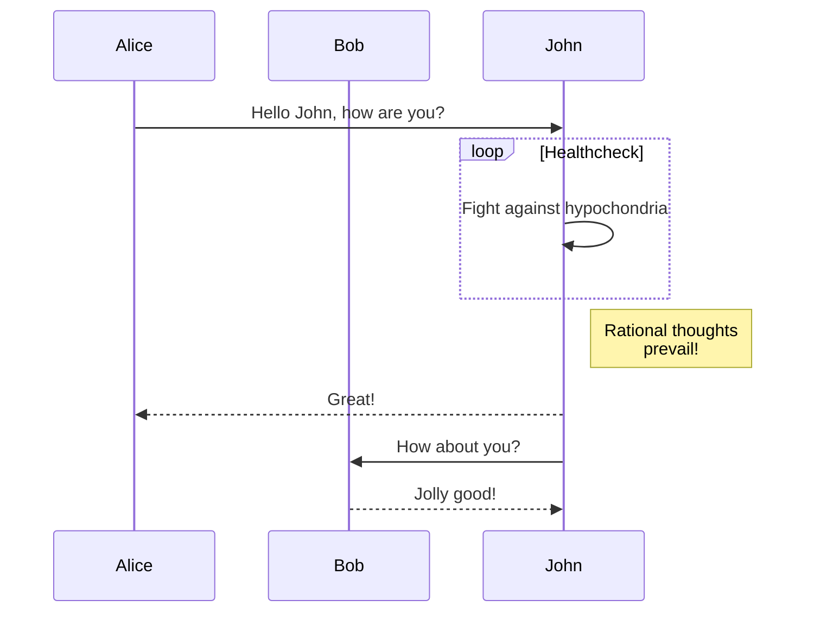

# Welcome to Agile documentation!

This is a collection of document about Agile in general but in particular about Scrum, Kanban and Extreme Programming (XP).

I'm putting togehter this documentation to help me and my teams to understand this methologies better and create a reference and resources for everybody.

The GitHub pages for this repo is available [here](https://erossini.github.io/agile).

This site was created using [**Docsify**](https://docsify.js.org), which is an open source documentation site generator, and imported in GitHub page. This site was created with the template from [**PureSourceCode.com**](https://www.puresourcecode.com/).

## Mermaid

