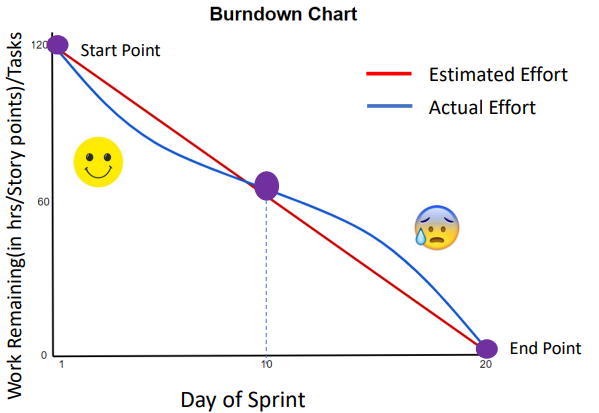
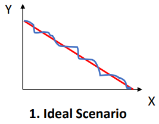
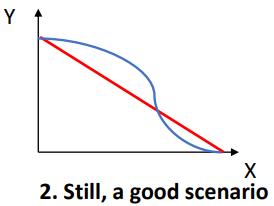
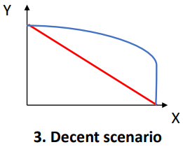
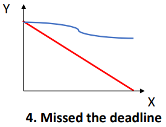
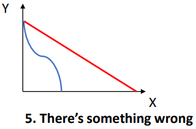
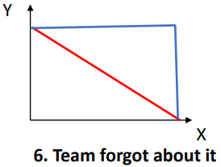

# Burn down chart

Sometimes, it feels like that is never enough hours in the day to get everything done. Time is a constraint which project managers are always working to control. The better data they have related to time and work, the better they can schedule and get the project completed on time and within budget.

A **Burn down chart** is one tool for collecting that project data. It enables to monitoring of work progress in a sprint and product release by clearly visualizing the difference between the actual and the estimated effort. Using a Burn down chart, you can visually display the amount of work completed and remaining in a project sprint or iteration.

In the image above, this is how a burn down chart target looks like. In most cases, the X axis of the chart represents the time that has passed since beginning of the project. The Y axis represents amount of work remaining. It can be represented in hours or story points or tasks. The value within the graph is remaining work for any specific day within the sprint duration, which enables anyone at a glance to see the status of the sprint.

For example, in the point in the middle of the chart, which you can see in the above graph, the time tend to be of the sprint and the work remaining is around 60 hours. As we mentioned, the work can be in terms of story points or task etc.

For a better understanding, let me take you through how to read this burn chart. Whenever we refer to a burn down chart, we are actually an effort line as of today and compared with the estimate line.

## What are these actual estimated lines?

The red line is the estimated effort line and the line in blue shown is the actual effort line. The project's starting point is the farthest point to the left of the chart (top left) and it occurs on the day zero of the project or iteration. The project endpoint is the farthest to the right and marks the final day of the project (bottom right) or iteration.

The estimated (you can also call it as **ideal**) effort line is a straight line connection the start and the end. The estimated effort shows the sum of the estimates for all the tasks that need to be completed. At the end point, there is not work left to be done. Just remember that this line is based on an estimation and therefore not always accurate.

Now, the actual effort line is in blue and shows the actual work that remains in the project or iteration. How you can see in the graph, at the starting point, the estimated effort and the actual effort are the same. But as the project or iteration progresses, the actual effort line will fluctuate above or below the estimated effort line.

Each day the project team picks up the work and a new point is added to this actually effort line until the project is done to make sure it is as accurate as possible.

Now, if the actual effort line is above the estimated effort line, it means there is more work left than originally thought of. In other words, the project is behind schedule. However, if the actual effort line is below the estimated line, there is less work left than had been predicted and the project is ahead of schedule. If the actual effort line is too below the estimated line, then the team might have overestimated in the first place and capable to work on more work for this sprint duration.

Generally speaking, the best burn down chart should show the actual effort line close to the estimated effort line. If not, there is something that needs intervention.

Essentially, with the help of these 2 lines, you will be able to compare the actual numbers of hours available to the remaining. So, you can find out daily whether the effort is going as planned is in better shape than you expected or is in trouble.

## Analyze different scenarios

### Ideal scenario

This is the ideal scenario also a false scenario. In this scenario as well, there are 2 lines. The red line represents the estimated effort and the blue line represents the actual effort.

This illustrated a perfectly organized team. So, the starting point for estimating an actual effort remains the same. The team is in behind schedule, not ahead of it. You can see, neither the blue line is way below the red line or above the red line. Therefore, it wraps up the final task just in time. Because of it, there are no adjustments needed in this case.

### Still a good scenario

This is quite a common scenario with experience Agile teams. It shows that the team started slowly but eventually caught up.

As you can see, the blue line is above the red line, which means the project was running behind the schedule before the point where the red and blue line touch each other. The team should come up with a solution to the late start, so that burn chart down can look more like in the first scenario.

### Decent scenario

This scenario indicates that the team started slowly and was moving behind schedule but it yet managed to finish the sprint in time.

### Missed the deadline

In this scenario, the team missed the deadline. Ideally, the end point for the blue line should have been the same as the end point for the red line for the task to be completed as the expected timelines.

The majority of the project is still yet to be completed. Since this particular sprint is yer to be completed and has already missed the deadline in such scenario, the next sprint capacity should be burned down or decreased. So, the team can have time to complete tasks or story points from the previous sprint.

So, whichever the next sprint is, that sprint capacity will have to be compromised because of missing the deadline over here.

### Something wrong

In this scenario, the team overestimated the project timeline. As you can see, the actual effort line is way below the estimated effort line and therefore the tasks have been completed well before the estimated timeline.

There is a need to fix the estimations in such cases.

### Team forgot about it

While the team is working hard towards meeting the deadline and they have met the deadline as well, what seems like the team isn't updating the brn down chart throughout the process, but only at the end.

That's why the progress of the actual effort is not shown during the project but only at the end of the project.

## Benefits

The burn down chart is almost a must have tool for a scrum team and is always useful in many ways. Firstly, burn down chart are easy to understand, you can track your team's progress only with a glance. No need to get into complex mathematical diagrams.

The burn down chart is updated daily which means the scrum master can identify bottlenecks before they occur and prevent them from happening altogether. Product issues identified during this process can be addressed during meetings. So, they don't transform into bigger problems.

The most important, burn down chart keeps the team motivated as well as a team can see the progress on a daily basis which will keep the team dedicated to the project success.
