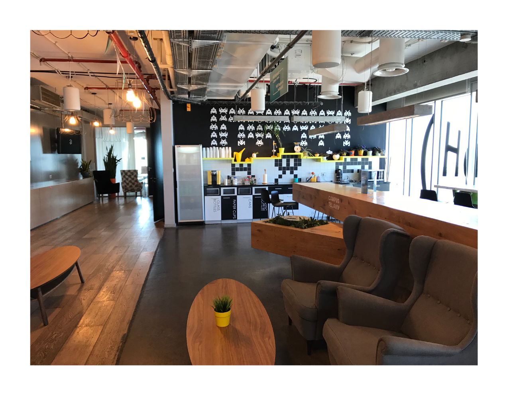

# Agile environment

"Agile" is a word that means "to move quickly and easily", whereas agile project management is a widely used approach in IT and software development. An agile workflow allows a team to:

- Break projects down into short cycles or iterations
- Rapidly bring a working product to market
- Involve customers in the process and leverage their feedback to create better products or services
- Conduct events or rituals called agile ceremonies (or Scrum ceremonies, if you're using Scrum as an agile framework) to stay focused

Agile methodologies follow the principles and core values laid out in the [Agile Manifesto](../agile/manifesto.md). In 2001, 17 software developers laid out in this treatise their vision for a substitute to complicated software development processes with too much emphasis on documentation.

It was also then that the word “agile” was formally used to refer to many software development practices and frameworks.

Although agile began as an alternative to the unwieldy [waterfall](../waterfall/waterfall.md) method for software development, the guiding principles of the Agile Manifesto also apply to other business aspects. An agile environment, in a nutshell, is a work environment that:

- Supports collaboration and teamwork
- Encourages openness to frequent change and experimentation
- Emphasizes innovation and creativity
- Promotes self-organization
- Focuses on outcome over output
- Embraces the potential of feedback loops for process improvement and behavioral change
- Values interaction over documented processes

Agile organizations are more customer-centric, achieve higher revenue growth, post lower costs, and have a more engaged workforce.

## Benefits of creating an agile environment

The characteristics that make IT agile are the same attributes that make organizations agile: constant feedback and learning, flexibility, collaboration, creativity, and innovation. Adopting an agile process, whether in software development, HR, or marketing, has numerous advantages.

### Attract top talent and increase retention

Acquiring top talent is one of the many challenges organizations face. Not only are skilled professionals in short supply, they also generally do not stay long. In the tech industry, for instance, the employee tenure average for many Silicon Valley companies, including Dropbox, Tesla, and Square, is between 2 and 3 years.

Studies show that salary increases don't necessarily deter employees from leaving. Many of today's workers admit that company culture plays a pivotal role in employee turnover, and 94% of employees are willing to stay longer if companies invest in their learning and development.

As for professionals working from home, Upwork's 2020 Future Workforce report found that 64% of top professionals prefer to work independently.

### Increase overall productivity

With technology comes a multitude of agile tools that enable distance work, increase collaboration, and boost productivity among teams.

When employees aren't hampered by rigid structures and processes (e.g., no bureaucracy to worry about for approvals and dissemination of relevant information) or inflexible job descriptions that limit what they can do, they are better able to fluidly collaborate with their peers, develop skills aligned to their goals and objectives, and play to their strengths.

### Develop a competitive edge

Because agile organizations are highly collaborative, anticipate and embrace constant change, and recognize the value of customer feedback for continuous improvement, they can:

- Quickly respond to evolving market demands and disruptive trends
- Create innovative products and services that are in line with what customers need

## How to create an agile environment

So how exactly can small businesses create an agile environment? Let's take a look at some tips and best practices.

### Get everyone on board

Transitioning from a traditional top-down organization in which decisions are made by just a few in leadership positions to an agile work environment with a flat structure will require changes to how people work. It's vital that everyone is on board - from the CEO down to the newest entry-level person in the organization.

### Empower people

Empowerment isn't just about conferring titles or responsibilities. It's also about providing an environment and nurturing a workplace culture where employees can maximize their full potential, make their own decisions, and take charge of their actions. This means:

- Setting clear expectations
- Providing the tools such as project management software, Gantt and burndown charts, collaboration systems, etc. and resources to get things done
- Relinquishing control and allowing employees to perform their jobs the way they see fit
- Providing constructive feedback
- Being receptive to various ideas and input
- Recognizing achievements
- Clearly communicating the company's vision

### Encourage learning

Achieving organizational agility doesn't happen overnight. Plus, market trends, technologies, and customer demands are evolving at an unprecedented pace.

So, the importance of an organizational culture that fosters continuous learning cannot be emphasized enough. Learning from past mistakes and applying those learnings to future endeavors is a core tenet of agile.

### Promote transparency

Organizational transparency is all about sharing information, whether good or bad, with employees, and endeavoring to keep them in the loop regarding issues and strategies, among other things.

This, in turn, strengthens collaboration, promotes accountability, and allows team members to make timely and informed decisions.

### Minimize bureaucracy

Bureaucracy is a term often used to describe complex organizations with multilayered systems and procedures. Although these processes and structures are designed to achieve control and uniformity throughout the company, they can also hamper innovation and operational efficiency.

Eliminating bureaucracy in the workplace can mean:

- Finding the shortest route to get to what you want done
- Eliminating routine processes that aren't necessary
- Minimizing paperwork, if possible
- Prioritizing tasks and projects
- Not delaying decision-making
- Becoming an action-oriented organization, hiring people of action, and rewarding them for action taken

## Examples of Agile Environments

An example of an organization that has successfully adopted the concept of an Agile environment is Google. Google's Mountain View office houses workspaces that are fluid, with plenty of space for functional collaboration. With less space allocated to individuals and more space designed around collective teams, Google teams have a positive, exciting workspace that is fluid and dynamic and supports creating value together. 

Communal tables in open spaces encourage stand-up meetings, while project rooms on the periphery have tools for group workshops. Teams can use dedicated team rooms with writable wall surfaces and display areas where brainstorming sessions can take place. 

Facebook, LinkedIn, Airbnb, Salesforce and other forward-thinking organizations have also recognized the importance of providing their employees with creative, collaborative infrastructure and spaces that will help foster innovation and fuel productivity.

### How to Create an Agile Physical Environment

An organization that wants to go agile can start by offering a conducive environment; one that equips its workforce with the right physical infrastructure and tools.

#### By collocating the team

A collocated team that is able to hold face-to-face conversations is in the best position to collaborate well. When teams are in the same physical space, trust is enhanced, communication is encouraged, and transparency is the result. A workspace should ideally have no hierarchy at all, with open-plan workstations that allow people to collaborate more easily. They can get clarifications at once instead of waiting for online responses, and can help each other when they find themselves in a tough spot. 

However, in today's world collocation of teams is not always an option. Teams that are distributed across geographies and time zones can take advantage of online collaboration tools such as Microsoft Teams so on to stay on the same page and keep in touch on a real-time basis.

#### Set up a dedicated physical space

Teams that are in the same location will perform better when they have a dedicated team room where they can work together in close proximity. One wall can be set up with whiteboards and pin up boards for team collaboration, mapping of tasks and so on. The space can be set up to boost productivity; workstations around the edge of the room and a conference table in the middle will work well.

#### Keep the team safe from distractions

Any outside distractions, such as interference from management, consults on other projects, and so on will throw the team off track and greatly hinder progress. It is the Scrum Master's responsibility to smoothen any and all such obstructions, and some of the ways in which this can be done are listed here:

- Avoid multitasking
- Work on one goal at a time
- Let the team figure out who works on what
- Block any outside distractors

Distractions will drain the team's focus and result in wasted time, energy and effort.  

#### Equip the team with the right tools

There is no dearth of productivity-enhancing tools that can help a team stay on track with respect to schedules, budget and resources. Some tools that will enhance the team's productivity and boost progress like Azure DevOps, Jira or Trello.

#### Equip the team with the right devices

To improve the collaboration between members of the team, one of the recommendation is to equip the team with laptop that are easy to carry and move around instead of desktop computers. So, if a member needs to show something to another member, it is easy to grab the laptop and go to visit the other one or sit in a common space.