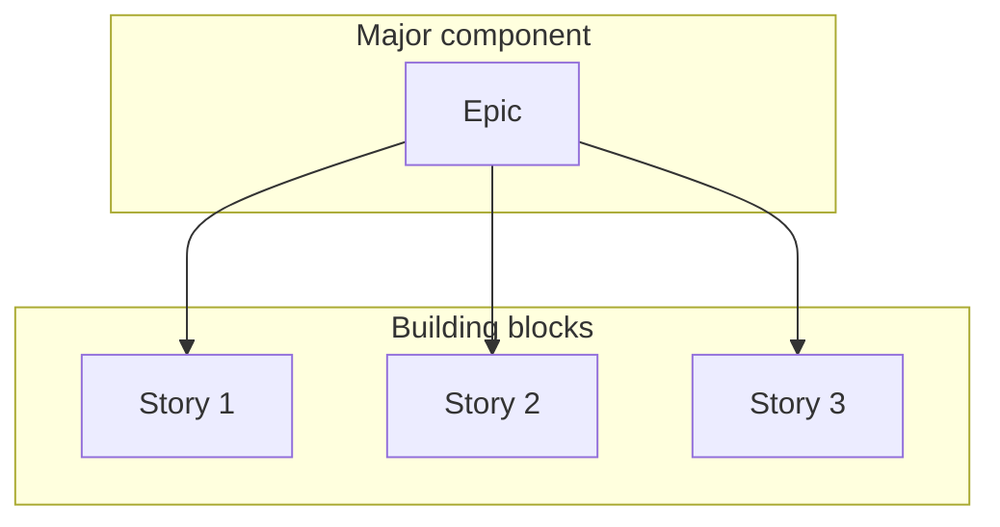

# Epic

In Agile development, An **Epic** represents a series of user stories that share a broader strategic objective. [Stories](../agile/user-story.md) and epics are similar to stories and epics in film or literature. A **story** is one simple narrative and a series of related and independent stories make up an **epic**.

>[!TIP]
> An epic is a large user story that cannot be delivered as defined with a single iteration or is large enough that it can be split into smaller user tasks/user stories.

So, as you can see in the diagram, the epic is a major component and it is split into multiple stories, which are the building blocks. There is no standard format to represent it. The idea is to break work down into shippable pieces. So, large projects can actually get done and you can continue to ship value to your customers on a regular basis.

Epics help team to break their work while continuing to work towards a bigger goal.

>[!NOTE]
> - Series of user stories with a broader strategic objective
> - A large user story that cannot be delivered as defined within a single iteration or is large enough that it can be split into smaller user tasks/user stories
> - No standard format to represent epics

## Example

Let's look at an example of large user stories or Epic being split into smaller stories. So, the example is on selecting marketing campaigns and it is from a company that sells software to large retailers. Think of something like M&S. The target user is a vice president of marketing who is trying to figure out how to spend the ad budget. The users big goal is the full story.

> Selecting Marketing Campaigns
> 1: As a VP Marketing, I want to review the performance of historical promotional campaigns so that I can identify and repeat profitable campaigns.

This is clearly an epic and that's why it needs to be split down into multiple user stories. This is the way the larger story has been broken down into two user stories:

> 1a: As a VP Marketing, I want to select the timeframe to use when reviewing the performance of past promotional campaigns, so that...
>
> 1b: As a VP Marketing, I can select which type of campaigns (direct mail, TV, email, radio, etc.) to include when reviewing the performance of past so that...

The number of these stories is a way to make easy to sse which story came from which parent. If you use some tools for it, it is much easy to understand. So, `1a` and `1b` represent a user story which are coming from the parent story `1`. This is a real project I faced. I would not necessarily do that unless I were using a tool that did it automatically for us. Doing that, it is easy to estimate each user stories in terms of hours, days, weeks, months...

For that, we have to do an **estimation** (more detail about estimation in the next document). So, assuming that 1a will take few days and `1b` will take weeks. Based on the estimation, it is identified that 1B is still a large story and it needs to be further split down and multiple stories.

> 1b1: As a VP Marketing, I want to see information on direct mailings when reviewing historical campaigns so that...
>
> 1b2: As a VP Marketing, I want to see information on TV ads when reviewing historical campaigns so that...
>
> 1b3: As a VP Marketing, I want to see information on email ads when reviewing historical campaigns so that...
>
> and so on for each type of ad campaign.

So, you can see that I split `1b` to `1b1`, `1b2`, `1b3` and more if required.

This was an example of epic where you can see that we had identified that a user story is epic and it needs to be further split down in multiple user stories to get business done.
