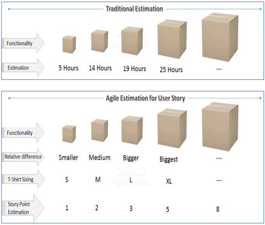
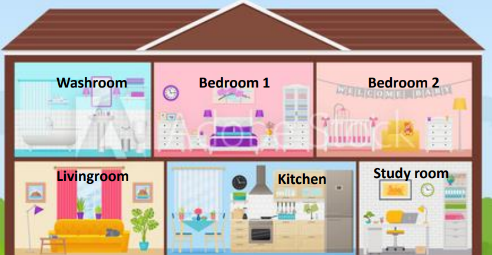
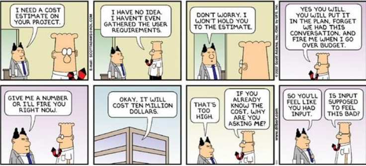
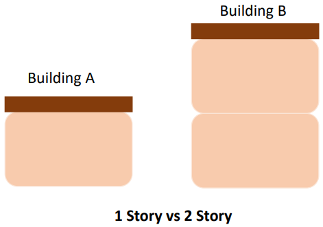
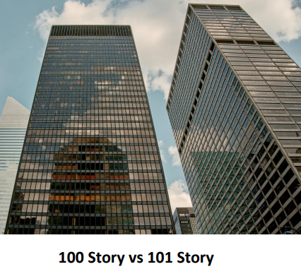
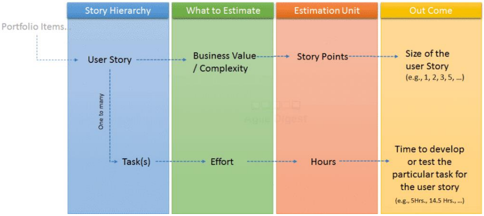
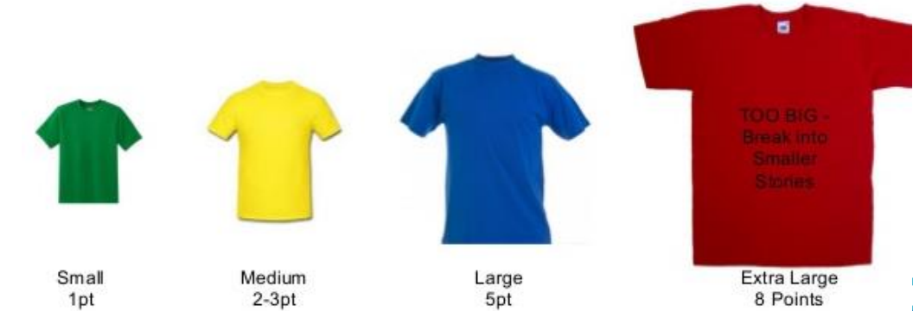
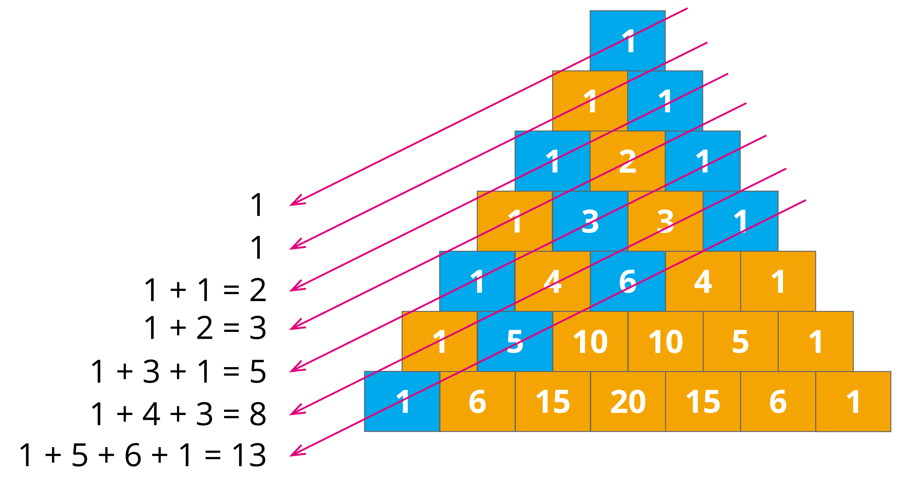
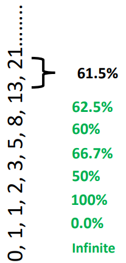
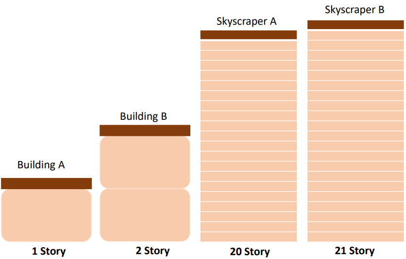

# Estimation

In literal terms, the meaning of estimation means approximate calculation of something. For example, is someone asks you how long is that car, you can come you with an estimation of 3 meters. It may not be accurate but it suggests you are using the information you have to arrive at your best guess. In general, you estimate by using what you know already to make a reasonable guess about an amount. So, that brings us to the point that we definitely need estimation to plan something. It may not be accurate, but it can definitely lead you to success in the long term.

In Agile, we do estimation a little differently that tradition estimation.

| Tradition estimation                | Agile estimation                           |
|-------------------------------------|--------------------------------------------|
| Efforts were estimated              | Business values or Complexity is estimated |
| Unit: Hours                         | Unit: Story Points or bucket               |
| Estimation is done in task level    | Estimation is done in user story level     |
| Provides absolute estimate          | Provides relative estimate                 |
| Estimates once done are not revised | Estimates are revisited in every iteration |

In software development, traditionally, efforts were estimated to deliver functionality. Effort necessary to carry out a given development task was estimated whereas in case of Agile, we estimate business values or complexity of a user story level. So, **efforts is estimated as business values and complexity**.

In tradition estimation the unit of estimation a task for its effort is hours, whereas the unit of estimating user story for its value on complexity is story points or bucket. The higher the number of points, the more effort the team believes the task will take.

In traditional project management, estimation is usually task based. The project manager with the help of the team develops a work breakdown structure. Essentially, a list of tasks and then the a group of expert take a stab at estimating the number of hours each task will take, whereas estimation in Agile is feature based or user story based.

The next difference is that traditional estimation will deliver back a number which will signify the estimate duration to complete a particular task. It will be an absolute number. For example, that person or team gives an absolute estimation of 10 days to complete the task or feature. Focus is always on how much time it will tak to complete the work, hence the scope is always constant. In Agile, estimation is sightly different. Agile looks at things in a relative manner. It will look at the list of tasks and see whether it is large, medium or small. The focus is not on how much time it will take to complete but what bucket it goes to, whether it is small or large or medium, which eventually refrain from attaching an absolute time production of the task or use user story.

In tradition approach, estimates once done are not revised but in Agile estimates and plans are revisited in every iteration which brings it more closely to reality.

So, as you can see in the diagram, in the traditional estimation, the estimation is done in form of hours, whereas in Agile the estimation gives the relative difference. It can be in form of size, whether the small or medium, bigger or biggest, it can be T-Shirt sizing (small, medium, large, extra-large) or it can be a story point estimation which can be 1, 2, 3, 5, 8... and so on.

For now, just understand that traditional estimation gives estimation in absolute terms whereas Agile estimation gives its estimation in relative terms.

So, while these are the key differences but if we see the overall intent, the intent is to aggregate many individual to obtain an indication of the overall duration of complexity of a software project.

## Example

How long do I take to paint my house?

So, in my house there are six different sections. There is a washroom, 2 bedrooms, 1 living room, 1 kitchen and 1 study.

Now, let's perform an Agile estimation. So, if you see the study room, it seems reasonably simple. So, we will give this and I estimate of 3 points. The bedrooms are large but easy to paint an we will estimate 5 point each. The kitchen is roughly the same size as the bedrooms but more complex because the plumbing, pans and so on. So, we will estimate about 8 points.

| Room       | Story point |
|------------|-------------|
| Study room | 3           |
| Bedroom 1  | 5           |
| Bedroom 2  | 5           |
| Kitchen    | 8           |

What we are doing here is trying to do the sizing or estimating based on relativity to the other things that we were already estimated as part of the project. So, once the estimation was started, the estimation of our bedrooms is done and relatively the estimation for the kitchen is done. And once that relative measurement is done, we look at categorizing the user stories in those story points.

In order to estimate the size of a user story in form of a story points, you need to take into consideration sme of the influencing factors:

- Business value
- Complexity
- Risks
- Dependencies
- Amount of work

## Why relative estimation?

There might be a question in your mind that why the relative estimation in the first place? There are multiple reasons for it.

Firstly, because humans are assumed to be not so great at guessing how big something is, but they are good at sorting things from smallest to largest. The larger the items get, the hardest it is to guess at small differences. 

For example, in the image above, if you are standing on the street if front of these two buildings, which is building A and building B, you will be easily able to differentiate building A with 1 story from building B with 2 stories. So, you can easily tell which one is taller.

Now, if you are looking at the 2 skyscrapers, one has 100 stories tall and the other is 101 stories tall. Could you tell at a glance which one is taller? To most people, the 2 building will appear to be of the same height. That is why when the basic values become large, the relative difference also has to be large. So that people can clearly see or perceive the difference between the 2 values. So, this was one of the reason why a relative estimation is done.

Secondly, the duration or dates which I provided as part of the traditional estimation does not account for the non-project related work like emails, meetings and interviews that a team members may be involved and is consuming most of his time. SOmetimes, debate about a duration could drive people in emotional situation. The Agile estimation plays an important role, removing any emotional attachment. And once you agree on the relative effort of each story point value, you can assign points quickly without much debate.

Lastly, story points reward team members for solving problems based on difficulty and not the time spent. This keeps the members focused on shipping value and not spending time.

So, the diagram summarizes what we discuss in story level estimation and task estimation. User stories are for the broken down into tasks and in traditional software development effort is estimated in form of hours and the outcome is the time to develop or test the particular task for the user story. Whereas in Agile, the estimation is done for a user story. Where the business value or the complexity of the user story is estimated and the estimation is in form of story point. The outcome is the size of the user story. It can be numerical value or it can be the T-Shirt size like small, extra small, large, medium etc depending on the estimation technique which is being used.

Despite these useful ways of doing estimation, estimation is hard. For software developers, it is amongst the most difficult aspects of their job. One important point is that estimate isn't a final answer. It reflects the information that was on hand at the time of estimation and communicating it. It should always be permissible to update an estimation in light of new information either upwards od downwards. So, it is not a commitment, it is just an estimation.

Let's look at some ways to make Agile estimation as accurate as possible.

Agile estimation is a team sport which involves everyone, whether it is developers, designers, testers, deployers and this is a key part of it. Each team member brings a different perspective on the product and the work required to deliver a user story.

For example, if product management wants to do something that seems simple, like support a new web browser, but here development and QA need to take in account what other teams haven't consider such as design changes required not only the design team's input but the development team and the QA are involved as well. Essentially, leaving part of the broader product team out of the estimation process creates lower quality estimates, lower morale because key contributors don't feel included and compromises the quality of the software.

## Estimation method

The most popular estimation method include:

- T-shirt sizes (XS, S, M, L, XL)
- Fibonacci sequence (1, 2, 3, 5, 8, 13, 21, 34, etc)

### T-shirt sizes

In this case, we see sizes extra small, small, medium, large and extra large.

This is a perfect technique to give a rough estimation of te large backlog of items and it is useful when quick and rough estimation needs to be done. Once this estimation in terms of small, medium, large and extra large is done, these sizes can be converted into numbers.

So, start with a relative size, mostly medium, to decided after mutual discussion and agreement of the team members or estimaters, the number as assigned to the items according to the relative size. The disadvantage of this technique in terms of what seems large to someone may seem to be extra large for someone else. But after all estimates assign their own side to the items, after discussion and resolving them as matches, a consensus is reached to get the final estimate.

### Fibonacci sequence

This is the most popular scoring skill for estimating Agile story points. In this sequence, each number is a sum of the previous 2 indices.

Now, look at the relative gaps between the Fibonacci sequence. Between 1 and 2 the gap is 100%. The relative gap between 2 and 3 is 50%. The relative gap between 3 and 5 is 66.7% and so on.

The average gap between 2 number is around 61%. So, Fibonacci Agile estimation refers to using the sequence as a scoring scale when estimating the effort of Agile development tasks.

#### Why use the Fibonacci sequence?

So, imagine you are standing on a street in front of a building A and B, you can easily differentiate between building and see that the building B is taller than the building A. If you are looking at 2 skyscrapers where one ws 20 stories tall while the other was 21 stories, can you tell at a glance what is the tallest? 

When the number of stories starts to increase, our brain can't perceive the real difference. For this reason, it is recommended to use the Fibonacci sequence for estimating Agile story point. The reason is that the numbers your team can choose from the sequence progresses grows a consistent rate. Each number representing about 60% jump and this is something we can understand.

The point to be noted over here is that even as the numbers get huge, our brain can still perceive the difference if the next number is 60% greater than the previous one.

#### Story points are relative

When we see 1 point, it means quick to deliver and minimal complexity. When we have user stories like, it should be deliver in a few hours and a developer can deliver some of them in a day. Next number is 2. We can assume this user story is quick to deliver but with some complexity and might take multiple hours to complete and a developer can complete 1 or 2 story in a day. Here a table with some examples.

| Points | Explanation                                                      | Example                                                      |
|--------|------------------------------------------------------------------|--------------------------------------------------------------|
| 1      | Quick to deliver and minimal complexity                          | Add field to a form. An hour                                 |
| 2      | Quick to deliver and some complexity                             | Add parameter to form, validation, storage. Multiple hours   |
| 3      | Moderate time to deliver, moderate complexity, possible unknowns | Migrate somewhat complex static CSS into a CSS pre-processor |
| 5      | Longer time to deliver, high complexity, likely unknowns         | Integrate with third-party API for pushing/pulling data, and link to user profiles in platform |
| 8      | Long time to deliver, high complexity, critical unknowns         | Overhaul the layout/HTML/CSS/JS of a web application         |
| 13     | Long time to deliver, high complexity, many critical unknowns    | Migrate application from an outdated data store to new DB technology and ORM |
| 21     | You are doing something wrong 😉                                 |                                                             | 

>[!ATTENTION]
> If any story appears to be more than 13 points, it is strongly recommended to break the story in smaller parts.

While breaking the story into smaller stories, we need to keep in mind that each story has to be potentially shippable. We should not break a story on the bases of its tasks like developing in a task and testing in another task. This is something that we don't do in Agile. Breaking a story means splitting off an expected functionality by 2 independent and smaller functionalities. You can also know that when a user story is assigned higher point, it means that there is higher uncertainty of its completion in time because it has bigger risk dependencies and other unknown facts.