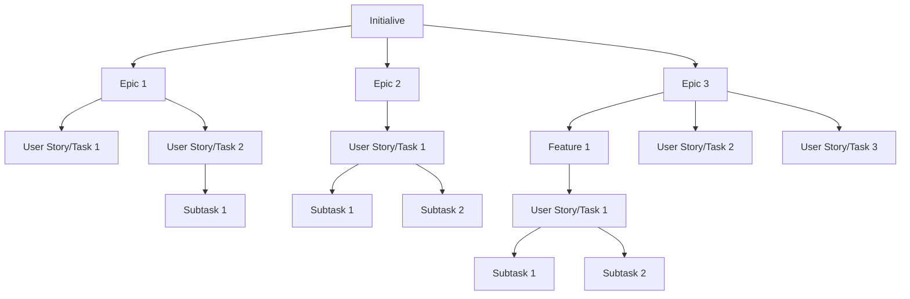

# Initiatives

Initiatives is a collection of epics that drive towards a common goal. The product roadmap is expressed and visualized as a set of initiatives, plotted along in a timeline. In many cases, an initiative combines epic from multiple teams to achieve a much broader, bigger goal.

They have a structure design. So, initiative houses epic and the completion of those epics head to the completion of the initiative.

So, while an epic is something you might completed in a month or a quarter, initiatives are often completed in multiple quarters.

So, you can see the hierarchy in the diagram. Initiatives are broken down into [epic](../agile/epic.md) and epic are brokwn down into a [user stories](../agile/user-story.md) or **task**.

>[!NOTE]
> - Initiatives are collections of epics that drive toward a common goal
> - The product roadmap is expressed and visualized as a set of initiatives plotted along a timeline
> - Completion of epics will lead to the completion of the initiative