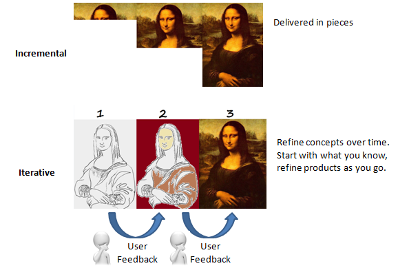

# What Agile is not?

There are multiple interpretation of what Agile is. Let's look what Agile is not.

The [Agile Manifesto](./manifesto.md) makes it clear that Agile is not:

- A specific way of doing software development
- A framework, standard or a process
- An end-goal by itself
- An excuse to stop reducing documentation or an opportunity to eliminate planning
- One size fits all (in fact, it is a tailored approach for an organization's unique vision, culture and specific needs)
- Scrum (Scrum follows [Agile principles](./principles.md))
- Kanban (Kanban applies [Agile principles](./principles.md))
- Limited to software developments

## What Agile is

- Refers to any process that aligns with the concepts of Agile Manifesto
- Based on incremental delivery and iterative approach. Agile is a term used to describe approaches to software development, emphasizing incremental delivery and iterative approach. It focuses on keeping the process lean and creating minimum viable products that go through a number of iterations before anything is completed.

    

- Encourages constant feedback from the end users. Customer feedback is gathered and implemented continually, and in all it is much more dynamic process where everyone is working together towards one goal.
- Deliver value faster and foster the ability to better respond to market trends

Agile is not limited to software development! The creators of the Agile Manifesto originally focused on software development because they worked in the IT industry. However, Agile project management techniques have spread beyond software development and even outside computer related products. 

Today, people use Agile approaches to create products in a variety of industries, including biotech, manufacturing, aerospace engineering, marketing, non-profit work and ever building constructions.

## Fun fact
Agile isn’t an excuse to stop documentation or an opportunity to eliminate planning, but it streamlines it in a form that gives the developer what is needed to do the work. Agile documents requirements as user stories, which are sufficient for a software developer to begin the task of building a new function.

The Agile Manifesto values documentation, but it values working software more.

