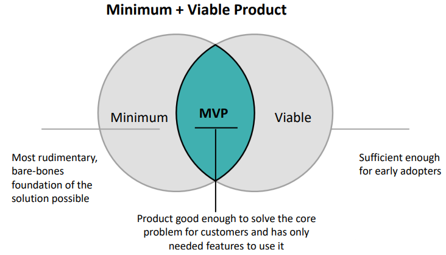
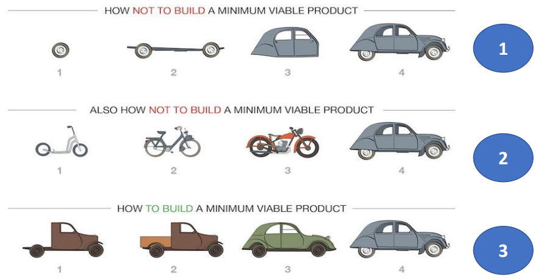
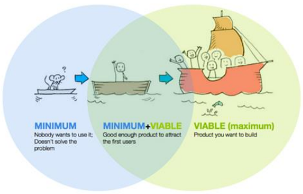
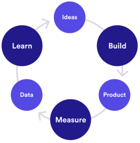

# Minimum Viable Product (MVP)

If you look at the formal definition provided by Agile Alliance, it refers to MVP as a version of a new product that allows a team to collect the maximum amount of validated learning about customers with the least amount of effect.

The **minimum** keyword refers to the most rudimentary foundation of the solution possible and **viable** means that the product should be sufficient enough for early adopters. So, we combine both these keywords and it gives us minimum viable product which is good enough to solve the core problem for customers and has only needed features to use it.

Essentially, a minimum viable product or MVP is a product with enough features to attract early adopter customers and validate a product idea early in the product development cycle. In industry such as software, the MVP can help the product team receive user feedback as quickly as possible to iterate and improve the product.

Because the Agile methodology is built on both validating and iterating products based on user input, the MVP plays a central role in Agile development.

## Use case

> Your target audience needs a specific means of transport, but they are not sure if they want to buy a premium product right away.

In this case, what do you do then? In the beginning, you create the most basic version of your product. It may be really simple and straightforward, but it does the job. It allows your end users to move from point A to point B. Your next step will be to gather the feedback on your product. Do users like it?

If so, you can implement a new feature to improve the product. If not, you need to go back to the previous step and see what can be done differently.

So, this is how the MVP cycle roughly looks like where you have the ideal basis which your build your product in the initial stage. The product is the basic version of that product which you call the MVP. You measure the results of the product by gathering feedback from your customers.

Based on the feedback we received from the customers, you learn from the results and accordingly you go back to the previous step where you build a product basis and improvise the product.

## How to build and not to build

Now, let's look at how to build and not to build an MVP. So in the above example, the first example is definitely not an MVP as it is not a product but just a part of the product. So, what I mean here is that if you see the first version of the product which is the single tire, it is not the basic version of the product but it is just a part of the product.

Therefore, it is not solving the intended purpose of allowing any user to move from point A to point B. So, from the first example, we have looked at how to not build a minimum viable product.

Now, the second example. in the first glance, it may seem that it fits the MVP model. However, it is not. Now, you must be wondering that the scooter, which has been created as the first version can allow the end user to move from point A to point B. While that might be tru, but we need to look at such cases differently. You can see that the first version of the product created over here is a scooter and the final version is a car. Scooter and car are based on entirely different operating principles, be cost to develop the same beat cost to develop the product or the parts required to build it. And, if you start with scooter, you will have to create a completely new product to end up making up car. It is easy to understand that you can't convert a bike or a scooter into a car. This is also an example of how not to build a minimum viable product.

The third example is very well fits to MVP model and provide something which the end user was looking for, and it makes sense from development standpoint as well.

## Why MVP?

MVP releases a product to the market as quickly as possible. You will face such situations mostly with the business teams, where the priority is to release the product as soon as possible to meet the business objectives.

Secondly, it is to test an idea with real users. To avoid any impacts later and before committing a large budget to the product full development, it is better to test the idea at the initial stage. Also, it helps what actually resonates with the company's target market and what doesn't.

>[!NOTE]
> - Release a product to the market as quickly as possible
> - Test an idea with real users before committing a large budget to the product’s full development
> - Learn what resonates with the company’s target market and what doesn't

## Important points

The first and the foremost point is make sure your planned MVP aligns with your business objectives which means the firs step in developing your MVP before being which feature to build is to make sure that the product will align with your team or company strategic goal.

Secondly, identify specific problems you want to solve for your users. To do that, you will need to be strategic in deciding which limited functionalities to include in your MVP. You can base these decisions on a number of factors, including user research or competitive analysis or how quickly you will be able to iterate on certain types of functionality when you receive user feedback. You can also look at the relative cost to implement the version etc.

In short, the MVP should deliver the very essence of the product idea in the simplest form.

Thirdly, product must be viable. It is important to keep in mind that in minimum viable product, the product must be viable. That means it must allow your customers to complete an entire task or project and it must provide a high quality user experience. An MVP cannot be a user interface with many horrible tools and features. It must be a working product that your company should be able to sell.

So, MVP is based on Lean startup philosophy and implies the iterative process of building, measuring, learning loop until product meets the market need completely.

>[!NOTE]
> - Make sure your planned MVP aligns with your business objectives
> - Identify specific problems you want to solve for your users
> - Product must be viable
> - MVP is based on iterative process of building

## Example of MVP

Let me tell you some stories behind successful services that are well known these days and how they started with their minimum viable product.

### AirBnB

Nowadays, everybody knows this brand. AirBnB started as a concierge MVP. Back in 2017, there was a great design conference in San Francisco and the AirBnB team decided to offer their cheap accommodations during this event and posted the information on a simple website. Within a short period of time, 3 guests were interested in paying for this minimum viable service.

They supported the market inside that potential customers would be willing to pay to stay at someone else's house rather than in a hotel.

### Facebook

In late 2004, Facebook was the definition of MVP on social media. Users had a simple profile and a great opportunity to connect with their group mates. This one feature was enough to provide an awesome boost to a small project into one of the largest public tech companies in history.

### Virgin Airlines

Virgin Airline is one of the largest British airlines operating internationally that was established and is owned by [Richard Branson](https://en.wikipedia.org/wiki/Richard_Branson). So, what was the minimum viable product for Virgin Airlines? It was just one route and one plane flying between Gatwick and Newark.
