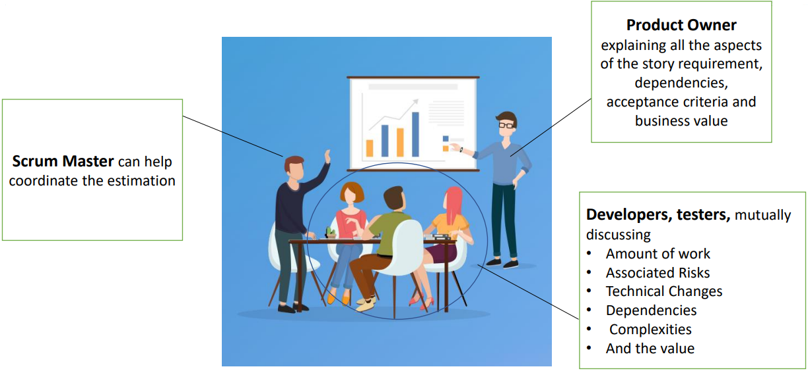
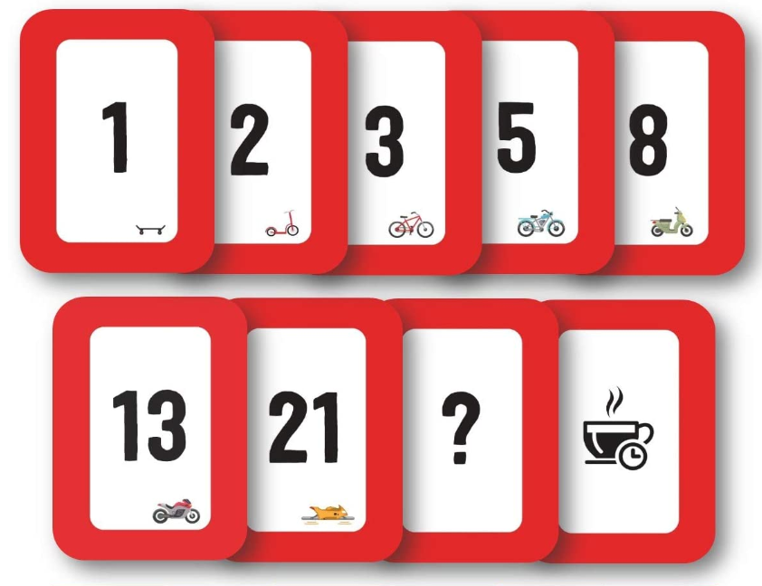

# Planning poker

There are different techniques for estimate user story:

- Delphi
- Wide Band Delphi
- Complexity Bucket 
- Estimation Poker

Now, I like to discuss the most popular and common used technique in software development industry called **estimation poker** but well known as **Planning poker**. Planning poker is very common practice across companies.

The team will take an item from the backlog, discuss it briefly and each member will mentally formulate an estimate.

The team member development team, including testers, Scrum Master and product owner, participate and optionally an external technical or financial expert can join but only the development team member can estimate the user story. After all, the development team has to do the work to create the features that stories describe.

The product owner explains all the aspects of the story, requirements, dependencies, acceptance criteria and business value. We have the Scrum master who can help to coordinate the estimation. And then we have the most important people, the developers and testers who mutually disclose the amount of work, the associated risks, technical issues, dependencies, complexities and finally arriving at the estimation value.

The development team during this activity can clarify any of their doubts from the product owner.

Now, to play estimation or planning poker, you need a deck of cards, having the number in [Fibonacci sequence](../agile/estimation.md) printed on each card. Nowadays, you can use an online software to play the planning poker.

Each estimator shows the card simultaneously to everyone to cast their vote for the user story. The Scrum master takes the most common number and assign it to the user story. Each user story receives an estimate relative to the other user stories. If there is not a clear majority in the cards, the players with the highest and lowest scores talk about their assumptions and why they think the estimation of the user story should be higher or lower, respectively. If required, the product owner provides more clarification about the user story. When everyone agrees on assumptions and has any necessary clarifications, the players will evaluate their estimates and place their new selected cards on the table. If the story points are different, the players repeat the process usually up to 3 times. If the players can't agree on their estimated effort, the Scrum master helps the development team to determine the score that all the players can support or determine that the user story requires mode details or needs to be further broken down.

An average, a developer team will spend 10% of their time a project requirement, including estimating and re-estimating.

So, playing estimation poker for, say, 500 user stories could take a long time and in that case you need a way to focus on only the user stories you must discuss to gain consensus. When you have a large number of user stories, many of them are probably similar and would require a similar amount of effort to complete.

One way to read and write stories for discussion is to use **affinity estimating**. With affinity estimating you quickly categorize your user stories and then apply estimates to these categories of stories. Then the user stories in the same sie category will have the same user story score.