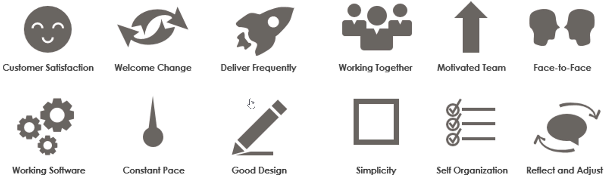
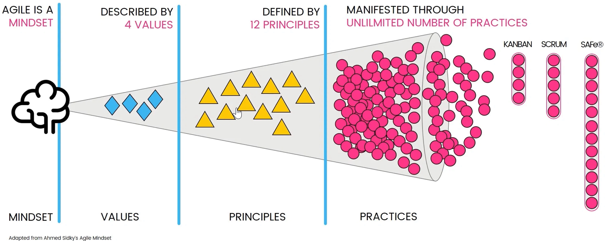

# Agile Principles

In addition to the [Agile Manifesto](./manifesto.md) there are 12 [Principles](http://agilemanifesto.org/iso/en/principles.html) that support the values.

1. Our highest priority is to satisfy the customer through early and continuous delivery of valuable software.
2. Welcome changing requirements, even late in development. Agile processes harness change for the customer's competitive advantage.
3. Deliver working software frequently, from a couple of weeks to a couple of months, with a preference to the shorter timescale.
4. Business people and developers must work together daily throughout the project.
5. Build projects around motivated individuals. Give them the environment and support they need, and trust them to get the job done.
6. The most efficient and effective method of conveying information to and within a development team is face-to-face conversation.
7. Working software is the primary measure of progress.
8. Agile processes promote sustainable development. The sponsors, developers, and users should be able to maintain a constant pace indefinitely.
9. Continuous attention to technical excellence and good design enhances agility.
10. Simplicity - the art of maximizing the amount of work not done - is essential.
11. The best architectures, requirements, and designs emerge from self-organizing teams.
12. At regular intervals, the team reflects on how to become more effective, then tunes and adjust its behavior accordingly.

So, in a nutshell, Agile is a mindset described by four values and the principles of the Agile Manifesto, and that manifested an unlimted number of practices, tools and processes. Implementing the practices, tools and processes without the Agile mindset, values and principles of the Agile Manifesto is not Agile.

Let's try to apply this through an example. 

## Example

Consider a new project that is in discussion on how to get the requirements. The suggested approach, if you think of it, is to require that the business owner write down all the requirements and sign of them before beginning the work of a team that is falling agile would see while that might work, isn't that inconsistent with our belief that we should value our customer collaboration over contract negotiation?

And doesn't it violate our principle that says the developers should be working with the business owners every day? So effectively, what I wat to see over here is that a team that is following Agile, they may be making hundreds of substitutions each week and that's how the decisioning should be.