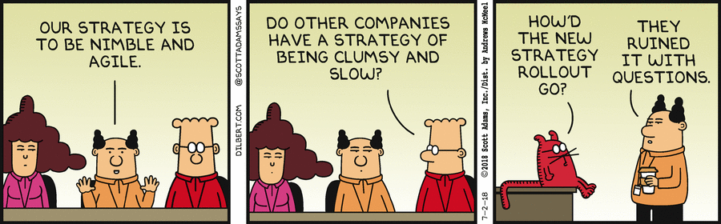

# Advantages & Disadvantages

There are various advantages of using Agile methodology or traditional Waterfall model or others. Agile development methodology and testing practices have worked wonderfully for numerous organizations with positive aspects. The positive aspects of Agile are not hidden but very clear in the organization.

Agile evolved from different development approaches in the 1990s and as a response to some project managers dislike of the rigid linear Waterfall methodology. It focuses on flexibility, continuous improvement and speed.

## Advantages

The first and foremost advantage of Agile is that **changes embraced** with shorter planning cycles, there is always opportunity to refine and re-prioritize the backlog to accommodate changes throughout the project. 

**End goal** can be unknown. Agile is beneficial for projects where the end goal is not clearly defined. As a project progresses, the goal will become evident and their team can adapt. 

Next is **faster, high-quality delivery**, breaking down the project and digressions allow the team to focus on high quality development, testing and collaboration. Conducting testing during each iteration means that the bugs can be identified and solve more quickly.

In Agile, there is a **strong team interaction** that embraces frequent communication and face to face interactions (via Microsoft Teams or Zoom for example) which promote team collaboration.

**Customers are always heard**. Customers have many opportunities to see the work being delivered, share their input and have an impact on the end product, which is very important.

There is **continuos improvement**. Feedback is always encouraged from users and members throughout the project. So, listen, learn and use to improve future iterations.

- Change is embraced
- End-goal can be unknown
- Faster, high-quality delivery
- Strong team interaction
- Customers are heard
- Continuos improvement

While these are few of the advantages of Agile, there are more such benefits which you will experience when you will start using Agile.

## Disadvantages

Now, coming to the disadvantages of Agile. While flexibility in Agile in usually a positive, it also comes with some trade offs.

It can be hard to establish a solid delivery date, documentation can be neglected or the final product can be very different than the original intended. So, let's look at the disadvantages one by one.

Firstly, **planning can be less concrete** because project managers are often re-prioritizing task, it is possible some items schedule for delivery may not be completed in time and additional sprint may be added at any time in the project, adding to the overall timeline.

Secondly, **team must be knowledgeable**. Agile teams are usually small. So, team members must be highly skilled in a variety of areas and understand Agile methodology to be successful. It requires an expert project member to tak crucial decisions in the meeting.

**Time commitment from developers is required**. Active involvement and collaboration is required throughout the Agile process which is more time consuming than a tradition approach.

Lastly, **documentation can be neglected**. As you are aware, Agile prefers working deliverables over comprehensive documentation. While documentation on its own does not lead to success, teams should find the right balance between the documentation and discussion. The requirements need to be clear at all times. The project can quickly go out of track if the project manager is not clear about requirements and what the outcome he or she wants.

- Planning can be less concrete
- Team must be knowledgeable
- Time commitment from developers is required
- Documentation can be neglected

Agile development also fails at times due to unrealistic expectations. Agile is commonly believed to be a set of practices, processes, and tools, when, in fact, Agile is really more of a mindset and culture.

## Fun fact

The New Agile Team Doesn’t Get Agile Training- This mistake made when setting up new agile team mistake is really common. We don’t provide training.

Sometimes the lack of proper agile training is a conscious choice. We don’t have time for training because we need to get something done quickly. Or, we cannot afford to pay for a trainer or to have people off line for two days.

People overlook the long term cost of the decision in favor of the short time cost of the training.

