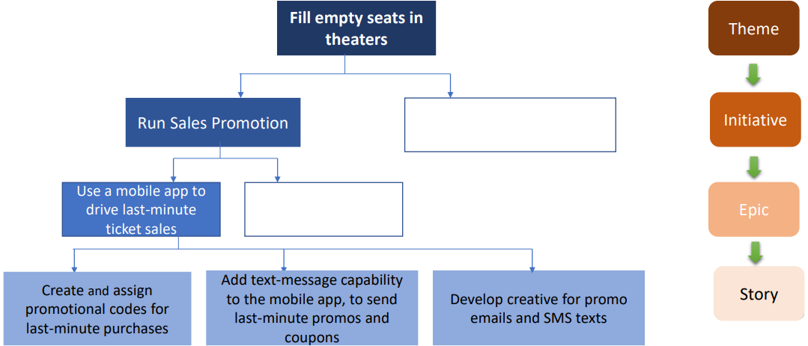

# Relationship

Let's understand the relationship between [teams](../agile/themes.md), [initiatives](../agile/initiatives.md), [epics](../agile/epic.md) and [user story](../agile/user-story.md) through an hypothetical movie theater example.

So, let's say the senior management of a major theater chain has its product team with filling empty seats in its theater. This has became a common problem for movies that have been showing for sever weeks. The theater studio contracts require movies to be shown for a minimum run length, sometimes many months. As a result, even after successful films opening, the theater shows the movie to nearly empty screening rooms until the contract ends.

This is the problem statement. Now, here is how the product team might plan its Agile development of a solution. So, the overall team is to full empty seats in a theater. Now, in order to do that, there need to be multiple initiatives which will drive the overall theme of this problem statement. Then, those initiatives would be broken down into epics.

For example, the team in charge of filling the empty seat in theaters, was broken down into an initiative called `Run Sales Promotions`. The `Run Sales Promotion` initiative wa broken down into multiple epics. One of the epics was `Use a mobile app to drive last-minute ticket sales`. But to user a company's app to offer discounts on last minute movie tickets leads a quite complex story and the team won't be able to execute on this this strategy without breaking it down further into smaller and more actionable stories.

## Benefits

There are sever advantages of breaking a team development work down into epics and stories. Firstly, **it allows for more strategically sound decisions**. So, the foundation unit of measurement in Agile development work is a **story point**.

Story point is a metric used to estimate the level of effort required to complete an item on the team's backlog. When a team assigned story points to each user story, it can then add all the points that roll up to a given epic and get a sense of how long and how many resources that epic will take. Knowing this will help the team make better informed decisions about where to focus its limited development time and resources.

**It improves performance monitoring and timeline estimates**. So, assume a cross-functional team learns over time that it can complete 23 points worth of development work in a giver sprint. As that team reviews epics and stories from upcoming work, it will be in a better position to know in advance if a planned sprint represents too much work or too little work. This will help the team estimate its capabilities more accurately and ensure the team neither over committed to sources nor leaves developers underused.

Lastly, **it keeps the team focused on key goals**. On a product map teams are big sweeping goals. As we saw in the last example, the goal was to fill empty seats. Stories are tactical units of development work, something like out text capability to the mobile app. So, epics help to tie all of these items on a road map together, which helps keep the team together towards its shared objective.

Basically, epics and initiatives are helping to tie the two key items, which is the goal and development work together.

>[!NOTE]
> - It allows for more strategically sound decisions
> - It improves performance monitoring and timeline estimates
> - It keeps the team focused on key goals
