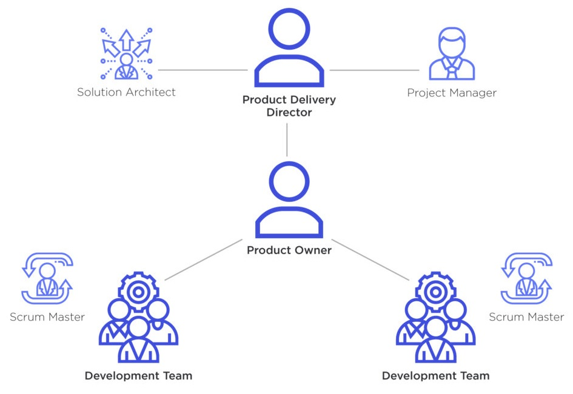
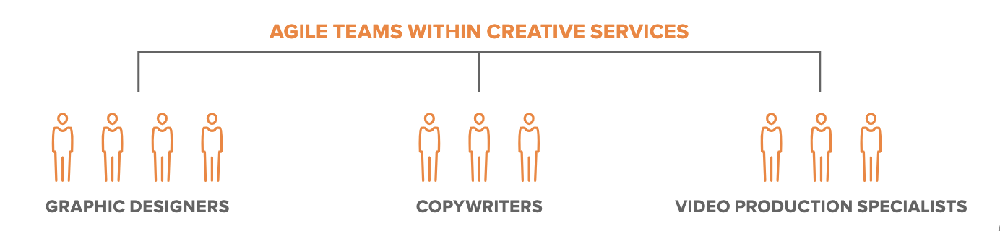
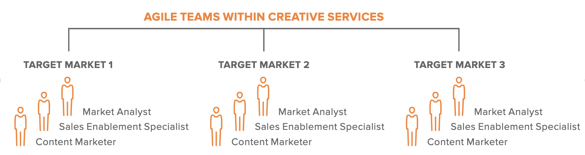
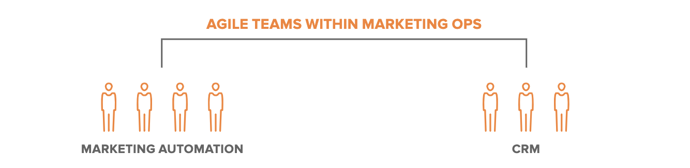

# Agile Roles and responsibilities

An Agile team is a cross-functional group of people that are organized to work collaboratively in order to deliver a product increment. Agile teams are faster and more adaptable than traditional project groups. Teams work iteratively, completing a piece of the whole at a time. This means that the final product is done quicker and with less risk.

Agile teams are structured in a way that enables the team to be more responsive to change and more adaptable. This structure is based on the principles of self-organization and cross-functional work.

In each Agile team, there are several roles that play an important part in the success of the project. The roles in the Agile team are listed below.

- Product Owner
- Team Lead/Scrum Master
- Development Team Members
- Stakeholders

The importance of each role in the team varies depending on the type and size of the team. A Scrum Master, for example, is usually only necessary for teams with more than nine people, while a Product Owner may not be necessary at all.

## Product Owner

**Product owners** are responsible for managing the product roadmap and prioritizing the [backlog](../agile/product_backlog.md). They are also responsible for defining the [product vision](../agile/vision.md), managing stakeholders, and maximizing ROI. A Product Owner is a person who has the authority to make decisions and prioritize the product backlog. They are in charge of making sure that the team is working on the right items.

The Product Owner should be able to understand and has a deep knowledge of what needs to be built, communicate with stakeholders about what's being built, and prioritize work for the team.

Some benefits of having a Product Owner on your Agile team are listed below.

- The Product Owner understands what customers want, which means they can make adjustments accordingly.
- They can be the liaison between engineering and business teams if there are any issues or misunderstandings between them.
- The Product Owner can offer valuable insights to marketing and sales teams when they need information about the product.

## Team Lead/Scrum Master

Depending on the methodology used by the Agile team, the role of the Scrum Master is interchangeable with the role of the team leader. The **Scrum Master** is a role in Scrum, while the **team leader** is a role in an Agile team doing [Kanban](../kanban/index.md).

The team leader plays an important role in Agile, as they provide leadership and guidance to the team. They are responsible for ensuring that the team is working together to achieve their goals. The team leader will often be a member of the team, but he is not an active team member. Their role is to facilitate and make sure that everything goes smoothly. The team leader needs to be available at all times to answer any questions that may arise during a meeting, but they do not participate in any other way.

The team leader has two primary responsibilities:

- ensuring that the team is following a process
- facilitating communication within the team

## Development Team Members

A **development team** is a group of people who are responsible for building a product. They may be working in an Agile environment, which means that they are using Agile methodologies such as [Scrum](../scrum/intro.md) and [Kanban](../kanban/index.md). Development team members are responsible for incrementally implementing requirements into a product, often in sprints or iterations. They are responsible for ensuring that the product is delivered and meets the customer's needs.

The development team usually consists of the following roles.

- **Developers**: The developers are in charge of programming, testing, and debugging the product.
- **Designers**: The designers are in charge of designing the product and its user interface.
- **Testers**: The testers make sure that everything works as it should be, both before and after release.
- **Quality Assurance (QA)**: QA is a team that monitors the quality of what is being produced by checking for bugs and other issues.

Developers are the backbone of any software company. The skills of this team are important, as they need to be able to create an accurate and successful product in order for it to be worthwhile.

## Stakeholders

The **stakeholders** are those who have an interest in the project that is being undertaken. They can be internal or external to the organization, and they may have a financial, operational, or strategic interest in the project.

Internal stakeholders are those who work for the company that is developing the product. They include employees and managers, as well as other departments within the organization.

External stakeholders are those who do not work for the company but have a stake in it. These may include customers, suppliers, partners, and investors.

The stakeholders are an important part of Agile teams as they provide valuable input on what should be done with the product. They also provide valuable input on how to deal with any issues that arise during the course of development.

## What Are the Additional Roles for Larger Scrum Projects?

In addition to the main roles in an Agile team, there are additional roles for larger [Scrum](../scrum/intro.md) projects, listed below.

- an Integrator
- an Independent Testing and Audit Team
- technical and Domain Experts
- an Architect Owner

### An Integrator

**Integrators** are sometimes needed for large agile projects involving independent but closely coordinated subsystems. They are responsible for integrating subsystems as well as testing, which may be done by an external testing team.

### An Independent Testing and Audit Team

During the product development lifecycle, an **independent testing and audit team** may work alongside Scrum team members.

### Technical and Domain Experts

**Technical and domain experts** have the knowledge of technology and understand the vast variety of stakeholders' expectations and requirements.

### An Architect Owner

**Architect Owners** may be needed for architectural envisioning, decision-making, and planning. There may be multiple Architecture roles in a single subteam, working on connected subsystems of the project.

## How should you build an Agile Team?

If you're building an Agile team, you must focus on the three most important pillars for this process – balancing teams, opening up communications, and handling failures together.

Agile teams require efficient collaboration, adaptation, and flexibility. This won't happen until you get the right people in place. In order to build an Agile team, you'll often need to break down and reorganize staff assignments. It is important for organizations to analyze the work styles and personalities of their entire workforce, as well as the strengths and weaknesses of the team members. This would result in forming a balanced team that will meet the project objectives and scope. Ensure that employees receive adequate support and feedback, as well as an appreciation of their strengths and weaknesses.

It won't be easy to adopt an [Agile work environment](../agile/environment.md) overnight. The work needs to be overhauled, staff reorganized, and the company's culture changed. As the teammates adjust to their new work environment, there will be growing pains for the organization. Transparency by leadership is required to mitigate these issues. The organization will be able to dialogue freely during this transitional period by establishing clear processes and allowing staff to offer their input through survey questions and answers.

Each member of an Agile team adds value to the team and has a purpose. One of the biggest shifts comes from teaching staff to embrace risk and learn from mistakes. Many mature organizations view failure as inherently bad, which can be challenging. Think about putting in place rules and practices that call out risks and opportunities for learning to overcome this challenge. In staff meetings, thank team members for taking risks, or award teams who discover valuable learning opportunities to share with the whole organization.

### Can an Agile Team be successful without the 4 Key Roles?

No, you can't have a successful Agile team without all four main roles. However, for smaller Agile teams, not all of the four roles must be present. For example, the role of the Product Owner may not be needed for small teams. In Kanban, the Product Owner's role will be covered by the team leader.

### What Are the Tools to Enhance the Work of an Agile Team?

There are Agile tools that Agile teams use to support and enhance their daily work.

- Kanban tools
- Scrum tools
- Brainstorming tools
- Communication tools
- Tools to facilitate meetings and retrospectives
- Task management tools

### How Can You Ensure Collaboration Between the Roles in an Agile Team?

The roles, responsibilities, and expectations of each person in an Agile team must be clearly defined before starting a project so that everyone knows what they are expected to do. There must be enough time for communication between team members in order for them to understand each other's needs and goals. Additionally, it is essential to conduct regular meetings about the progress of a project so that everyone is aware of what is happening.

Collaboration is the key to success in an Agile team. Team members should be able to work together and not just do their own jobs. They should be able to work with each other with a shared understanding of what they are doing. They need to have the same goals and expectations about the project.

More details about the structure of the team for small and large teams in Scrum is [available on this document](../scrum/roles-responsibilities.md).

## Structure examples

An ideal Agile team size is small—around three to seven people. Many assign a project owner for each Agile team, though it may work to have multiple Agile teams report to a single project owner. This is a person who they are likely already reporting to. If you have more than seven people on your team, you can create multiple smaller Agile teams.

### For creative services (simple)

This could be a creative services team with 4 graphic designers, 3 copywriters, and 3 video production specialists. Under this option, you would create three small Agile teams: one for all graphic design tasks and requests, one for all copy tasks and requests, and one for all video projects and requests.

### For creative services (complex)

This could apply to a cross-functional product marketing team that focuses on a specific target market. A product marketing team with multiple target markets, could create smaller Agile teams each containing a content marketer, a sales enablement specialist, and a market analyst. Each team works on only the projects and requests relevant to their target market and each individual works on their part of the process specifically.

### For marketing ops

This might be a large marketing ops team with smaller Agile teams based around the different solutions they support: one team for marketing automation and another for CRM and the project management solution.

