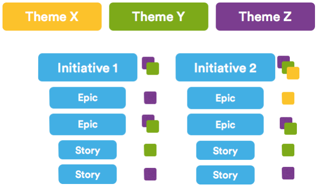

# Themes

A themes is an organization goal that drive the creation of [epics](../agile/epic.md) and [initiatives](../agile/initiatives.md). It allows you to label backlog items, epics and initiatives to understand what work contributes to what organization goals.

Teams should inspire the creation of epics and initiatives, but don't have a rigid one-to-one relationship with them.

A set of completed epics drive a specific initiative which keeps the overall product developing and involving with market and customer demands on top of organization themes. So, in the diagram you can see how the epics and user stories are related.