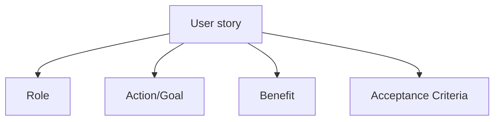
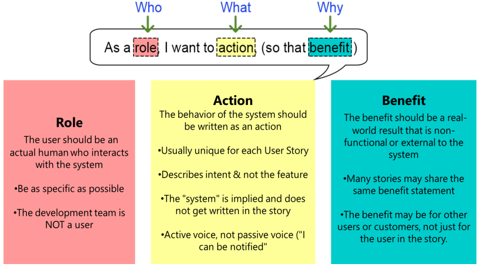

# User story

Introducing you to the first concept called **User story**. In consultation with the customer or product owner, the team divides up the work to be done into financial increments called user stories.

User stories are written in everyday language and describe a specific goal from the prospective of an individual. Along with the reason why he or she wanted a user story, it can be of one or mre sentences. The requirement in the user story needs to be sufficient enough. So, a developer can start and finish his development and a tester can test the developer code to check if it is meeting the required functionality. Lastly, the product owner can verify the desired functionality to accept the story completion.

Each story has to fulfill a requirement with a very specific **goal** or **benefit**. It is always advisable to break any story to smaller stories if it has more than one goal. Requirement of a story has to be of a complete functionality means upon completion of development, testing and acceptance. The code should be deployable for future release. In other words, each user story should be potentially shippable.

Sizable user story as measured in **story points** to provide a business value and complexity.

>[!NOTE]
> - Work divided into functional increments called “user stories
> - Short description of a feature from the perspective of the person who desires the new capability
> - User story should be potentially shippable
> - Size of a user story is measured in story points

## User story structure

Now, let's discuss the structure of a user story. A good user story contains 4 major segments to describe the requirements and its testing scenarios:

- Role
- Action/Goal
- Benefit
- Acceptance criteria

In software development, the goal is often a new product feature targeting the end user and the reason is the benefit that the user sees in the targeted product. Feature user story typically follow a simple template, which you can see below.

### Role

As a **role**, I want to action (so that benefit). You can see there are 3 key components over here: **role**, **action**, **benefit**. As mentioned before, a user story describes a software feature from the end users prospective. It includes it all, but does that type of user. The user should be an actual human who interacts with the system. Try to be as specific as possible when you mention the role over here. 

>[!NOTE]
> The development team is not a user

### Action

Next is **Action**. The behavior of the system should be written as an action. Action is usually unique for each user story. Through action, user needs to describe the intent and not the features they use. So, basically, it defines what actually you are trying to achieve. This statement should be implementation free.

If you are describing any part of the UI and not what the user goal is.

### Benefit

Coming to the third component, which is **Benefit**. Benefit is the users immediate desire to do something and this fit into the bigger picture and the overall benefit they are trying to achieve. It defines the big problem that needs solving.

The benefit should be a real world result that is non-functional or external to the system.

>[!NOTE]
> Many stories may share the same benefits statement and the benefit may be for other users or customer, not just for the user in the story.

## Acceptance criteria

In Agile, **Acceptance criteria**, is a set of predefined requirement that must be met in order to mark a user story complete. Also, sometimes **Acceptance criteria** is called **Definition of Done (DoD)** because they didn't mind the scope and requirement that must be executed by developers to consider the user story finished.

The Acceptance criteria is very crucial for a user story to use and unit testing, quality assessment and story acceptance by product owner and all stakeholders. Here a few traits of effective acceptance criteria.

First, Acceptance criteria **should be testable** since there requirements help formulate the definition of done for your engineers. They need to be easy to test and the result of these tests must leave no room for interpretation. Tests should reveal straightforward *yes* or *no*, *all pass* or *fail* results.

Criteria **should be clear and concise**. So you are writing comprehensive documentation here, keep your criteria as simple as possible.

**Everyone must understand** your acceptance criteria. Your criteria is useless if the developers can't understand it. If you are unsure about whether something is clear, take the time to ask and make adjustment until things are clear to everyone.

Lastly, acceptance criteria **should provide a user perspective**. This is a very important! Acceptance criteria is a means of looking at the problem from the user point of view. From a customer standpoint, it should be done in the context of a real user's experience. 

> [!NOTE]
> - Should be testable
> - Should be clear and concise
> - Everyone must understand
> - Should provide user perspective

#### Who is Responsible for Writing Acceptance Criteria?

There might be a couple of questions for which would be looking and answer. The first one is **who is responsible for writing acceptance criteria?** So, what you need anyone on the cross-functional team could write acceptance criteria for user stories. Usually, it is the product owner or manager who is responsible for writing acceptance criteria or at least facilitating the discussion about it.

The idea behind that is to ensure that the requirements are done with customer needs in mind and to better understand customer needs than a product person. It is widely recommended to make writing acceptance criteria group activity that includes both development and quality assessment representatives.

Generally speaking, the product owner is primary responsible of the content of a user story. In some cases, the business analyst gets involved to write and take the responsibility of user story content. Team members can help product owner or the business analyst to write user stories, but as a product owner or business analyst understand the business requirements and acceptance criteria are better than any other team member.

It is always a good idea to leave this responsibility with product owner or business analyst. Once the initial draft is created, the product owner or the business analyst can enhance the requirement from the input from the member or any other external source. 

#### When Should User Story Acceptance Criteria Be Written?

Now, **when should user story acceptance criteria be written?** At the very latest acceptance criteria should be defined before development begins. Otherwise, you will miss many of the benefits of having it in the first place.  

#### How Should You Format User Story Acceptance Criteria?

Now, **how should you format user story acceptance criteria?** There is no single right or wrong to write acceptance criteria for a user story. Ultimately, you need to establish a format and procedure for creating acceptance criteria that consistently works for your team.

Now, have a look to the [example for user stories](../agile/user-story-example.md).

## INVEST

The acronym **INVEST** helps to remember a widely accepted set of criteria or checklist to assess the quality of a user story. If a user story fails to meet one of these criteria, the team may want to reword it or ever consider rewrite it.

- **I**ndependent (of all others)
- **N**egotiable (not a specific contract for features)
- **V**aluable
- **E**stimable (to a good approximation)
- **S**mall (so as to fit within an iteration)
- **T**estable (in principle, even if there isn’t a test for it yet)

**Independent** means the user story should be self-contained in a way that there is no inherent dependency on another user story. **Negotiable** means user story are not explicit contracts and should leave space for discussion. **Valuable** means a user story must deliver value to our stakeholders and/or business. **Estimable** highlights that you must always be able to estimate the size of a user story. **Small** stresses on the fact that the story should not be so big as to become impossible to plan or prioritize with a certain level of certainty. The user story should be **testable** which means user story and the related description provide the necessary information to make the test development possible.
