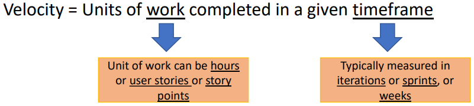
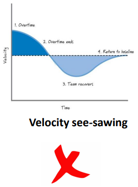
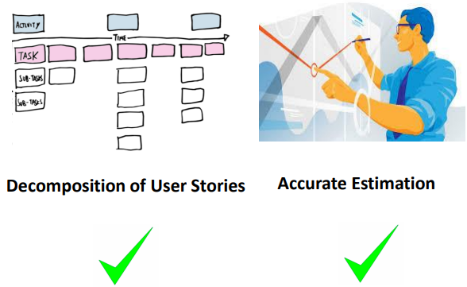

# Velocity

Tha Agile Alliance define **velocity** as

>[!TIP]
> At the end of each iteration, the team adds up effort estimates associated with user stories that were completed during that iteration. This total is called velocity.

So, velocity in Agile is used as a planning tool to measure how much work can be completed in each iteration. It is widely used as a calibration tool to help development teams to create accurate and efficient timelines. Velocity is a single calculation, measuring **units of work** completed in a given **time frame**.

Units of work can be measured in several ways, including hours, user stories or story points. The same applies to time frame. It is typically measured in iterations, sprints or weeks. At the end of each iteration, the team sums up the estimate associated with user stories that were completed during that iteration and this total is called **velocity**.

Knowing velocity, the team can compute (or revise) an estimate of how long the project will take to complete, based on the estimates associated with remaining user stories and assuming that velocity over the remaining iterations will remain approximately the same. This is generally an accurate prediction, even though rarely a precise one.

Velocity is primary used to encourage consistency and prevent burnout on the team.

## Example

So, let's assume an Agile team has started working on a sprint which has 3 stories (A, B and C).

| User Stories | Story points | Status      |
|--------------|--------------|-------------|
| A            | 3            | Complete    |
| B            | 5            | Incomplete  |
| C            | 8            | Completed   |

> Velocity = 3 + 8 = 11 Story point

The Agile team is planning to complete the A story in 3 point, story B in 5 and C in 8. Assuming we are at the end of an iteration. The stories A and C are 100% completed but story B is only 70% completed. Agile team generally acknowledge only 2 levels of completion, either 0% or 100%. Therefore, story B is not counted toward velocity. Since we know that velocity of a sprint is the sum of story point of the only completed stories, the velocity in the example is 11 (sum of the story points of stories A and C).

Now, assume we have completed other 2 sprints and the story points per sprint is as follow:

| Sprint | Story points |
|--------|--------------|
| 1      | 11           |
| 2      | 13           |
| 3      | 6            |

Now, if you look at the average velocity, it is 10 story points (sum the story points of the 3 sprints divided by 3 (11+13+6)/3=10).

>[!NOTE]
> You need to successfully completed at least 3 sprints to get a better visibility and plan future sprints

Once the average velocity is calculated, it will provide you reference on how much user stories can be completed in each sprint in the future.

In the example above, the project manager should pick up for next sprints not more that 10 story points. With the help of this average velocity, you can be assured that you are not over or under planning your future sprint.

Also, you can user average velocity for planning releases. For example, if you are a product owner, you need to know when you can deliver all the features. If you know the team's velocity, you can put all user stories from product backlog and sprint to calculate how many sprint it will take to finish all the features.

For example, suppose the remaining user story is of 60 story points. We know the average velocity of the team is 10 story points. That means, the team will take 6 sprints to complete all the stories (60 story points / 10 story point = 6). Usually, each sprint takes 2 weeks. So, in order to complete the product, we have to wait up to 18 weeks.

So, this is a useful way of predicting your timeline of delivering the final product with all the features.

## Warning signs

Failing to bring a story to completion, velocity see-sawing, decomposition of user stories and accurate estimation are the 4 warning signs in Agile project managing.

### Failing to bring a story to completion

If the user stories in the sprint are not completed, that will impact the next sprint velocity.

### Velocity see-sawing

If your velocity is increasing in one sprint and decreasing in the next sprint, then that can be a warning sign for you and can impact the project completion timelines.

### Decomposition of user stories and accurate estimation

The expected response is to seek a final grained decomposition of stories with proper, accurate estimation. Which means that try to decompose your stories as much as possible in order to arrive at the accurate estimation.

## Practice Exercise: Calculating Sprint Velocity
SPRINT 1
- Assuming that in Sprint 1, team committed to total of 5 user stories
- Story point of each of the user story = 8 story points
- Total story points committed by team in sprint 1 = 40 story points
- By end of sprint 01 team completed 3 out of 5 user stories

SPRINT 2
- Assuming that in sprint 02, team committed to total of 7 user stories
- Story point of each of the user story = 8 story points
- Total story points committed by team in sprint 01 = 56 story points
- By end sprint team completed 4 out of 7 user stories

SPRINT 3
- Assuming that in sprint 03, team committed to total of 9 user stories
- Story point of each of the user story = 8 story points
- Total story points committed by team in sprint 03 = 72 story points
- By end sprint 03, team completed 5 out of 9 user stories

Q1. Calculate Velocity for each of the Sprint 1,2 and 3.

Q2. Calculate Average Velocity of Sprint 1,2 and 3.

Q3. Suppose the user stories remaining represent a total of 160 story points, in how many sprints the project will get completed?

### Solution

#### Solution for Q1

Velocity of SPRINT 1: 24 Story points

- Total user stories completed in sprint 01 = 3 user stories
- Total story points completed in sprint 01 = 3 x 8 story points -> 24 story points

Velocity of SPRINT 2: 32 Story points

- Total user story completed in sprint 02 = 4 user stories
- Total story points completed in sprint 02 = 4 × 8 story points -> 32 story points

Velocity of SPRINT 3: 40 Story Points

- Total user story completed in sprint 03 = 5 user stories
- Total story points completed in sprint 03 = 5 × 8 story points -> 40 story points

#### Solution for Q2
Once you know the velocity of sprint 1, 2 and 3, calculate the average of them.

- Sprint 01: 24
- Sprint 02: 32
- Sprint 03: 40

So, your average velocity of sprint is: 24 + 32 + 40 / 3 = 32 Story Points/Sprint

#### Solution for Q3
Total Story points against remaining User Stories (A): 160

Average Velocity (B): 32 Story Points / Sprint

Forecast for the remaining effort for the Project: A / B = 160 / 32
 = 5 Sprints with each sprint of 32 story points
