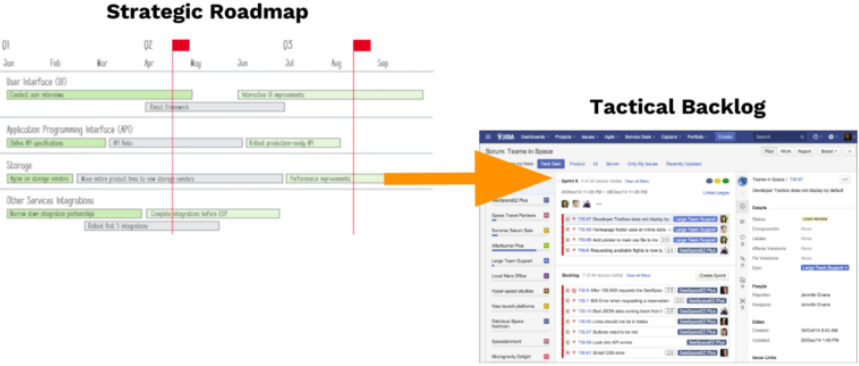

# Vision

The [backlog](../agile/product_backlog.md) is not the roadmap! Bot of these living documents serve distinct purposes for Agile teams. While the backlog of tactical details of development, the roadmap focuses on the broader strategy.

Let me step back a bit and talk about how we see the big broader vision that you have for your product working its way to a very specific release plan and the backlog.

So, we see the product vision of your product as something that is unchanging and it can often last for a number of years. Your product may not yet be fulfilling that vision. For establish organization, the vision is mostly clear, but for some organization or startups vision isn't clear. So, product managers should be encouraged to make sure that their team understand where you are headed over the long term and then that product vision gives you the goals. The goals can be covered over a period of months or perhaps even years.

Not talking about the product goals, but the goals you have might be customer related goals or business related goals and then productive works to fulfill those goals and then from those goals, developing your product roadmap.

As mentioned earlier, product roadmap is a strategic document. It is not only the document you use to develop from. We are talking about where you are headed and why. And then from the roadmap, you develop your release plan and backlog.

Hopefully, this helps you get some sense on how product roadmap and backlog is viewed by organizations and teams.

The example above is the very typical roadmap. The strategic roadmap is often based in time, and this example here is based on months and quarters and it is tied to the tactical backlog.

## Difference between Product backlog and Product Roadmap

Firstly, the product roadmap includes high level themes and epics, whereas the [backlog](../agile/product_backlog.md) includes task level jobs such as [user stories](../agile/user-story.md) and defects. The product roadmap audience will include your executive team, whereas backlog is an internal document primarily for the product and development teams.

The roadmap conveys your strategy, whereas the backlog conveys your plan to implement it. If we talk about time frame, the product roadmap time frame varies: it typically is around 3 months, whereas for product backlog the time frame is around 1 or 2 sprints.

|            | Product Roadmap                                    | Product Backlog                             |
|------------|----------------------------------------------------|---------------------------------------------|
| Content    | High-level: themes and epics or outcomes and goals | Task-level: user stories and defects        |
| Audience   | Executive team (and other stakeholders)            | Primary for product and development teams   |
| Intent     | Convey a strategy                                  | Conveys tactical steps in execution of plan |
| Time frame | Varies, typically ~3 Months                        | 1 or 2 sprints                              |
