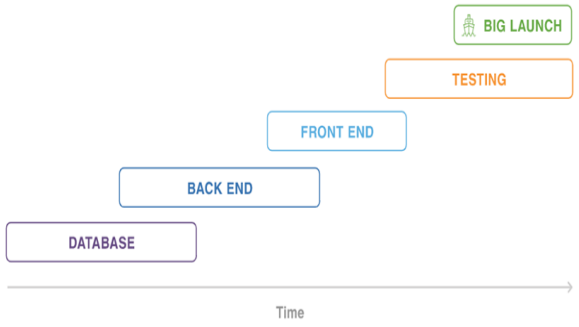
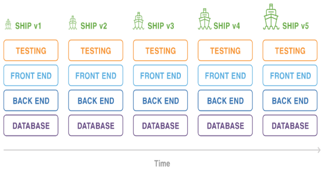
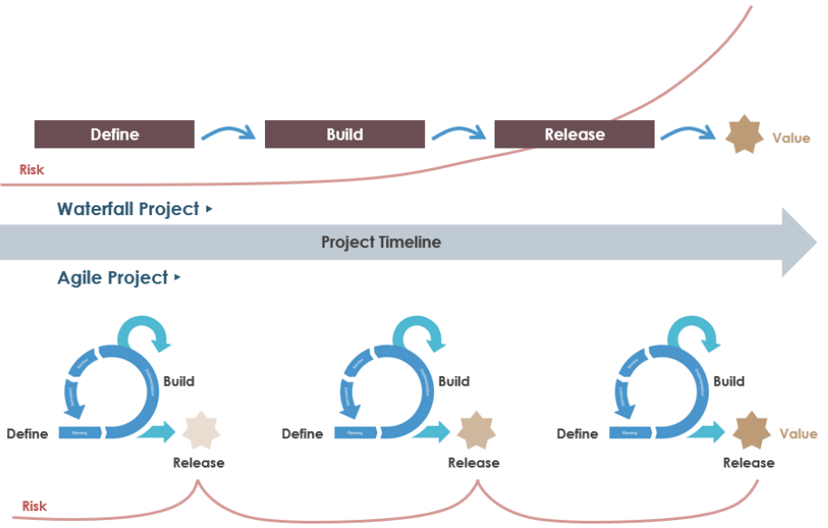

# Waterfall vs Agile

Traditional project management styles like [Waterfall](../waterfall/waterfall.md) is built in **phases**. Here you see an illustration of a standard Waterfall project.

This style of product development pulls everything into a single big bank, high risk release once a project passes one phase. It is painful to revisit it because teams are always pressing forward to the next stage. Also, traditional project management styles often create critical parts where the project can't move forward until a blocking issue is resolved. Most importantly, the end customer can't interact with the product until it fully complete. Those important issues in the products designed and could go undiscovered until it is released.

Summarize, the Waterfall approach is:

- Built in phases
- Painful to revisit previous phases
- High dependency on critical paths
- Customer can’t interact with product until it’s fully complete

Now, let's contrast this with an Agile project management style which takes an iterative approach to development with regular feedback intervals. These alterations allow for the team to be diverted to another area of the project while a blocking issue is resolved.

Besides removing critical parts, iterations to let you interact with the product during development. This gives the team constant opportunities to build, deliver, learn and adjust.

An ever greater benefit is shared skill set among the team. The team overlapping skill sets add flexibility to the work in all parts of the team's code base. In this way time isn't wasted if the project direction changes. 

So, with the Agile approach you expect to

- Follows iterative approach
- Regular feedback intervals
- Iterations resolve blocking issue & let you interact with the product
- Quickly adapt new requirements/changes
- Shared skillset among the team

In other hands, we can say that Waterfall is a much restricted, rigid process whereas Agile is flexible and continuously evolving. Also, Waterfall is sequential whereas Agile does not enforce a linear process. Waterfall is a structured process where you can't start on a new phase until the previous one has been completed. On the other hand, Agile is a flexible process, allowing you to move through the project as you like.

Waterfall projects usually include defined requirements in advance, whereas requirements are expected to change and evolve in Agile projects.

## Compare

The difference between what Waterfall methodology was as Agile can be summed up saying Waterfall is a much stricter, rigid process whereas Agile is flexible an continuously evolving. Waterfall is sequentially whereas Agile does not enforce a linear process. Waterfall is a structured process where you can't start on a new phase until the previous one has been completed. On the other hand, Agile is a flexible process that allow you to move through the project as you like.

Waterfall projects usually include defined requirements in advance, whereas requirements are expected to change and evolve in Agile projects.

Both of them deliver quality products. In Waterfall projects you can't change things that were done in previous stages, whereas Agile is very accommodating to changes and is therefore continually evolving.

|              | Waterfall | Agile |
|--------------|-----------|-------|
| Sequential   | X         |       |
| Flexible     |           | X     |
| Accommodate change |     | X     |
| Defined requirements | X |       |
| Deliver quality products | X | X |
| Continually evolving |   | X     |
| Rigid process | X        |       |

Now, if you are still confused with when to use Waterfall and when to use Agile, I will try to clarify that for use.

### Use Waterfall if...

It is recommended to use Waterfall if:

- You don’t expect changes in scope and you’re working with fixed-price contracts
- The project is very simple or you’ve done it many times before
- Requirements are very well known and fixed
- Customers know exactly what they want in advance
- You’re working with orderly and predictable projects

### Use Agile if...

You should use Agile when:

- The final product isn’t clearly defined
- The clients/stakeholders need the ability to modify the scope
- You anticipate any kind of changes during the project
- Rapid deployment is the goal

So, when deciding between Agile versus Waterfall, it can all boil down to this. If you anticipate or expect any changes throughout the project, go with Agile. If we know that project is fixed, unchanging, unpredictable, Waterfall may be a better choice.

Agile is designed to accommodate new evolving requirements any time during the project, whereas Waterfall does not allow you to go back a completed phase and make changes to accommodate frequent inspection and immediate adaptation.

Agile project work in iterations that a smaller segment of the overall project and as you can see, Agile project involved tha same type of work as in a traditional Waterfall project. You create requirements and designs, develop the product documented and if necessary, integrate the product with other products. You test the product, fix any problems and release it for use. However, instead of completing these steps for all product features at once, as in a Waterfall project, you break the project into iterations also while sprints. So, effectively in Agile, that is a guided continuos improvement where you fail fast, but definitely you succeed early as well.
