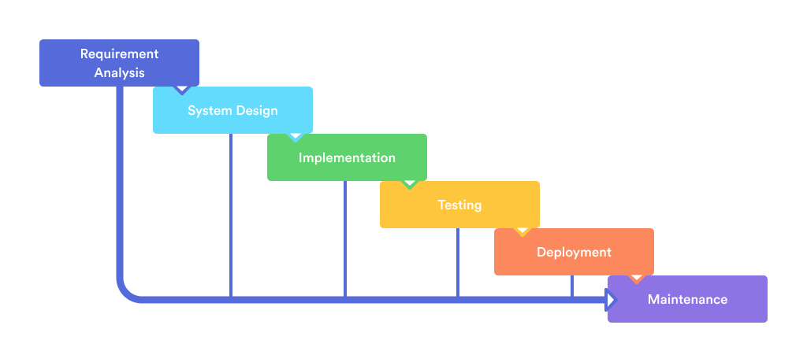
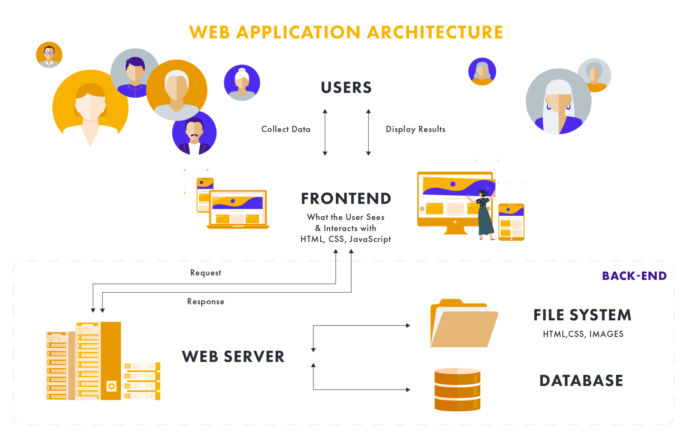
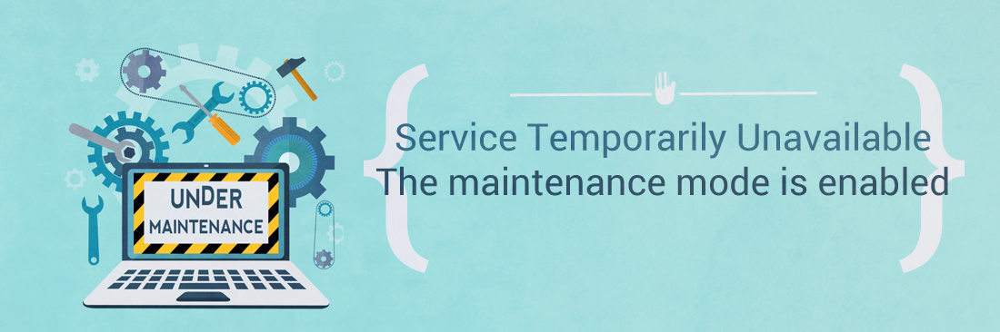

# Waterfall

The waterfall process was first time introduced by _Dr. Winston W. Rice_ on a paper published in 1970. In simple words, the **Waterfall** Model is a _software development process_. The waterfall process emphasizes these principles that a logical step should be taken in all the sequential steps of the Software Development Life Cycle (SDLC), such as the steps coming down from the rising waterfall process. 

The logical nature of the sequencing process used in the waterfall method cannot be denied, and it is common in the industry, a somewhat simple design in the beginning. This approch has a solid strcuture:

- **requirements**: During this initial phase, the application's potential requirements procedure is analyzed in detail and written into a specific document, which is the basis for all future developments. The result is usually a document of requirements that explains what the application should do, but not how it should be done.
- **system design** (also known as **design** or **analysis**): a complete and very detailed analysis of the system is performed to properly develop the models and business logic that will be used in the software application. Also, the architecture of the software must be define in each part and then it must be documented
- **implementation**: this is the part when finally developers create the software. So, the developers implement all the models, business logic, and service integration that were described in the previous steps.
- **testing** or **verification**: during this phase, developers deploy the application in a test environment to verify all the functionalities and the architecture. Also, _Beta Testers_, _QA_, and all other testers regularly detect and report issues in the application that need to be resolved. Creating a "necessary iteration" of the previous coding step for this step is not an easy task, so it is important to correct the revealed error correctly.
- **deployment**: finally, the software is ready for deployment directly in the production environment.
- **maintenance**: the software has to be maintained by the software house or other developers to add new functionalities or fix some buggy code

## The Advantages

In recent years there has been a gradual decline in the waterfall model in favor of more **agile** methods. But it still has many benefits. Specially for large projects and organizations that require strict procedures and deadlines.

- _According to the shifting teams_: Although not necessarily specific to the waterfall model alone, the use of the waterfall method allows the project as a whole to be more detailed, robust with the scope, and to maintain the design structure, like all clear Due to plans and documentation steps. This is especially suitable for large companies, organizations that come to the members and see the life of the project, through which the burden of design can be placed on the basic documents and no team member has to be ignored.
- _The structured organization_: Although some say it is a burden rather than a benefit, the reality is that the waterfall model is compelling. Besides, even the organization building has spoken of the project being exceptionally disciplined in its design and structure. Most large projects will include detailed procedures for managing every aspect of the project, as needed, from design and development to testing and implementation.
- _Waterfall process allows for early design changes_: Although it may be difficult to make later design changes in the process, the waterfall approach automatically improves the initial changes in the life cycle. This is great when you work with the development team and the clients to get the specific documents out in the first two steps. The reason is that the changes can be made quickly and with minimal effort, as no coding or implementation has taken place so far.
- _Suitable for milestone-focused development_: Due to the inherent linear structure of the waterfall project, such applications are always suitable for organizations or teams that work well under a milestone and data-driven model. With clear, solid, and well-understood steps that everyone on the team can understand and prepare for, creating a timeline for the whole process and specific markers and stones for each stage and even completion Assigning mail is relatively easy. This is not to suggest that software development is often delayed, but that the waterfall process is a type of project that requires a deadline.

## The Disadvantages

No doubt that there are advantages to human-made inventions, there are also disadvantages. There are some similar flaws in the waterfall process. Let’s take a closer look at these flaws.

While some elements in software development never change, many other things often fall apart in the process. Dr. Winston W. Rice’s initial proposal, now known as the waterfall model, was to break the earth. When it was first published in 1970, there were several cracks in its theory.

- _Non adaptive design constraints_: Although only a whole book can be written on this subject, the most detrimental aspect of the waterfall model is the inherent lack of adaptation at all stages of the developmental period. When the test in step five reveals a fundamental flaw in the design of the system, it requires not only a dramatic leap in the process. But in some cases, it can often lead to a devastating feeling about the legitimacy of the entire system. Although experienced teams and developers would (rightly) argue that such disclosures should not occur if the system is properly designed in the first place. Especially when the stages are often delayed until the end of the waterfall process.
- _Ignore moderate user/client feedback_: Due to the rigorous step-by-step process of implementing the waterfall process, another particularly difficult problem is that the feedback provided by the user or client late in the development cycle can often be too short, too late. Although project managers can clearly implement a process to return to the previous stage due to an expected need or a change from a client. So, it will be expensive and time-consuming for both the development team and the client.
- _Delayed the period of testing_: Phase most modern SDLC models try to integrate testing as a basic and ever-present process during development. The waterfall model avoids late testing for life cycles. Not only does this mean that most bugs or even design issues can’t be traced back to this process, but it also encourages poor coding methods because testing is just a thought.

## Project Manager

Who has the responsability of the project is a **Project Manager**. A succesful Project Manager has to:

- time bounded
- requires definitive effort
- needs to be well planed
- must be completed within the assigned budget

In the waterfall approch the project moves to the next phase only when the previous phase is completed.

## Project Management

Waterfall is a traditional project management approach where you complete a project as a step-by-step (linear or sequential) process. The project team essentially completes each task/stage in the project before moving on to the next one.

And as each step cascades into the next one, like water flowing down in a waterfall, this approach is called the Waterfall methodology. 

### Pros

- _Easy to learn and understand_: if you follow the step sequentially, manage a project is quite easy
- _Extensive documentation_: Waterfall project management is a document-heavy approach for each phase. Documentation may seem boring and tedious to do. However, it actually has a few benefits, like:
    * everyone will be on the same page about what to do in each phase
    * new project team members can read these documents to familiarize themselves with the project quickly 
    * you can use it as references when presenting progress reports to clients
- _Suitable for small projects_: in smal project the requirements are deliverables are less likely to change. As the project scope is fixed, you can proceed through each development stage seamlessly.

### Cons

- _Lack of flexibility_: the model requires everything to be clearly defined before starting each phase — something that's not practical when client/customer needs could change any time. So, if they want to change any project feature, or if the requirements aren’t clear, you’ll have to restart the project from the requirements phase again.
- _The testing process can be risky_: you need to develop the entire project before you can start testing it. This delay can increase the chances of your project being riddled with bugs and other issues. And if the testing process reveals too many issues, you’ll have to restart the whole development process from scratch. Moreover, as the project is nearly over by the time you reach the testing stage, teams tend to rush through it just to deliver the project in time. While they’ll meet the deadline, the client could receive a product that wasn’t adequately tested and checked. 
- _Not suitable for large, complex projects_: large projects are also more prone to changing requirements. If you use the Waterfall model to manage such projects, you’ll have to restart the development process each time the requirement changes — which is definitely not feasible. Additionally, as the testing phase occurs only post-development, you can’t test individual components in such projects — resulting in a bug-ridden product.

## A real example

In my experience, I have created a lof of different webapplication and very complex, for example for hospitals, bank and other big organizations. In this scenario, the webapplication has a **frontend** that interacts with the users and a **back-end** that deals with the code, files, databases and other resources to support the frontend and gives to the users a nice experience. This is a generic a simple schema.

When I had to deploy this webapplication on a server, there were always issues with the **downtime**. Because we have to replace the code on the server or apply changes to the infrastructure, the users could experience some difficulties in using the webapplication or face a message like "This service is temporarily unavailable. We are currently performing scheluled maintenance. Normal service will be restored soon".

To avoid those issues, it was necessary to find new ways to deploy new software without creating issues to the users but not always was avoidable.

Think in our modern world. You want to buy from Amazon at any time products or your shopping, see your bank statement, play with your Xbox, read your emails...

So, it is not longer acceptable that a webapplication could be down. The worst scenario is with apps. Could you accept if your mobile bank is down or can't connect to the server? Could you accept if you can't watch a movie from Netflix?

## FAQs

- _When can design changes be made in the Waterfall process?_ Alterations are easy to accommodate in the early stages of development, such as when the project manager is still fleshing out the specification documents with the development team and clients. Later in the Waterfall process, once coding has already begun, design changes can be difficult and expensive to make.
- _What other benefits are there to Waterfall’s organized structure?_ While the Waterfall methodology may sound overly restrictive for certain kinds of projects, it can be a great way to keep a well-defined, predictable project from exceeding time and budget guidelines. The clear and detailed organization can also help during complex projects that involve a lot of people working toward a clearly outlined goal.