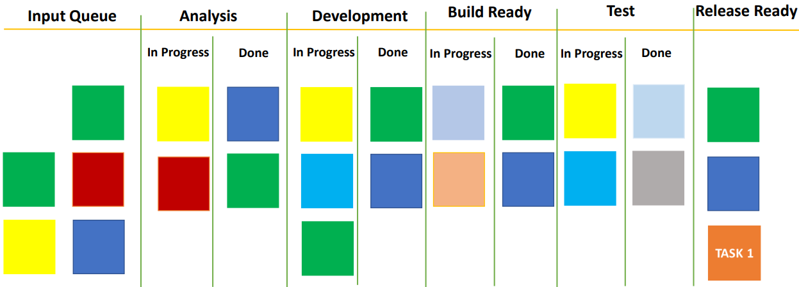

# Definition of Done

When a particular task is completed? We are just not going to define the Definition of Done (DoD) for a feature but also for each step.

Let's understand this through an example. We have a task A which is in the building step. In order to see that step is completed, the developer first must know exactly what is expected from the developer feature and what is exactly to be delivered.

Similarly, if we talk about the final feature is going into production, that should match the customers or managers expectation. So, Kanban suggested that each column (or let's say most columns) should have this bifurcation of **in progress** and **done**. It should be clearly defined when we can move a task from being in progress in that step to being completed or done.

When we clearly defined what is done, the quality is maintained at each step and therefore the final outcome is of high quality.

One point to be noted here is that when we see a step is complete on a task, it does not mean necessarily that task moves to the next step. The task will simply set in the **Done** column of the previous step.

We talked about Kanban being a pull based system. Even if the developer has written the code does not mean that the task is not pending with the testing team. Tasks come to testing team, when the development team completed their steps. Nobody pushes it down to them, it is their discretion on when to pick up the task.

Another thing I want o highlight here is you might be wondering that do these subcolumns (**In progress** and **Done**) have separate WIP limits. As Kanban is flexible, this is your choice. The general practice is to have a single limit for the entire steps.

As long as the task is in that step, it should be counted against that steps as a work in progress. So, do not have separate WIP limit for subcolumns.

Lastly, there are two practices to understand if the rules are implemented properly. It is a good practice to actually write these rules on some notes and have these notes on the Kanban board. Whenever someone is moving a task from one column to another, another team member should check if the rules were done well in the previous step or not.

In an Agile team, the entire team is accountable for the quality of the delivery. Therefore, the team should check each other's work to prevent misjudgment or carelessness by one person to avoid any negative impact on the task or feature.

>[!NOTE]
> - If a step is complete on a task, it does **not necessarily mean that the task moves to the next step**
> - **Task will simply sit in the done column** of the previous step
> - Do not have separate WIP limits for sub columns "In progress" and "Done"
> - **Write "Done" rules as notes** on the Kanban board
> - **Always check if the rules for "Done" were met** in the previous step or not
