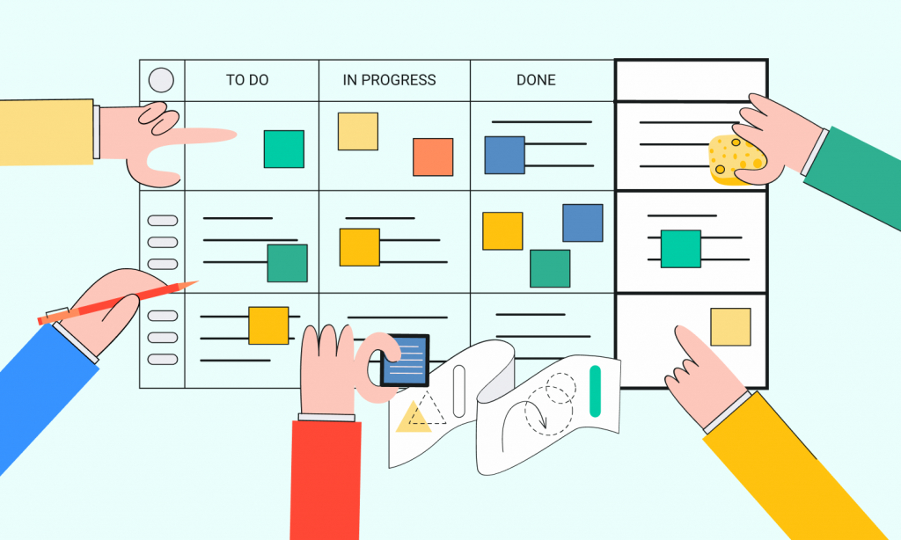

# Kanban

Kanban is a very flexible and easy to implement method for process improvement. It is so easy that it should be the starting point for all the teams that are thinking of adopting the [Agile](../agile/index.md) approach.

Unlike [Scrum](../scrum/intro.md) which has strict rules to be followed or extreme programming, which has strict practices, Kanban is very flexible and teams have a lot of scope of being creative by implementing Kanban.

Kanban is a Japanese word that literally means a sign board. It comes from the manufacturing industry when Toyota implemented Kanban to monitor the car making process and identify the steps which are the bottlenecks. From there, it has been adapted for software development and it has been similarly successful.

The idea of Kanban is visualizing the workflow to achieve process improvement.

The first part is visualizing the workflow. This means that there should be a clear picture of what steps and actions that re being taken by the team. By visualizing this, we try to identify at which step we have inefficiencies or waste and what are these steps at which flow is getting interrupted.

The second part is achieving process improvement. There are several steps or practices that can suggest to improve the process and achieve higher flow of work through it. Some practices are like limiting the work in progress or managing the flow or implementing feedback loop. These are just suggestions and not rules.

The team can come up with any type of creative solution to the issues they identified while visualizing the workflow.
