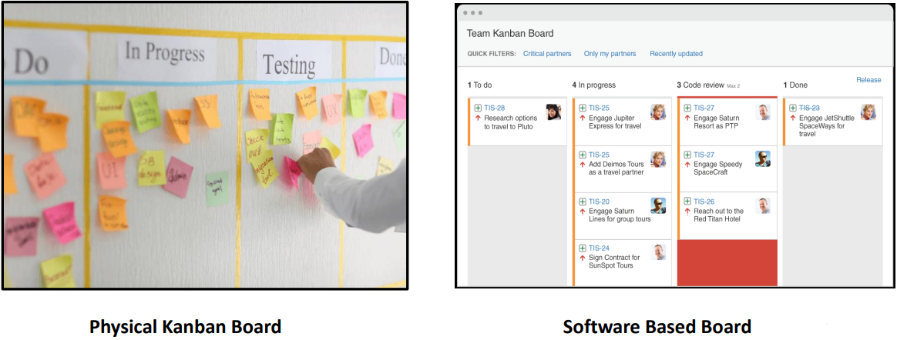
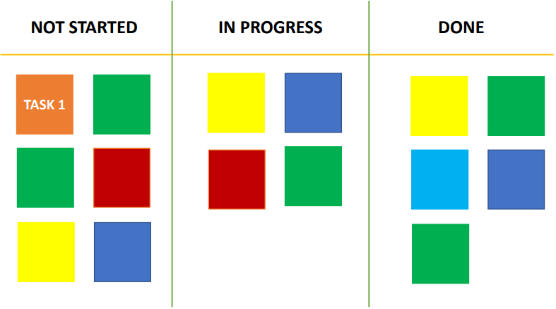
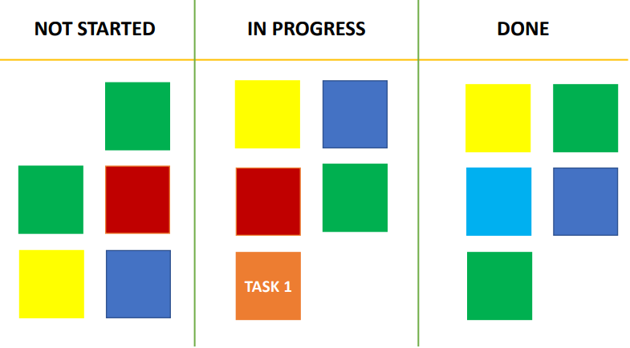
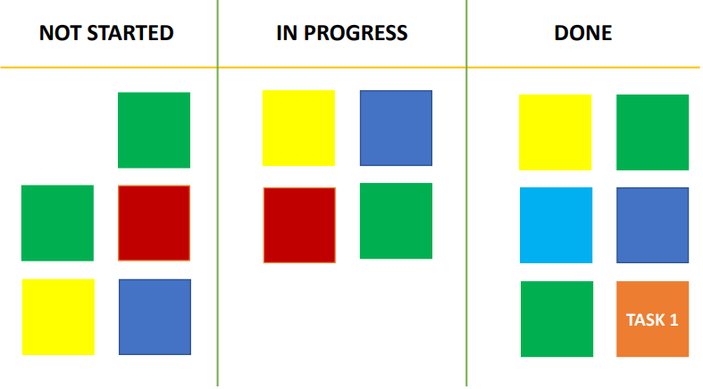
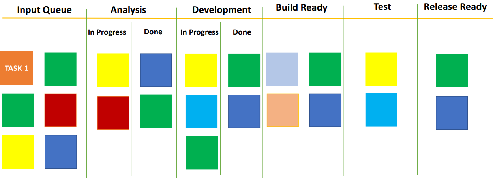
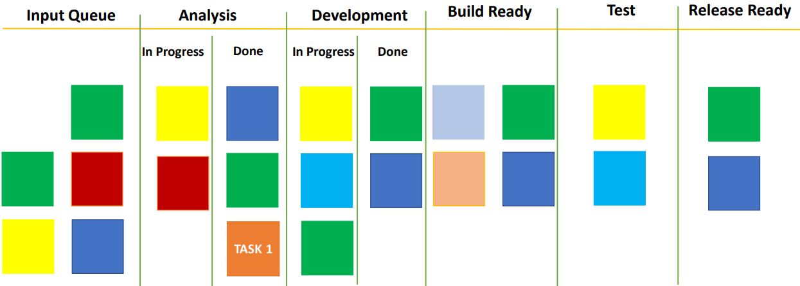
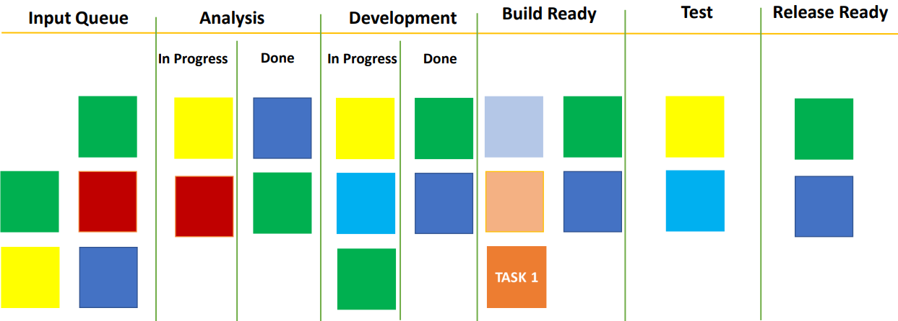
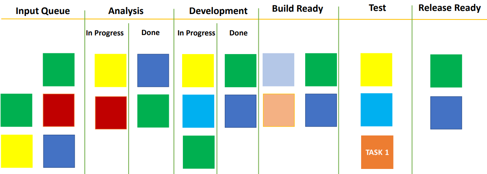
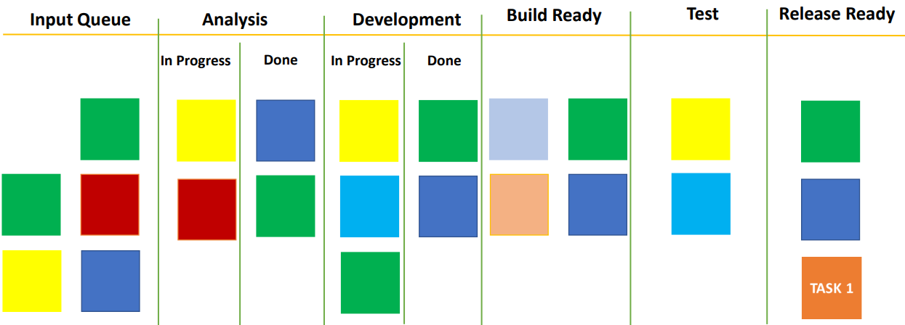
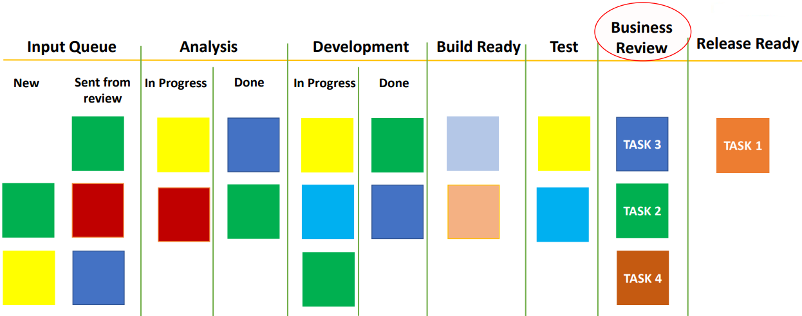

# Kanban board

Kanban board is a tool that teams use to visualize their workflow. Now, this can be a physical board on the wall with sticky notes being used to represent us on it or it can be a software based.

In these boards we created different columns for different steps involved in the development process.

In the first column, we have the to do list. Then, we have in progress, followed by code review and done. Within each step we have set of tasks to be performed.

## Simple example

Now, let's take an example to understand this further. In the following image is the simplest form of Kanban board. We have segregated the task workflow into 3 parts. The first column is *Not started*, followed by *in progress* and then *Done*.

Every task starts on the left in the *Not started* column. When the team starts working on it, the sticky note is removed from the first column and put into the second column *In progress*.

When the task is complete, it is moved to the *Done* column.

This is a simple example of Kanban board which can work not just for project but for visualizing every kind of process. This is a pretty basic. If you really want to benefit from the Kanban board, you need to look at your process and make columns showing exactly the process for your team.

## A real example

Here is a sample board with a few extra columns. You will relate to it if you have ever worked in a development team. There is an import queue which just calls out all the things on which the team has to work.

Once an item is picker up, each item undergoes this process of analysis, followed by a development then build ready, testing and then release ready.

For *analysis* and *development*, we have segregation in 2 columns: *In progress* and *Done*. They may be some tasks which analysis is done but the development has still not started. So, such tasks will stay in the *Done* section of the analysis column. Some goes for the development tab.

This example is from [David Anderson's book](https://amzn.to/3OGvJn3) titled *Kanban: Successful Evolutionary Change for Your Technology Business*.

As mentioned earlier, each team is different and the process followed is different. Therefore, steps in Kanban board for each team will be different. For example, suppose you have an extra step after testing and before releasing the change to production that your team presents the developed task to the business team or the business managers.

Based on their feedback, some tasks are sent back to the input queue and some move forward to the release early stage.

It is important to create the right columns in the Kanban table which exactly represent the process that is followed in your case. Once you do this, your Kanban board will start showing you the inefficiencies in your process.
