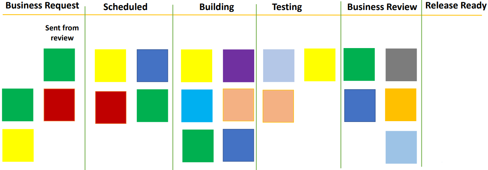

# Marking the task

This is an example of a Kanban board that maps the process. We have the **Business Review** step where managers review the future development. If it is OK, if it goes to the next step in the **Release Ready** column. If it needs some changes, it goes back to the first step in the **Business Request** column.

This back and forth creates a **Feedback loop**. There can be more feedback loops in the process you follow in your organization. Feedback loops are important because they ensure the relevant business information is fed into the process and in the right steps. The features being developed are up to date and accommodate changes in market and competitive strategy.

However, we must also realize that if a lot of items are sent back for rework after review, the overall flow of the process will reduce.

Whenever an item is sent back for revoke, the work done on it previously goes to waste. Plus, team members need to work on it again. This is clearly an inefficiency which needs to be addressed. We need to ensure that items are not sent back for review multiple times.

How do we know that any item has been reviewed multiple times? One way to visualize this on the Kanban board is to make a note how many times the task is going back and forth through the process.

As you would have experience, often the process of review is not a daily thing. Managers do not review the tasks every day. What happens is the tasks are getting piled up for review and only when 7/8 tasks are ready to be reviewed, a meeting is planned. For all this time, the tasks are pilled up in the queue. This creates inefficiency and waste. So, we need to ensure that such meetings happen frequently and regularly to minimize this waste. Having too frequent meetings leads to inefficiency. Then, you have to find a balance in you company set the appropriate WIP for your reviews.

## Recap

| No. | Situation                                                               | Suggestion
|-----|-------------------------------------------------------------------------|----------------------------------|
| 1   | Too much work in progress (WIP) on a single stage - **[Limiting the WIP](../kanban/process-inefficiencies.md)** | More team members need to work on that stage(for e.g. testing stage in this scenario) instead of any of the previous stage |
| 2   | **[Under utilization of resources](../kanban/underutilization-resources.md)** - Pending tasks not moving to the next step | Reallocate the resources somewhere else where they can be utilized optimally |
| 3   | **[Task is taking longer time than it should be](../kanban/unequal-sized-tasks.md)** | Keep a regular track of the board - Break down the task into smaller sized tasks |
| 4   | **[Multiple feedback loop](../kanban/marking-task.md)** | Make a mark on the task for the number of rounds that task is going for rework |