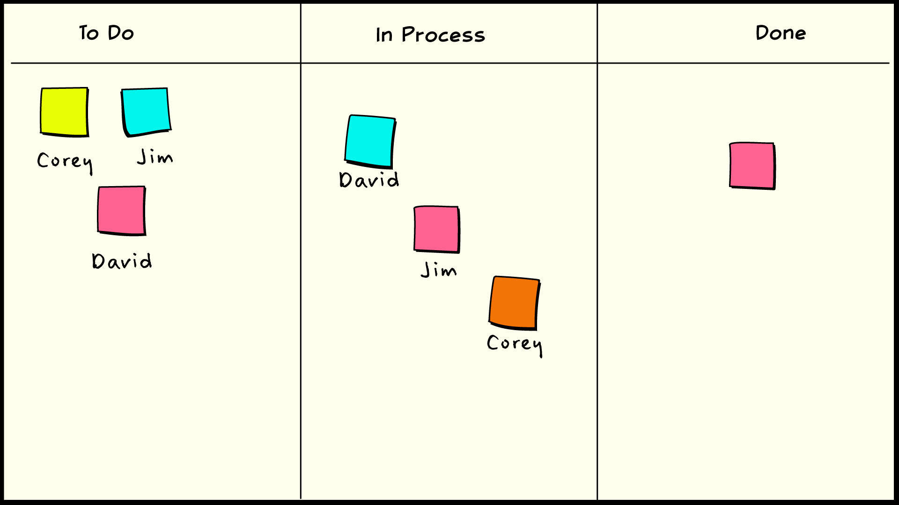
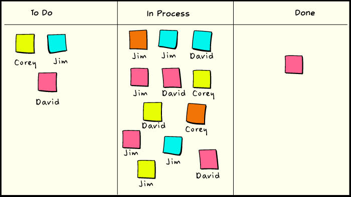
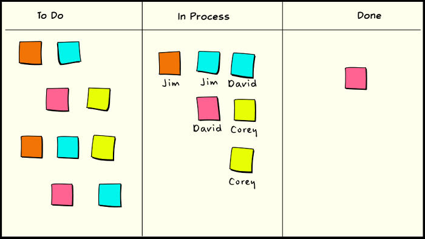
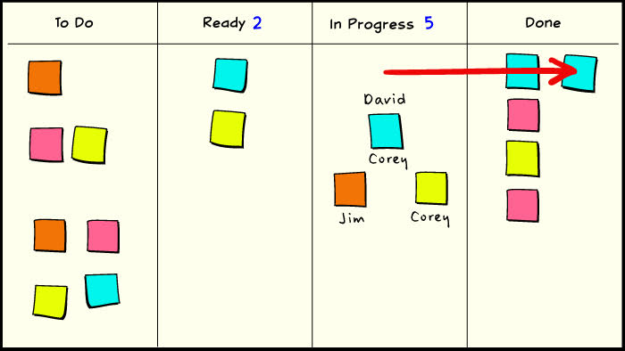
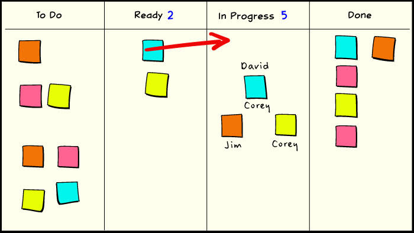
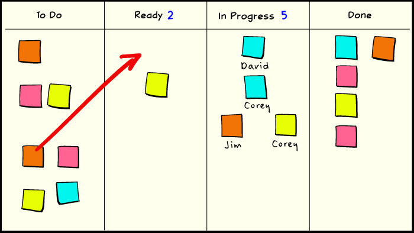
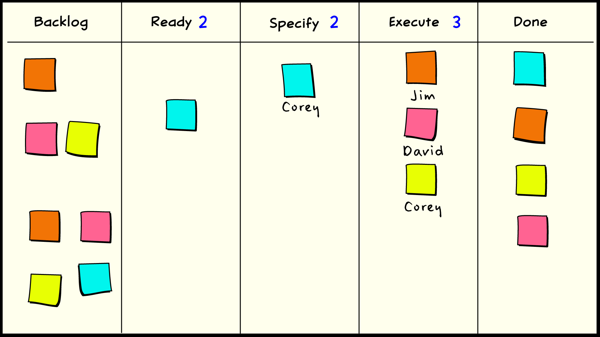
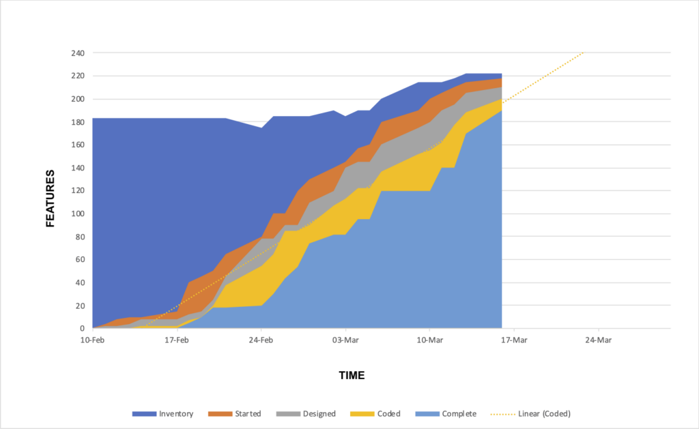
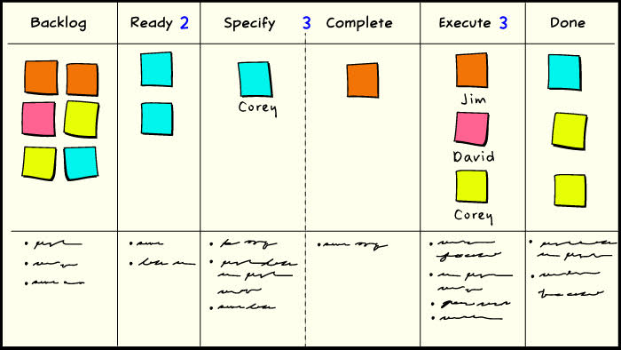
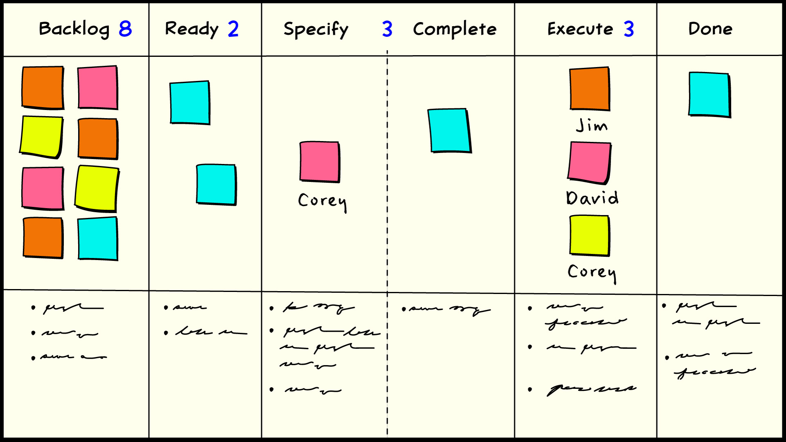

# Scrumban

As more people become interested in Lean ideas and their application to knowledge work and project management, it’s helpful to find ways that make it easier to get started or learn a few basic concepts that can lead to deeper insights later. For those that are curious about kanban in an office context, it’s not unusual to find people who are either currently using Scrum, or have some understanding of Scrum as representative of Agile thinking. One way or another, Scrum users are an important constituent of the Kanban audience. Since Scrum can be described as a statement in the language we use to describe kanban systems, it is also fairly easy to elaborate on that case in order to describe Scrum/Kanban hybrids. This can be useful for existing Scrum teams who are looking to improve their scale or capability. It can also be useful for more cautious new users who find comfort in an “established” method. (Despite the fact that the kanban idea is at least 40 years older.)

The idea of using a simple task board with index cards or sticky notes is as old as Agile itself. Consider an example of such a task board with a simple Pending → In Process → Complete workflow. The cards on the board represent work items that are in the current scope of work. Names can be associated with the cards to indicate who is working on what. Agile teams have been using this sort of method for a long time, and a few people pointed out early on that this had some resemblance to the notion of kanban in Lean systems.

Of course, a variety of electronic tools exist that perform these functions, but the simple task board represents a couple of Lean principles that I find very valuable: simple technology and visual control. The utility of such a simple method of workflow management is that it is easy to manage, and more importantly, it is easy to change. Huddling around a computer monitor, even a very large one, is in no way a substitute for the tactile and social interactivity that accompanies manipulating a large task board. Maybe someday it will. Not today. (Today, in this case, was April of 2008.) Electronic tools are good for managing lists of things, like backlogs and bugs, and producing reports. Simple tools can be a difficult concept to explain to technology fanatics, but then, so can value.

A problem with the basic index-card task board is that there is nothing to prevent you from accumulating a big pile of work in process. Time-boxing, by its nature, sets a bound on how much WIP that can be, but it can still allow much more than would be desirable. If a kanban is a token that represents a work request, and our task board can still get out of control, then what is the problem here? The problem is that a kanban is more than just a work request on a card, and putting sticky notes on a whiteboard is not enough to implement a pull system.

## A Kanban is More than an Index Card

In a modern economy, the production and distribution of scarce goods and services are regulated by a system of money and prices. Money can be represented by currency notes, which have little intrinsic value, but that by agreement, can be exchanged for real goods and services. The existence of a neutral medium of exchange makes possible a system of economic calculation of the relative scarcity of the supply of goods in an economy. Such a system of prices is a market. Markets communicate the value of economic production and distribution to their participants.

If a currency note can be exchanged for an object of real value, then there must be some way to enforce the scarcity of the notes in a way that corresponds to the scarcity of real value in the economy. In practice, some kind of institution must enforce this scarcity. The health of a market economy depends greatly on the ability of its monetary institution to coordinate the supply of money with the supply of goods and services. In an unhealthy economy, unstable prices make economic calculation difficult and disrupt the communication between producers and consumers needed for efficient production and distribution.

A kanban represents a portion of the productive capacity of some closed internal economy. It is a medium of exchange for the goods and services provided by the operations of a system of productive resources. The supply of kanban in circulation is controlled by some regulatory function that enforces its value. That is, a kanban is a kind of private currency and the shop floor manager is the bank that issues it, for the purpose of economic calculation.

If you carry the currency analogy further, then you might say that kanban is not about the cards at all. Just like money is not about the bills. Kanban is all about the limits, the quantity in circulation. How that is represented in a transaction is mostly incidental.

A simple rule for understanding all of this might be:

> A task card without a limit is not a kanban in the same way that a photocopy of a dollar bill is not money.

If you use a durable token like a plastic card, then this is easy to manage: control the number of cards in circulation. If all of the available cards are already in circulation, then the next person who comes looking for one is just going to have to wait until one returns. This is the very purpose of the kanban system. However, if you use a more disposable medium like index cards or sticky notes, then you need another mechanism to regulate the “money supply.” In our case, we simply write the quantity of kanban in circulation on the task board, and allocate new cards according to that limit.

This means that a kanban serves two functions: it is a request to do something in particular, but it is also permission to do something in general. That second notion of permission is where people who are new to Lean thinking tend to struggle. But this is precisely how we can “optimize the whole” or “subordinate to the constraint.” (The Theory of Constraints is an adjacent theory to Lean, and the Kanban movement in software development freely mixes and matches ideas from these theories.)

## Crunchy on the Outside, Chewy on the Inside

Just as an unregulated index card on a cork board is not a kanban, timeboxed iteration planning is not pull. No reasonable interpretation of Lean involves building to a one-month forecast unless the cycle time for each work order is also a month. One month worth of stuff in process is certainly a much smaller batch size than 3 months or 18 months, but if your iteration backlog contains 20 work items, then that’s still about 19 more than it needs to be a pull system.

Nonetheless, it is not difficult to augment Scrum with a few simple practices that move us towards a more recognizably Lean workflow. The most obvious is the reduction of iteration length, although this is not without problems. As we will see, it is possible to incrementally enhance Scrum with more and more pull-like features until all that remains of the original process is vestigial scaffolding. The simple approach is to start with Scrum-like iterations and iteration planning process, and begin to add pull features to the team’s internal process.

One simple technique that brings us much closer to our kanban definition is to set a multitasking limit for individuals. You might have a simple principle like prefer completing work to starting new work. Or you might express that as a rule that says try to work on only one item at a time. But if you are blocked, then you can work on a second item, but no more. In our example, that rule gives us an effective WIP limit of 6.

Another common technique is the late binding of tasks to owners. Some teams will preassign all of the known tasks during iteration planning. That is generally not a good idea because it artificially creates a critical path. Waiting until the “last responsible moment” to assign tasks to people maximizes knowledge and brings you closer to pull. (The idea of the last responsible moment is associated with the Poppendiecks, set-based design, and real options.)

Just because anybody can have more than one item in process doesn’t mean that everybody should have more than one item in process. A problem with our multitasking rule is that it locally optimizes with no consideration of the whole. An implicit total WIP limit of 6 is still more WIP than we should probably tolerate for our three workers. A limit of 4 of 5 total items in process at one time still allows for some multitasking exceptions, but disallows the obviously dysfunctional behavior of everybody carrying two items. At this step, we have moved beyond a rule about individuals and have made a rule about the task cards themselves. That is, we have made our cards into kanban.

Another enhancement we can make to our previous board is to add a ready queue between the backlog and work-in-process. The ready queue contains items that are pending from the backlog but have high priority. We still haven’t bound any individual to these tasks, but as soon as somebody becomes available, they should take one of these tasks instead of picking something out of the general backlog. This enables us to decouple the process of assigning work from the process of prioritizing work, and it simplifies assignment. The ready queue also has a kanban limit, and it should be a small limit, since its only purpose is to indicate which work item should be started next.

Now we can begin to see some of the mechanics of pull and flow:

- David completes a task and moves it into the "done" column

- David draws a new kanban from the ready queue and begins working

- The team responds to the pull event and selects the next priority item to go into the ready queue

At this point, we are now operating a simple kanban pull system. We still have our time-boxed iteration and planning cycle, so perhaps we might call such a thing a Scrumban system!

Now that we have a sense of capacity and pull, it is natural to think about flow. Breaking up our nebulous in-process state into better-defined states can give everybody more visibility into the strengths, weaknesses, and overall health of the team. Even Agile workflows like Extreme Programming have relatively well-defined roles and states, and a smooth flow of work between those states is just as important as a smooth flow of work through the process overall.

Here we’ve broken down the in-process state into two states: specify and execute. Specify is about defining whatever criteria are necessary to determine when the work item can be considered complete. Execute is about doing the work necessary to bring that work item into a state which satisfies those criteria. We have split our previous WIP limit of 5 across these two states. Specify is considered to take less time in this case, so it is given a limit of 2. Execute consumes the remaining limit of 3. We might change this ratio as time goes on and our performance changes.

Since we are now thinking more about flow, the additional workflow detail strongly suggests using a cumulative flow diagram to track the work and measure our performance. A simple burndown tells you something about whether or not you are delivering work, but not very much about why. The CFD communicates additional information about lead times and inventories that can diagnose problems, or even prevent them.

By defining our workflow a little better, we can also account for some functional specialization. In this case, it might be a soft specialization, where some of us prefer doing one type of work more than another, even if we are capable of doing it all. It’s important to understand that this kind of pull workflow system allows specialization but does not enforce specialization. The team owns the work and the workflow, and it’s up to the team to figure out how to get it done efficiently.

If we let the person who is best at performing the specify function handle more of that work, then we may also need to coordinate handoffs between ourselves. Adding the specify-complete column communicates to the team that a work order that was previously in the specify queue is now ready to pull work from the execute queue as soon as a suitable resource becomes available. Work that is still active in the specify queue is not yet eligible to make such a pull request. If the owner of a ticket in the specify queue wants to hand it off, he can put it in the complete buffer, and this action constitutes a pull request. If he doesn’t want to hand it off, he can move it directly into the execute state as long as capacity is available to pull from that queue. It might be that the execute queue is full, and the only eligible work is for the ready queue to pull available capacity from the specify queue.

Since we have added a new column for our hand-off buffer, we are also increasing the WIP limit by a small amount. The trade-off is that the increase in lead time due to the new inventory should be offset by the decrease in lead time due to the advantage of specialization. We also mitigate the impact of that new inventory by pooling the WIP limit across the preceding state. This has the very beneficial consequence of making the specify-complete buffer a variable throttle for the preceding station. The more work that piles up in the specify-complete buffer, the less work can be in process in the specify state, until specify is shut down entirely. But we see it coming, it doesn’t “just happen.”

If we’re going to allow workflow specialization and the handoffs that result, then we will also need some agreement about what results to expect at each handoff. We can do that by defining some simple work standards or standard procedures for each state. These do not have to be complicated or exhaustive. Here, they are simple bullets or checklists drawn directly on the task board. They only need to be sufficient to avoid misunderstanding between producers and consumers. These standards are themselves made and owned by the team, and they can change them as necessary according the practice of kaizen, or continuous improvement. Putting them in a soft medium like a whiteboard or a wiki reinforces the notion of team ownership.

## Level 2 Scrumban

In the basic version of Scrumban described so far, the iteration review and planning cycle happens just as it does in ordinary Scrum. But as our production process has matured, we have also given ourselves some tools to make the planning process more efficient, more responsive, and better integrated with the business that it serves.

With the pull system in place, our flow will become smoother as our process capability improves. We can use our inter-process buffers and flow diagrams to show us our process weaknesses and opportunities for kaizen. As we get closer to level production, we will start to become less concerned with burndown and more concerned with cycle time, as one is the effect and the other is the cause. Average lead time and cycle time will become the primary focus of performance. If cycle time is under control and the team capacity is balanced against demand, then lead time will also be under control. If cycle time is under control, then burndowns are predictable and uninteresting. If burndowns are uninteresting, then goal-setting and risky heroic efforts are unnecessary. If burndowns are uninteresting, then iteration backlogs are just inventory for the purpose of planning regularity and feeding the pull system. As such, they should be the smallest inventories possible that optimize planning costs.

Since the team now selects from a small ready queue as work capacity becomes available, then from the team’s perspective, the value of the iteration backlog is that it always contains something that is worth doing next. Therefore, we should use the least wasteful mechanism that will satisfy that simple condition.

A simple mechanism that fits the bill is a size limit for the iteration backlog. Rather than go through the trouble of estimating a scope of work for every iteration, just make the backlog a fixed size that will occasionally run to zero before the planning interval ends. That is a simple calculation. It’s just the average number of things released per iteration, which in turn is just a multiple of average cycle time. So if you have 5 things in process, on average, and it takes 5 days to complete something, on average, then you’ll finish 1 thing per day, on average. If your iteration interval is two work weeks, or 10 work days, then the iteration backlog should be 10. You can add one or two for padding if you worry about running out. This might be a point that has been lost on the Scrum community: it is never necessary to estimate the particular sizes of things in the backlog. It is only necessary to estimate the average size of things in the backlog. Most of the effort spent estimating in Scrum is waste.

In our final incarnation of Scrumban, iteration planning still happens at a regular interval, synchronized with review and retrospective, but the goal of planning is to fill the slots available, not fill all of the slots, and certainly not determine the number of slots. This greatly reduces the overhead and ceremony of iteration planning. Time spent batch processing for iteration planning estimation can be replaced with a quality control inspection at the time that work is promoted to the ready queue. If a work item is ill- formed, then it gets bounced and repeat offenders get a root cause analysis.

## Off with the Training Wheels

If you have made it this far in your evolution, you will probably realize that the original mechanisms of Scrum are no longer doing much for you. Scrum can be a useful scaffold to hold a team together while you erect a more optimized solution in place. At some point you can slough off the cocoon and allow the pull system to spread its wings and take flight.

The first step beyond Scrum is to decouple the planning and release periods. There may be a convenient interval to batch up features to release, and there may be a convenient interval to get people together to plan. If we have a leaner, more pull-driven planning method, there’s really no reason why those two intervals should be the same. Your operations team might like to release once a month, and your product managers might like to establish a weekly prioritization routine. No reason not to accommodate them.

Once you’ve broken up the timebox, you can start to get leaner about the construction of the backlog. Agility implies an ability to respond to demand. The backlog should reflect the current understanding of business circumstances as often as possible, which is to say, the backlog should be event-driven. Timeboxed backlog planning is just that, where the event is a timer, but once we see it that way, we can imagine other sorts of events that allow us to respond more quickly to emerging priorities. Since our system already demonstrates pull and flow, that increased responsiveness should come at no cost to our current efficiency.

The problem we are trying to solve is:

> The ideal work planning process should always provide the development team with best thing to work on next, no more and no less.

Further planning beyond this does not add value and is therefore waste. Scrum-style timeboxed planning usually provides a much bigger backlog than what is strictly necessary to pick the next work item, and as such, it is unnecessary inventory and therefore unnecessary waste.

The next event we might consider for scheduling planning activities is the concept of an order point. An order point is an inventory level that triggers a process to order new materials. As we accept items from the backlog into the process, the backlog will diminish until the number of items remaining drops below the order point. When this happens, a notice goes out to the responsible parties to organize the next planning meeting. If our current backlog is 10, our throughput is 1/day, and we set an order point at 5, then this planning will happen about once a week.

Once a week might be reasonable if people are hard to schedule or need some lead time in order to prioritize. However, if they are more available than that, then we can set the order point lower. If the planners can respond within a day, then perhaps we can set the order point at 2. If the order point is 2, then there may be no need to keep a backlog of 10. Perhaps we can reduce the backlog to 4, and reduce our lead time by 6 days in the process.

The end state of this evolution is pull, or prioritization-on-demand. If the planners can make a good decision quickly enough, and there is no economy of scale in batching priority decisions together, then the size of the backlog only needs to be 1. At the moment the work order is authorized by the development team, the planning team is signaled to begin selecting the next item. This cycle of work authorization and capacity signaling is the fundamental mechanic of pull. If the planning team is fast enough in their response, then the development team will never stall. If there is some variation or delay in response, then a backlog of 2 might be necessary to prevent stalls. But 2 is still a lot smaller and leaner than 10. Or 20. Or 50, which is something I have seen more often than I would like.

The same kind of logic can be applied to the release interval. There is an optimum batch size for releases and we should first try to find it, and then try to improve it. The result of our efforts will ultimately be features-on-demand. Even at this level, we still have a fairly basic kanban system. From here we can add work item decomposition (swimlanes), or structural dependency flow for additional scale. Along with an enlightened division of labor, this is how we believe that Lean shows the way to scale Agile up to the enterprise.