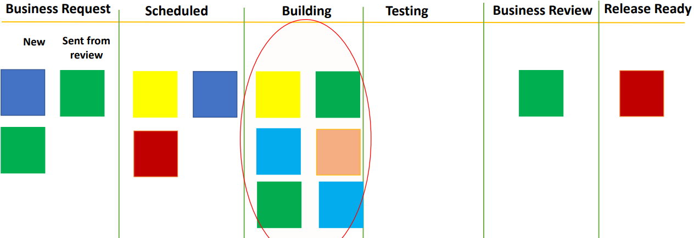
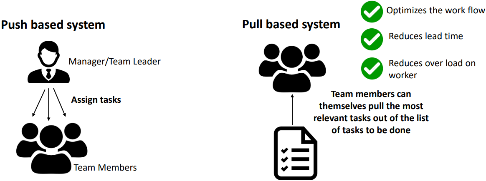

# Under utilization of resources

When we talked about [finding inefficiencies](../kanban/process-inefficiencies.md), we saw the problem of one step being too slow and hampering the flow. Now, we are going to see another type of inefficiency which is underutilization of resources.

Let's understand this through a Kanban board. Suppose you see a board like this; a lot of the tasks are in the *Building* step and, as you can see in the following image, the testing step is empty.

Now, as this testing step is empty, it is ready to get more work but those are still pending in the previous step and therefore are not moving to the next step which is a *testing* step.

In such a situation, the work force for testing will be underutilized. The resources which are managing the tasks and the testing step are not getting the input flow as much as they can handle. Generally, this type of problem is not intuitively found and that is where Kanban can help more.

If you see a particular column being empty most of the time, it is a sign that you have some underutilized resources which you can focus on somewhere else.

In both issues, [Limiting of WIP](../kanban/process-inefficiencies.md) and **Under utilization of resources**, there are flow issues. 

| No. | Situation                                                               | Suggestion
|-----|-------------------------------------------------------------------------|----------------------------------|
| 1   | Too much work in progress (WIP) on a single stage - **[Limiting the WIP](../kanban/process-inefficiencies.md)** | More team members need to work on that stage(for e.g. testing stage in this scenario) instead of any of the previous stage |
| 2   | **[Under utilization of resources](../kanban/underutilization-resources.md)** - Pending tasks not moving to the next step | Reallocate the resources somewhere else where they can be utilized optimally |

At some steps, work is flowing faster and some steps it is slower and the way we handle such situations is actually called **managing the flow**.

Just to clarify, managing the flow is not something that some manager will need to do. This is something which is recognized by the team. When the team sees the flow issue on the board, the members themselves know what to work on next. This is why Kanban is also known as **pull based system**.

## What is a push/pull based system?

Let me take an example to explain the difference between push and pull system and how Kanban is a pull based system.

Suppose there are several things to be done, such as developing a feature, some bug fixes, some documentation etc.

In a **push system**, there will be someone - it can be manager or a team leader - who will assign these stocks to the team members. Also, we can see that the task will be **pushed** to the team members. When you visualize the flow using Kanban, a team member will look at the Kanban board and will immediately know where he or she is most needed and can pick up the most relevant work straightaway. The person will be pulling the most relevant task out of the list of tasks to be done.

Now, since we are talking about **pull based system**, let's also discuss the benefit related to it.

The benefit of a pool based system is that it optimizes the workflow, it reduces the lead time and, most importantly, reduces the overload on the workers. Also, people are more happy when they choose the work that they do instead of a manager allocating the work to them.

>[!TIP]
> A Kanban board highlights the flow related issues for the team and an Agile team can therefore adjust or do flow management to optimize the flow throughout the system.