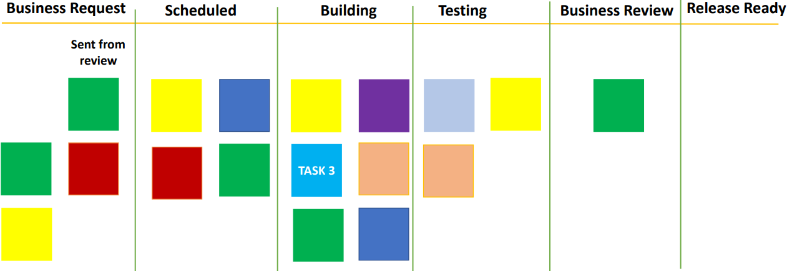
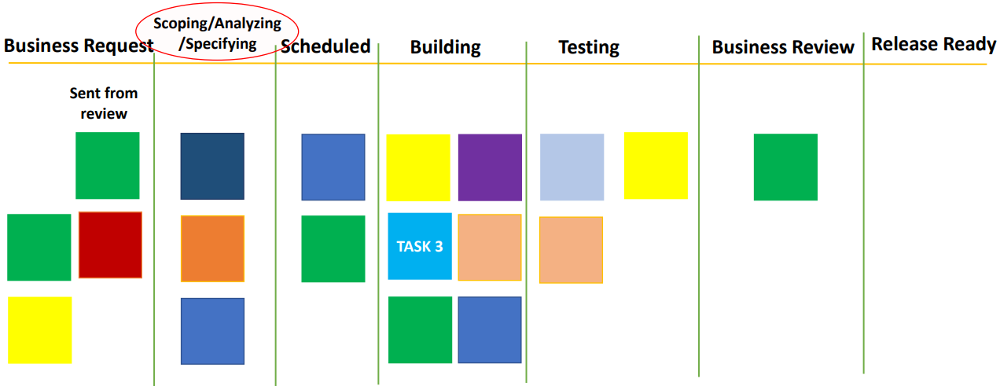

# Unequal sized tasks

Support one day you see a board like this.

Apart from the other tasks, there is the task number 3 which is in the *Building* column. A few days later, you see that all the other tasks have moved but task number 3 is still sitting in the some column. After few days later, as well, you again notice the some thing. Can you guess what this is suggesting?

This is suggesting that the task is taking longer time than it should. There can be many reasons for this. Let's discuss few of them along with few remedies.

Firstly, since each task is different, there is a change that this particular task requires more amount of work. For your understanding for Kanban to work properly and you want to get useful information from the board, we need to ensure that all tasks take about nearly the same amount of time and flow at the similar rate.

This means that if there is a big task, that has to be broken down into smaller size tasks.

To do this, a common practice adopted is to add a new column in the beginning with the step names as **Scoping / Analyzing / Specifying**. Where the main agenda is to create a task of equal size for the rest of the flow.

So, the point I want to highlight here is that you should always remember that in Kanban, we need to ensure that tasks are of equal size.

There are other possibilities. For example, there is a chance that the person assigned to the task is blocked or needs help. Maybe there are some bugs or issues that are stuck. Maybe the person assigned got carried away and is inappropriately expanding the scope of the task.

So, reasons could be any and there is no common practice to address such issues. However, a regular look at the Kanban would highlight such issues and then an Agile team can then act accordingly to resolve it.

| Reason                               | Suggestions                                  |
|--------------------------------------|----------------------------------------------|
| Unequal sized tasks                  | Break down the task into smaller sized tasks |
| Tasks stuck due to some bug or issue | Keep a regular track of the board            |

## Recap

| No. | Situation                                                               | Suggestion
|-----|-------------------------------------------------------------------------|----------------------------------|
| 1   | Too much work in progress (WIP) on a single stage - **[Limiting the WIP](../kanban/process-inefficiencies.md)** | More team members need to work on that stage(for e.g. testing stage in this scenario) instead of any of the previous stage |
| 2   | **[Under utilization of resources](../kanban/underutilization-resources.md)** - Pending tasks not moving to the next step | Reallocate the resources somewhere else where they can be utilized optimally |
| 3   | **[Task is taking longer time than it should be](../kanban/unequal-sized-tasks.md)** | Keep a regular track of the board - Break down the task into smaller sized tasks |