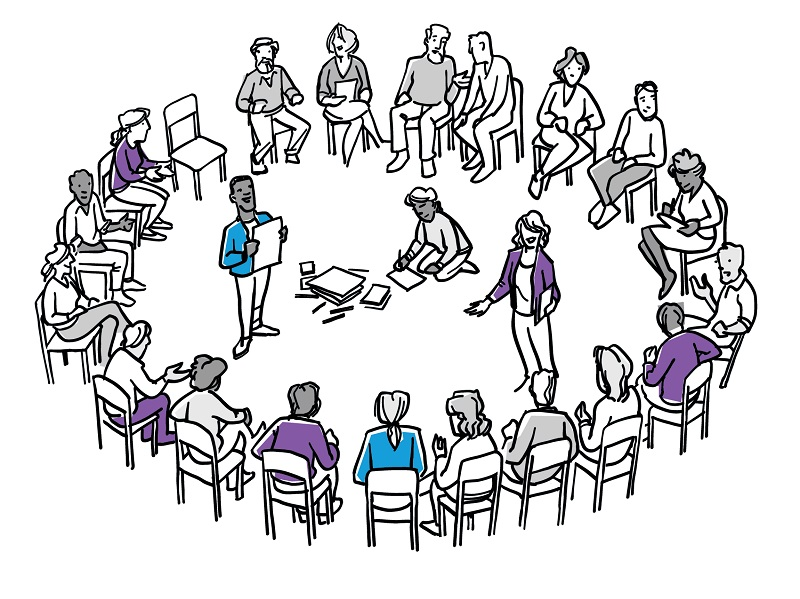

# Agile Kata

The Agile Kata is new. The Agile mindset and Kata thinking are certainly not. They both have a decades-long proven track record. The Agile Kata brings those two schools of thought together. For many in the Agile community, the term Kata might be new, so I can’t wait to show you how you could use the Agile Kata for small improvement initiatives, large-scale Agile transformations, or as a practice to achieve Business Agility.

## The challenges

According to a recent Business Agility Report from the Business Agility Institute, a stunning “75% of Agile transformations fail.” In the same report, they said that it would take on average two years for an organization to see the first significant benefits of Business Agility.

The long timeline combined with a high failure rate are possible reasons why many organizations face Agile transformation fatigue. Challenges and frustrations plus hefty price tags that often go along with Agile transformation efforts leave decision-makers wondering if an Agile transformation is worth it.

The answer is, of course, yes. The report stated that 25% of organizations experienced a faster time to market, 75% experienced higher employee engagement, and 92% of employees said they would recommend Agile ways of working to colleagues. And these are just three of many compelling reasons that were outlined.

The benefits of Business Agility are clear, but the process of getting there is not because we know that three out of four attempts are unsuccessful. When asked their biggest challenge, 48% of organizations stated that shifting to an Agile culture was their biggest challenge. Therefore, approaching Agile transformations with a different process that fosters an Agile culture could tremendously increase the success rate of many Agile transformations around the world.

Based on that single biggest challenge, let’s see how the Agile Kata can help positively shift the approach to a true and more successful Agile transformation.

## How can the Agile Kata help?

The Agile Kata:

- is an Agile approach to an Agile transformation
- nurtures and fosters an Agile culture throughout the transformation, not only as an end state.
- is continues and aligns with the values and principles of the Agile Manifesto
- deliberately measures current and target conditions of value

The Agile Kata consists of two elements. I call them the Agile Kata Core and the Agile Kata Shell.

