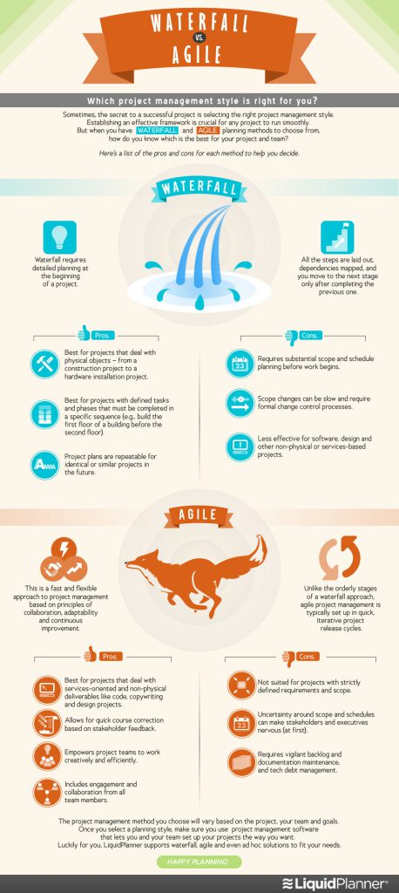
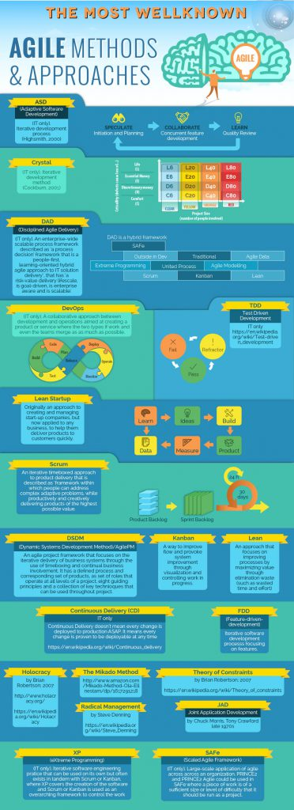
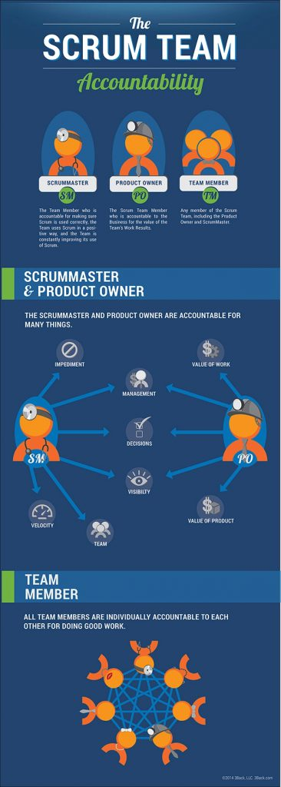
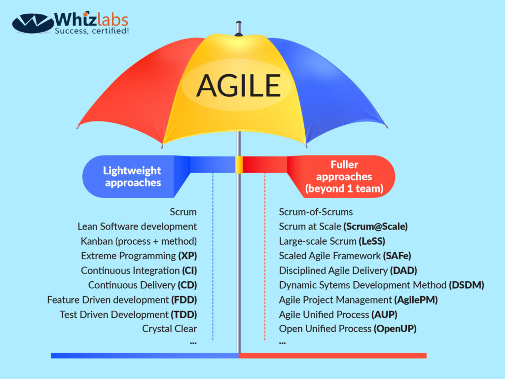

# Top (40) Scrum Interview Questions

### Basic Agile Scrum Interview Questions

While you are preparing for the Agile Scrum interview, move to your final preparation with the below-mentioned basic agile scrum interview questions. These are quick questions you should go through before your agile scrum interview.

##### 1\. What is the duration of a scrum sprint?

Answer: Generally, the duration of a scrum sprint (scrum cycle) depends upon the size of project and team working on it. The team size may vary from 3-9 members. In general, a scrum script complete in 3-4 weeks. Thus, on an average, the duration of a scrum sprint (scrum cycle) is 4 weeks. This type of sprint-based Agile scrum interview questions is very common in an agile or scrum master interview.

##### 2\. What is Velocity?

Answer: Velocity question is generally posed to understand if you have done some real work and familiar with the term. Its definition “Velocity is the rate at which team progresses print by sprint” should be enough. You can also add saying the important feature of velocity that you can’t compare the velocity to two different scrum teams.

##### 3\. What do you know about impediments in Scrum? Give some examples of impediments.

Answer: Impediments are the obstacles or issues faced by scrum team which slow down their speed of work. If something is trying to block the scrum team from their getting work “Done” then it is an impediment. Impediments can come in any form. Some of the impediments are coming from:

* Resource missing or sick team member
* Technical, operational, organizational problems
* Lack of management supportive system
* Business problems
* External issues such as weather, war etc
* Lack of skill or knowledge

While answering impediments related agile scrum interview questions remember that you may be asked the way to remove any of the mentioned impediment.

##### 4\. What is the difference and similarity between Agile and Scrum?

Answer: Difference between Agile and Scrum – Agile is a broad spectrum, it is a methodology used for project management while Scrum is just a form of the Agile that describes the process and its steps more concisely. Agile is a practice whereas scrum is a procedure to pursue this practice.

The similarity between Agile and Scrum – The Agile involves completing projects in steps or incrementally. People consider the Agile methodology iterative in nature. Being a form of Agile, Scrum is same as that of the Agile. It is also incremental and iterative.

##### 5\. What is the increment? Explain.

Answer: This is one of the common agile scrum interview questions and yu can answer it quickly in this way. An increment is the total of all the product backlogs items completed during a sprint. Each increment includes all the previous sprint increment values as it is cumulative. It must be in the available mode in the subsequent release as it is a step to reach your goal.

##### 6\. What is the “build-breaker”?

Answer: The build-breaker is a situation that arises when there is a bug in the software. Due to this sudden unexpected bug, compilation process stops or execution fails or a warning is generated. The responsibility of the tester is then to get the software back to the normal working stage removing the bug.

##### 7\. What do you understand by Daily Stand-Up?

Answer: You may surely get an interview question about daily stand-up. So, what should be the answer to this question? The daily stand-up is an everyday meeting (most preferably held in the morning) in which the whole team meets for almost 15 minutes to find answer to the following three questions:

* What was done yesterday?
* What is your plan for today?
* Is there any impediment or block that restricts you from completing your task?

The daily stand-up is an effective way to motivate the team and make them set a goal for the day.

##### 8\. What do you know about Scrum ban?

Answer: Scrum-ban is a Scrum and Kanban-based model for the software development. This model is specifically used for the projects that need continuous maintenance, have various programming errors or have some sudden changes. This model promotes the completion of a project in minimum time for a programming error or user story.

### Agile Interview Questions

In this section, we are going to cover Agile interview questions. You should be prepared for the agile interview with the following agile interview questions.

##### 9\. State some of the Agile quality strategies

Answer: Some of the Agile quality strategies are:

* Iteration
* Re-factoring
* Dynamic code analysis
* Short feedback cycles
* Reviews and inspection
* Standards and guidelines
* Milestone reviews

##### 10\. Do you know about Agile Manifesto & its Principles? Explain in brief

Answer: This is the theory which most of agile/scrum roles aspirant should be on tips. Four manifesto values and 12 principles should be explained as much as possible as part of this question. Even if it’s not explained in 100% accurate manner it should be fine but intentions of values and principles should come out e.g.

* Working Software should be demonstrated at regular intervals
* Individuals & interaction – self-organization, self-motivating should be encouraged
* Customer collaboration
* Welcoming change at any point in time in the project

##### 11\. Is there any drawback of the Agile model? If yes, explain

Answer: Yes, there are some drawbacks of the Agile model, some of them are as follows

1. It is not easy to make a prediction about the effort required to complete a task. It becomes more problematic in case of large projects as it becomes difficult to get an idea of the total effort required.
2. At sometimes, it’s not possible to properly focus on the design and documentation of the project
3. In case the requirements of the client are not understood properly, the final project will not meet the customer requirements. Thus, it will lead to the customer dissatisfaction.
4. Only the leader who has considerable experience in Agile methodologies is capable to take important decisions. The team members with little or no experience are not involved in decision-making, thus they don’t get chance to advance their knowledge.

It’s not always the case that you will be asked the questions about the characteristics and advantages of the agile and scrum in an agile scrum interview. So, just prepare yourself for the drawbacks and disadvantages related agile scrum interview questions.

##### 12\. What is the use of burn-up and burn-down charts?

Answer: The burn-up chart illustrates the amount of completed work in a project whereas the burn-down chart depicts the amount of work remained to complete a project. Thus, the burn-up and burn-down charts are tracing the progress of a project.

##### 13\. Define Zero Sprint and Spike in Agile.

Answer: To answer this question, describe Zero Sprint and Agile in detail, as follows.

**Zero sprint** - You refer to zero Sprint as the preparation step of the first sprint in Agile. There are some activities that are required to be done before actually starting the project. You can consider these activities as the Zero sprint; the examples of such activities are – setting the environment for development, preparation of backlogs etc.

**Spike** -  Spike is the type of story that can be taken between the sprints. Spikes are commonly used for the activities related to the design or technical issues such as research, design, prototyping, and exploration. There are two types of spikes – functional spikes and technical spikes.

### Scrum Interview Questions

While going for a scrum job interview, prepare yourself for some good scrum interview questions. There are a lot of questions related to scrum master, sprint, story point, sashimi, ceremonies you have to answer to the interviewer. So, prepare yourself for these scrum interview questions.

##### 14\. What is the role of the Scrum Master?

Answer: Here’s how you can answer Scrum Master interview questions like this:

The scrum master is the leader as well as coach of the Scrum team. The scrum master is responsible to serve and protect his team from any kind of distractions that could affect their performance. The main role of the scrum master is to motivate his team to achieve the sprint goal. The focus of the Scrum Master is to build a self-organized and motivated team where each member is familiar with the implementation of Agile and Scrum principles and applications. The scrum master keeps a proper check on the scrum team if they are executing committed tasks properly. He is also responsible to increase the efficiency and productivity of the team so that they can achieve the sprint goal effectively.

##### 15\. What do you know about a story point in Scrum?

Answer: A story point in Scrum is the unit for the estimation of total efforts that are required to perform or complete a particular task. So, here is how you can answer such agile scrum interview questions on a single line.

##### 16\. What is the role of Sashimi in Scrum methodology?

Answer: Sashimi plays an important role in Scrum methodology. Sashimi is a technique used by Scrum to check the completion of all the functions created by the developers. Using this technique, all the requirements such as analysis, designing, coding, testing and documentation that are used in the constitution of a product are checked and only after that the product is displayed.

##### 17\. What are the different roles in Scrum?

The three scrum roles i.e. Scrum Master, Product Owner and Team should be explained with the details of few primary responsibilities of each role. You can add more details as mentioned below for a particular depending on the role you are getting interviewed for.

**Product owner –** A product owner is actually the stakeholder of the project. He represents the project requirements before the team and is responsible to have a vision of what to build and convey his detailed vision to the team. He is the starting point of an agile scrum software development project.

**Scrum team –** Scrum team is formed by the collective contribution of individuals who perform for the accomplishment of a particular project. The team is bound to work for the timely delivery of the requested product.

**Scrum master –** Scrum master is the leader and the coach for the scrum team who checks whether the scrum team is executing committed tasks properly. He is also responsible to increase the efficiency and productivity of the team so that they can achieve the sprint goal effectively.

##### 18\. What are the responsibilities of a Scrum Master?

Answer: Key responsibilities of a Scrum Master involves:

* Tracking and monitoring
* Understanding requirements properly
* Work to reach the project goal
* Process checking master and quality master
* Protect the team from detachments
* Improving the performance of the team
* Lead the meetings and resolve issues
* Resolution of conflicts and impediments
* Communication and reporting

##### 19\. What are different ceremonies and their importance in Scrum?

*Scrum planning, Scrum – Daily stand up, Scrum review & scrum retrospective ceremonies should be clearly expressed with the purpose of the ceremony. It’s important to remember the time-boxing of the ceremonies for a standard 4 weeks of Sprint or as per the Sprint you have used in your projects.

### Agile Testing Interview Questions

Agile testing is the software development practice using practices of agile software development. In an interview for the Agile job, your interviewer can ask agile testing questions, so have a look at the agile testing interview questions.

##### 20\. What do you understand by the term Agile testing?

Answer: Agile testing is a software testing practice that is fully based on the agile principles of software development. It is an iterative methodology where the requirements are the outcome of collaboration between the product owner and team. The agile principles and applications are applied to meet the customer requirements by successful completion of the project.

##### 21\. State some major principles of Agile testing

Answer: Some major principles of Agile testing are

* Customer satisfaction
* Face to face communication
* Sustainable development
* Quick respond to changes
* Continuous feedback
* Successive improvement
* Self-organized
* Focus on essence
* Error-free clean node
* Collective work

##### 22\. What are the skills of a good Agile Tester?

Answer: An agile tester is one who implements agile software development principles for software testing. Followings are the skills of a good agile tester

* Required to be familiar with the concepts and principles of Agile
* Should have an excellent communication to communicate with the team and the clients
* Ability to set priority for the tasks according to the requirements
* Should be able to understand the requirements properly
* Understanding of the risks involved with a project due to changing requirements

##### 23\. What do you understand by the term “Scrum of Scrums”?

Answer: Very common question. Consider a case to understand the meaning of the term scrum of the scrums. Let us assume an active project on which seven teams are currently working. The number of members of each team is also seven. Each team is responsible to lead its own scrum meeting. But, in order to coordinate and communicate with different teams, it is required to organize a separate scrum meeting. The scrum meeting organized to hold a coordination between scrum teams is known as the scrum of scrums. There is one team leader from every team, known as ambassador, who is responsible to represent his team in the scrum of scrums.

##### 24\. Scrum is an Agile framework, right? Name a few other Agile frameworks.

Answer: Yes, Scrum is an Agile framework. Few other Agile frameworks are:

* Feature Driven Development
* Test Driven Development
* Kanban

While answering this type of Agile Scrum interview questions please note that name the frameworks you are familiar with or have followed.

##### 25\. Explain some common metrics for Agile

Answer: You may definitely come across agile scrum interview questions regarding agile metrics. The question may be related to a particular agile metric or explaining all the metrics. So, the detailed description of some common metrics for Agile is as follows:

**Velocity** - Velocity is the average number of points from last 3-4 sprints. You measure it by the summation of the all approved estimates of the stories. It gives an idea of the capacity, progress etc.

**Cumulative Flow Diagram** - With the help of a cumulative flow diagram, an inspection is done over the uniform workflow. In this diagram/graph, the x-axis represents time whereas the y-axis represents the number of efforts.

**Work Category Allocation** - Work category allocation is an important factor that gives a quick information of the time investment i.e. where the time is being invested and which task should be given priority as a factor of time.

**Time Coverage** - It is the time that is given to a code during testing. It is calculated in percentage as a factor of the number of lines of code called by the test suite and the total number of relative lines of code.

**Business Value Delivered** - It is a term which denotes the working efficiency of the team. The business objectives are assigned numerical values 1,2,3… and so on, as per the level of priority, complexity, and ROI.

**Defect Removal Awareness** - It is the factor that helps the team to deliver a quality product. The identification of an active number of defects, their awareness, and removal plays an important role in delivering a high-quality product.

**Defect Resolution Time** - It is a procedure through which the team members detect the defects (bugs) and set a priority for the defect resolution. The procedure of fixing errors/bugs or defect resolution comprises of multiple processes such as clearing the picture of defect, schedule defect fixation, completing defect fixation, generation, and handling of resolution report.

**Sprint Burn Down Metric** - The sprint burndown chart is a graph to represent the number of non-implemented or implemented sprints during as Scrum cycle. This metric helps to track the work completed with the sprint.

##### 26\. Is it ever suggested to use waterfall over Scrum? If yes, explain when

Yes, sometimes it is suggested to use a waterfall model over Scrum. It is done when the customer requirements are simple, well-defined, fully understood, predictable, and are not subjected to change until the completion of the project. It may the case that you would haven’t ever used waterfall over Scrum but you need to prepare for such Agile Scrum interview questions.

##### 27\. Why does Scrum encourage the use of automated testing for projects?

Answer: Scrum encourages the use of automated (automated performance or automated regression) testing to make the fastest possible delivery of the project. While answering this question, you may explain some tools that you have used for automated testing.

##### 28\. What do you know about “Planning Poker” technique?

Answer: Planning poker, also known as Scrum Poker, is a card-based agile technique that is used for planning and estimation. To start a session of planning poker technique, the agile user story is read by the product owner. The steps performed in the poker planning technique are –

1. Each estimator has a deck of poker cards with the values such as 0, 1, 2, 3, 5, and so on, to denote story points, ideal days or something else that the team uses for estimation.
2. Each estimator has a discussion with the product owner and then privately selects a card on the basis of their independent estimation.
3. If the cards with same value are selected by all estimators, it is considered as an estimate. If not, the estimator discusses the high and low value of their estimates.
4. Then again, each estimator privately selects a card and reveals. This process of poker planning is repeated to reach a general agreement.

There are many tools online you can use for planning poker. I suggest to use:

* [Planning Poker](https://play.planningpoker.com/)
* [Planitpoker](https://www.planitpoker.com/)

### Experience-based Agile Scrum Interview Questions

In this section, the questions will be related to the experience you have in agile or scrum. Prepare yourself with the data of few of your old projects when answering these experience-based agile scrum interview questions.

##### 29\. Name some methodologies and development where you have used the Agile model

Answer: While answering this type of agile scrum interview questions, keep in mind to mention those methodologies that are familiar with. Some of the methodologies and development where the Agile model can be used are:

* Crystal methodologies
* Lean software development
* Dynamic development
* Feature-driven development

##### 30\. Share your experience as a Scrum Master/Product Owner/Agile team member and what were your primary responsibilities?

Answer: Here you have to explain your project details where you worked in Scrum team and defining your role with the responsibilities you held. The trick in this question is whether while explaining you are showing self-organizing and self-motivational team. Also, the interviewer will try to judge how in depth you have worked in the agile/scrum environment based on your explanation.

##### 31\. What was the length of sprints/iterations in your project?

Answer: This is probably the most common question in agile interviews. The idea here is to judge in which kind of environment you have worked. There will be definitely follow up question like was this length fixed in the beginning and never changed? Have you tried with more than this length or less than that?

##### 32\. How have you done user story mapping & estimation of stories in your projects?

Answer: This question is to under how you have done story writing, mapping, and estimation. Have you used any estimation technique like planning poker, t-shirt, sizing etc? Whatever technique you used in your project just mention it very clearly.

##### 33\. What is the biggest challenge you faced in your project while handling the Scrum team members?

Answer: This question is pure to judge your experience. The better you articulate your challenges working in agile better it will be. Challenges generally faced in the initial stages of scrum is stabilizing the velocity, team members conflicts, sticking to time-boxing etc..

##### 34\. Have you ever performed the removal of impediments as a scrum master on behalf of scrum team?

Answer: As the scrum master acts as a coach for his team, he should motivate his team to perform every task. Although he can remove impediments on behalf of scrum team but he should not do this. For a scrum master the recommendation is not to over pamper nor overrule the team. There may be something when the team can face failure, at that time the scrum master should help them. He should guide them with an appropriate method t0 get out of the problem. Scrum master should prompt his team members to become independent enough to face problems and take a decision by themselves.

### Comparative Agile Scrum Interview Questions

Whatever is the field of job, interviewers prefer to ask one or more comparative or difference-based questions. So, here we represent some comparative agile scrum interview questions.

##### 35\. What is the difference between the agile & traditional way of working?

Answer: This question is to judge whether one is aware of the environment of the agile way of working. Here the answer covers few or all of below:

* The traditional way is sequential where design->Development->Testing etc. happens one after another whereas in agile all of this is done in every iteration/sprint
* Changes are welcomed in agile as Scope is flexible whereas in traditional manner scope is fixed in the beginning due to which changes have to follow change request path
* Progress is measured with % completion traditionally whereas working software is the measure of progress in agile
* Project Manager as a central controlling authority is traditionally driving the project whereas Self-motivated and self-organizing teams drive the projects in agile

##### 36\. What is the difference between Sprint Planning Meeting and Sprint Retrospective Meeting?

Answer: The difference between Sprint Planning Meeting and Sprint Retrospective Meeting is as follows:

**Sprint Planning Meeting –** A meeting in which all the Scrum roles (product owner, scrum team, and scrum master) have a discussion about the team’s priority features and product backlog items is known as sprint planning meeting. This meeting is held every week and lasts for almost 1 hour.

**Sprint Retrospective Meeting –** A meeting in which all the Scrum roles (product owner, scrum team, and scrum master) have a discussion about the good part of the sprint, the bad part of the sprint, and the sprint improvements is known as sprint retrospective meeting. This meeting that is held at the sprint review meeting or at the end of the sprint; it lasts for 2-3 hours.

##### 37\. How is an agile testing methodology different from other testing methodologies?

Answer: Agile scrum interview questions may include a number of questions from agile testing. Let’s understand how you can answer such questions.

The agile testing methodology involves the division of the whole testing process into multiple small segments of codes. In every step, these segments of codes undergo testing. There are a number of additional processes involved in agile testing methodologies such as team communication, strategic modifications for optimal results and many others.

##### 38\. What is the difference between agile & scrum?

Answer: This question will test whether you are aware of a broader picture of agile and its different frameworks or flavors. Below image will help you explain this answer where you can say agile is an umbrella of values and principles and under it, one of the lightweight frameworks is called Scrum.

### Certification-related Agile Scrum Interview Questions

Certifications have become very important these days. Although it’s not compulsory to have a certification for any job position it demonstrates your skills to the employers. So, interviewers include these certification-related agile scrum interview questions in an agile scrum interview.

##### 39\. Do you have a Scrum Master certification?

This question may seem awkward to you but it is one of the most popular Agile Scrum interview questions. If an interviewer asks this question, it doesn’t mean that a certification is must for the job position. Just be confident while answering whether you have a scrum master certification or not. If you have a certificate as scrum master, just share the details of your certification like certification exam, score obtained, and the year of passing the certification exam. In case you don’t have a certification, mention and highlight your experience in the particular field. Also, let the interviewer know if you are planning to invest in the certification in the near future.

##### 40\. Do you hold any agile certification? Why did you choose this certification?

Answer: Agile and scrum certifications are hot in the market and organizations are expecting the candidates to hold one or more out of it. Certifications generally looked by organizations are:

* ACP (Agile Certified Practitioner)
* ASM (Agile Scrum Master)
* CSM (Certified Scrum Master)
* PSM (Professional Scrum Master)
* Safe Agilist

If you have any of these certifications, showcase it here in a big manner. Due to the many options available in the market, organizations also have started asking why you have chosen one. It’s recommended that for your certification you know few good points as its advantages handy with you so that it can be mentioned once asked.

### Some Other Important Interview Questions

##### 1\. When can you say your story is ready to develop/groom enough to deliver?

**Answer:** Ready is a stable state of Scrum that is linked to a user story. As per the Definition of Ready (DoR), a user story has to satisfy some conditions before picking it up for a sprint i.e. to be in the ready state. So, the conditions that are essential for the development/grooming of a user story specify if the user story is ready to develop/groom enough to deliver or not.

Basically, when you write a user story consider to answer the following questions:

**Why**: Is it clear what the business or stakeholders are trying to achieve?

**What**: Is the goal or outcome of the user story clear?

**How**: Is the strategy for the implementation of user story clear? Is the story is small enough?

The conditions for the user story are defined by scrum master in coordination with the product owner. Although the conditions vary for the different projects, some of the common conditions for user story are:

* clear and well-written in a format to identify user type, function, and benefits
* self-contained i.e. independent of another user story inherently
* small so that can be delivered in a single sprint
* has a defined acceptance criteria for all the functional requirements and appropriate non-functional requirements
* estimated by the scrum team
* resolved all the external blocking dependencies before starting the sprint
* The resources/team have all the skills required to deliver the sprint

##### 2\. How do you manage if the story is high priority and resources left before last day of sprint completion?

**Answer**: The answer to this question will fully depend on the number of resources left.

If one or two members leave the story just before a day of the sprint completion, a scrum master can handle the situation as described below –

First, analyze the pending tasks and the impact on the overall sprint. According to that, try to find an alternative solution around to manage the situation. As a leader, you can decide to work for some extra hours to complete the sprint and can also ask (remember to ask, not to tell) other team members to do so. And this way, you can do the sprint completion on time.

In case, more or all the members leave just before a day of the sprint completion, then you can manage the situation in this way:

* Analyze the amount of pending work and its impact on the overall sprint.
* Check if you can manage the situation and finish the task by yourself or try to get some other resources to work. (Although this won’t be feasible as you will have to first explain everything about the sprint and task done to the new team; of course, it won’t be possible in a day.) So, if you can’t manage to complete the sprint by yourself, it’s better to tell this to your product owner. You can ask him to give some more time to complete the sprint, so you can get a new team or get it done by yourself by working extra hours.

##### 3\. As a scrum project manager, what are your responsibilities?

**Answer**: Firstly, I would like to correct the question as there is no project manager role in scrum i.e. Scrum Project Manager is not a defined role. The responsibilities of a project manager are split between the scrum master, product owner, and the development team.

Scrum Master is a facilitator who is responsible to manage the development teams working on Agile methodology. He is an intermediate between the product owner and the development team to work for the achievement of the final goal. The scrum master role is similar to the project manager in a few cases, and the responsibilities of a scrum master are:

* Performing Sprint planning
* To schedule the daily Scrum meeting
* Management of responsibilities of the Scrum process
* Assisting Scrum teams to follow Scrum practices
* Work to remove barriers to allow the team focus on work
* Providing assistance with the Product Backlog
* Co-ordinating with Product Owner to design Product Backlog items for the upcoming Sprint
* Motivating team not to be distracted by the external factors
* Helping team to improve the dynamics to reach the goal

##### 4\. How (What are the parameters) to choose the number of resources required to your scrum team?

**Answer**: The team members are the resources to build a scrum team. And the scrum guide recommends that the development team size should be between 3 and 9 (7 +/- 2) without giving any context or reasons for this.

Obviously, one common range can’t define the optimal size of the team for everyone. So, there are some factors that should be considered while determining the number of resources required to form a scrum team. These are not just the factors but the need for the development of the scrum team, let’s have a look.

* The broad set of skills required to build the team
* The consistency in team membership for a long period of time
* Dedication of team members to one and only one team
* Diversity and variety in thought and background I.e. a broad set of ideas and experience for more creativity

The scrum guide also states the issues faced by the teams with over 9 members in terms of concerns instead of failing points. However, you can even have 15 members in the scrum team.

In that case, two teams will be formed according to the nexus Guide for scaling Scrum.

But having a larger team won’t be that effective. In that case, there will be no room for error as going off the tangent will affect large team more. Remember that the events depend on sprint length, not on the team size. So, just follow scrum guide along with the consideration of some factors while determining team size.