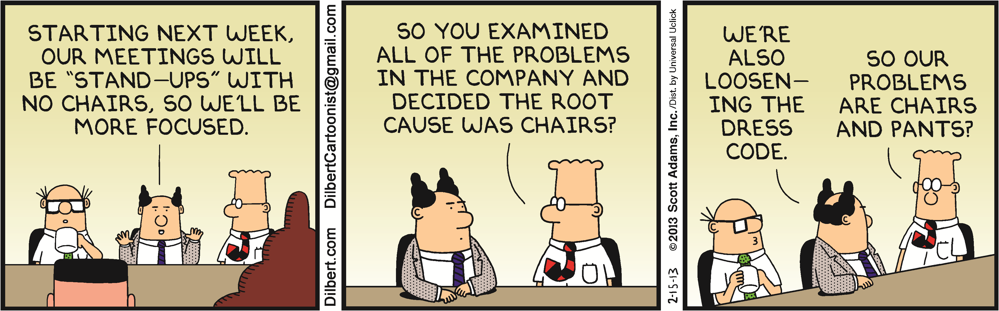

# Daily scrum

This is a 15 minute event done every day at the starting of the day. This event is for the development team and, of course, the Scrum master is there to help facilitate the event. Also, the product owner can attend the event. In development teams with a long experience in Scrum, Scrum master and product owner are not attending the daily Scrum most of the times.

>[!TIP]
> Although there are not titles in an Agile team, some developers are quite new and others are more experts. The people with low experience starts the Scrum, then the more experience for each sector - developers, designers, testers... - and so on up to the Principal Architect and Scrum master

So, this event is primary for the development team. To develop a habit of it, It is suggested that it is done at the same place and at the same time every day.

If you remember the [3 pillars of Scrum](../scrum/pillars.md), we said regular inspection and earlier adaptation are 2 of the 3 pillars. This event is the main implementation of those pillars.

Every morning the development team gets together and each member of the development team explains what he completed the day before and what is going to do today. If the person is facing any difficulty that is stopping the team to meet the sprint goal, that should be highlighted in this event, since it is the responsibility of the entire team to deliver the product increment.

If any person is facing any difficulty, the development team has to self-organize and ensure early adaptation.

You can also see that this event is like a self-inspection event for the development team. If after the daily Scrum event you see some members getting together, discussing, replanning and adapting, it means that this event is successful and it is doing its job.

However, if you see that the team members are reluctant to do the daily Scum or are not participating openly, the Scum master needs to intervene and teach the development team how to do the event properly.

A lot of teams which are not following the Scrum framework still take this as a practice.

This practice helps to build collaboration and team spirit, which increase the communication within the team.

