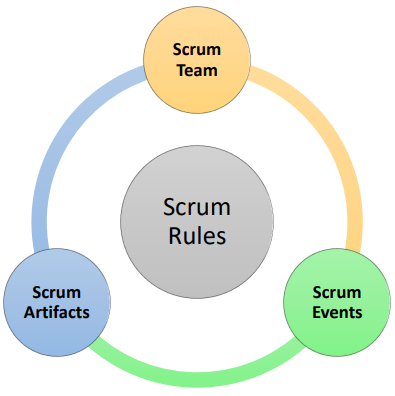

# Introduction to Scrum

Scrum is the most popular framework for software development. Scrum is not complicated and it is very easy to understand. Because yt has strict rules, it is a little difficult to implement in the beginning. Slowly, it becomes a habit and it is then that it leads to increase in productivity and creativity.

>[!NOTE]
> Scrum is a process framework used to manage product development and other knowledge work.

All development teams have some structure and some ways of getting and doing things. This structure or ways of doing things is called the **framework**.

Let me give you an example of a simple framework first before we discuss a biggest framework.

Suppose I lead a team of five developers, I go to discuss the product requirements with the business team. We make a list of changes and I come into the business team that we will deliver the product in 20 days. I will come back and assign work to developers and once the development is done, we hand over the product to the business team.

So, this entire process (how is development being structured,who meets the business team and when, what information is shared between business team and development team) is the framework for development.

Scrum is one such process framework. It has clear rules on how we should structure the team and what processes and techniques we should follow. So that, the development team continuously delivers improved product. Now, let us explorer the Scrum framework.

Scrum has 4 components: **Scrum team** which define the structure of the development team. Then we have **Scrum events**: they are regular events to ensure timely flow of information to, from and within the development team. **Scrum artifacts** are simply the list of things to be done, all things completed by the development team. The last component is the **Scrum rules**. Rules bind together these 3 components and govern the relationship and interaction among them. 