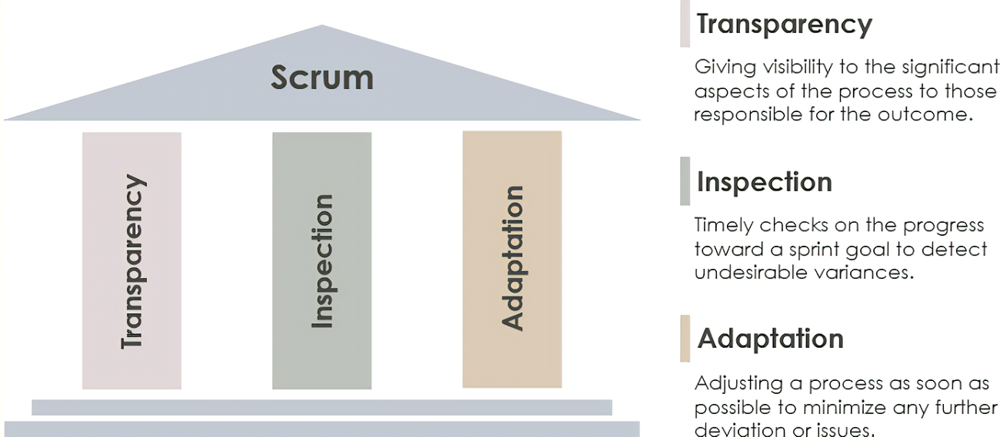

# 3 pillars of Scrum

Before we discuss each of the 3 framework components, I like to cover the 3 pillars of Scrum on which the Scrum framework is based upon. So, the 3 pillars are:

- transparency
- inspection
- adaptation

All the rules in Scrum framework try to increase transparency, ensure frequent inspection and allows early adjustments. So, there is a minimum deviation from the planned product.

## Transparency

Transparency means that all required information is available with the team performing the work and the understanding is clear among all parties. Development team should have clarity as to what is to be achieved. For example, A is the developer who is performing the task and B is someone who will be inspecting the final product. Both A and B should have a common definition of task completion.

So, Scrum tries to structure the team and include such events. So, all the relevant information flows properly. There is high transparency for the development team as well as the other stakeholders.

## Inspection

Inspection means regular monitoring of what is achieved and what is pending. The Scrum events and artifacts primarily aimed at this. So, inspection helps us identify any deviation from the intended final product. If there is any deviation, then we need to rectify it as early as possible and this is where the third pillar of adaptation comes in.

## Adaptation

We need to make adjustments as soon as possible to prevent further deviation.