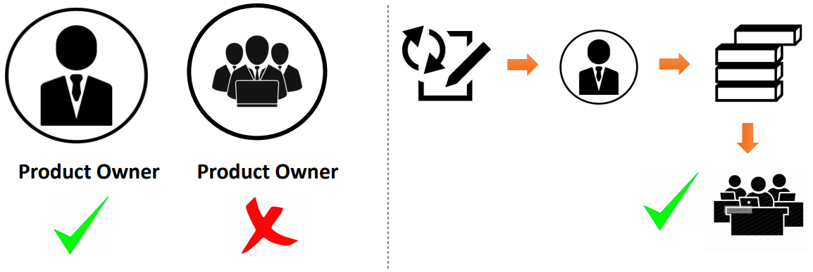

# Product owner

Imagine yourself as the product owner who is leading a development team. Suppose you are the product owner of Acme app. Under you, there is a developer team which consists of individuals who can do certain tasks. Now, your main responsibility is to maximize the total value of work done by the development team.

The practices you build for this may vary from organization to organization or person to person, but mainly this is done by ensuring transparency. One of the important things that a product owner is responsible for is maintaining the master list of pending tasks. This is also known as [product backlog](../agile/product_backlog.md), which is a **Scrum artifact**.

So, each item in the list should be clearly expressed. Then, the priority of each item that is ordering up the list is also the responsibility of the product owner. The list should be visible to the development team and the items on which the team will be working on next should be clear to the team.

Product owner must also ensure that the development team understands the tasks in the list.

Now, going back to the example, where you are the product owner of Acme shopping app, let us look at some examples that you might be getting.

**First task**: if a customer adds something in the shopping basket and leaves without paying, we want to send a reminder to that customer that there is a product in your basket for which payment is pending.

**Second task**: when a customer is adding an address, the city, state and postcode gets automatically filled based on the device's GPS location.

**Third task**: add an advertise banner of a sponsored product related to the last product searched by the customer.

There could be any number of pending tasks in the product backlog. So, it is your role to call it and clearly express all the separate requirements. For example for the first task, the more clearer we would be on the event of a closure, if there are products in the user basket, the user will receive an email or SMS after 10 minutes. So, this was one way of clearly expressing the requirements.

Then, you need to discuss the requirements with the stakeholders and order tasks in the order of their importance of priority. Also, you need to ensure that your team knows about the list and clearly understands each of these requirements.

With the responsibility, the organization must provide some authority to a product owner. In a Scrum team the authority is provided in this way: the product owner can only be a single person and not a group of people or a committee. Secondly, all changes to the product backlog must come through the product owner and no one can force the development team to work on a different set of requirements. The work is done by the product owner on the product backlog alone.

The product owner has sufficient authority and can successfully deliver on the responsibilities.
