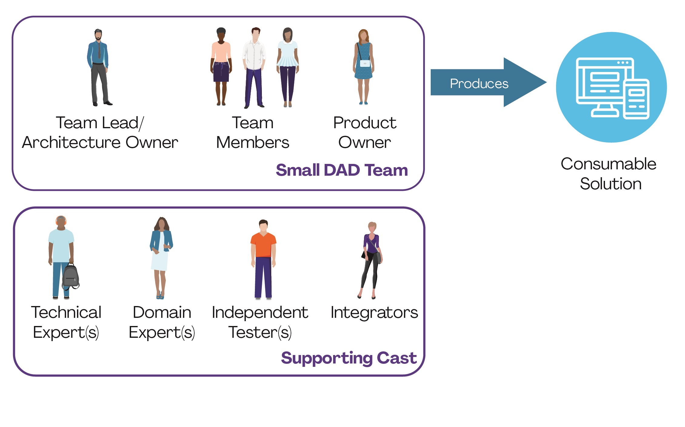
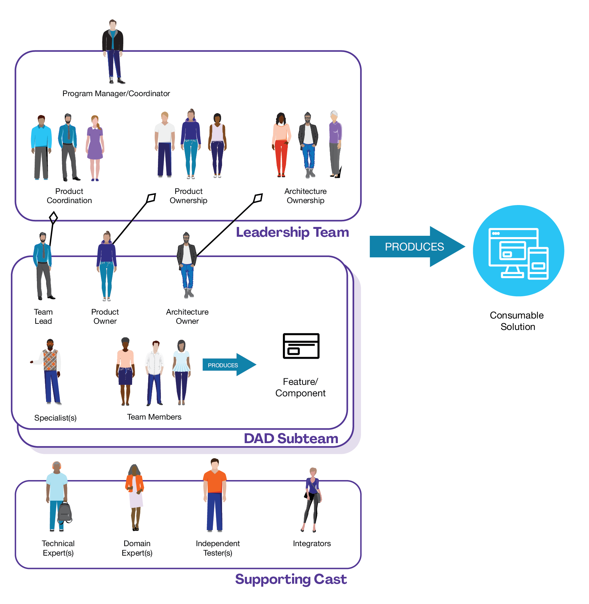

# Scrum Roles and responsibilities

In the Agile section, there is a document about the common [roles and responsibilities in an Agile team](../agile/roles-responsibilities.md).

Two common questions of people new to agile will ask include "what are the roles on an agile team?" and "how do you organize an agile team?" The goal of this article is to address these questions by examining how you would do so for a relatively small agile team, perhaps of 15 or less people, and for a large agile team, perhaps of 50 people or more. For teams in between these sizes you will need to tailor a solution somewhere in between.

The roles and organization structures described below are meant to be representative - your approach may differ slightly because you are in a different situation. But, if you think that your approach needs to be significantly different then you likely haven't yet fully given up on the thinking behind traditional IT roles and are likely putting your agile adoption at risk as a result. Also, this article does not address enterprise-level roles.

There are several key differences between the agile approach to team organization and the traditional approach.

- **Agile teams are "whole teams"**. Whole team is an Extreme Programming (XP) practice that advises you to have sufficient skills within the team itself to get the job done. The implication is that the development team has the requisite testing skills, database skills, user interface skills, and so on and does not rely on external experts or teams of experts for these sorts of things.
- **Agile teams are formed (mostly) of generalizing specialists**. A generalizing specialist, sometimes called a craftsperson, is someone who has one or more technical specialties (e.g. Java programming, project management, database administration, ...) so that they can contribute something of direct value to the team, has at least a general knowledge of software development and the business domain in which they work, and most importantly actively seeks to gain new skills in both their existing specialties as well as in other areas, including both technical and domain areas. Obviously novice IT professionals, and traditional IT professionals who are often specialized in just one area, will need to work towards this goal. Generalizing specialists are the sweet spot between the two extremes of specialists, people who know a lot about a narrow domain, and generalists who know a little about a wide range of topics.
- **Agile teams are stable**. Agilists understand that changing team structures -- this iteration Sally is part of the team but next iteration she's pulled off to help another team -- is detrimental to project success. We strive to keep our teams as stable as possible, a goal that is much easier to achieve if people are generalizing specialists.

## Small Agile Teams

There are several roles, which have different names depending on the methodology being followed, common to agile teams. Roles are not positions, any given person takes on one or more roles and can switch roles over time, and any given role may have zero or more people in it at any given point in a project. The common agile roles are:

- **Team lead**. This role, called "[Scrum Master](../scrum/scrum-master.md)" in [Scrum](../scrum/intro.md) or team coach or project lead in other methods, is responsible for facilitating the team, obtaining resources for it, and protecting it from problems. This role encompasses the soft skills of project management but not the technical ones such as planning and scheduling, activities which are better left to the team as a whole
- **Team member**. This role, sometimes referred to as developer or programmer, is responsible for the creation and delivery of a system. This includes modeling, programming, testing, and release activities, as well as others
- **Product owner**. The [product owner](../scrum/product-owner.md), called on-site customer in XP and **active stakeholder** in AM, represents the stakeholders. This is the one person responsible on a team (or sub-team for large projects) who is responsible for the prioritized work item list (called a [product backlog](../scrum/product-backlog.md) in Scrum), for making decisions in a timely manner, and for providing information in a timely manner
- **Stakeholder**. A stakeholder is anyone who is a direct user, indirect user, manager of users, senior manager, operations staff member, the "gold owner" who funds the project, support (help desk) staff member, auditors, your program/portfolio manager, developers working on other systems that integrate or interact with the one under development, or maintenance professionals potentially affected by the development and/or deployment of a software project.

This is an overviews of the structure of a small agile team. What you typically read about in the agile literature is how a team of developers, lead by the team lead, works closely with a [product owner](../scrum/product-owner.md) to build a high-quality working system on an incremental basis. What you don't hear about as often is what I call the "supporting cast":

- **Technical experts**. Sometimes the team needs the help of technical experts, such as build masters to set up their build scripts or an **Agile DBA** to help design and test their database. Technical experts are brought in on an as-needed, temporary basis, to help the team overcome a difficult problem and to transfer their skills to one or more developers on the team

- **Domain experts**. As you can see in image above the product owner represents a wide range of stakeholders, not just end users, and in practice it isn't reasonable to expect them to be experts at every single nuance in your domain. As a result the product owner will sometimes bring in domain experts to work with the team, perhaps a tax expert to explain the details of a requirement or the sponsoring executive to explain the vision for the project.
- **Independent tester**. Effective agile teams often have an independent test team working in parallel that validates their work throughout the lifecycle. This is an optional role, typically adopted only on very complex projects (or at scale).

## Large Agile Teams

When the size of an agile team gets to be around twenty or more you discover that you need to divide and conquer and take a "team of teams" approach. The typical strategy is to organize your larger team into a collection of smaller teams, and the most effective way to do so is around the architecture of your system,. Each subteam should be responsible for one or more subsystems, enabling them to work as a small agile team responsible for delivering working software on a timely basis. This strategy is often referred to as Conway's Law after Melvin Conway who introduced it in the late 1960s, and is one of several **lean development governance** strategies.

The additional roles on agile teams at scale include:

- **Architecture owner**. This person is responsible for facilitating architectural decisions on a sub-team and is part of the architecture owner team which is responsible for overall architectural direction of the project. The architecture owner leads their sub-team through initial **architecture envisioning** for their sub-systems and will be involved with the initial architecture envisioning for the system as a whole. Architecture owners are different than traditional architects in that they are not solely responsible for setting the architectural direction but instead facilitate its creation and evolution.
- **Integrator**. The subteams are typically responsible for one or more subsystems, and the larger the overall team generally the larger and more complicated the system being built. In these situations the overall team may require one or more people in the role of integrator who are responsible for building the entire system from its various subsystems. These people often work closely with the independent test team, if there is one, who will want to perform system integration testing regularly throughout the project.

As in the picture above indicates, on large agile teams you need to coordinate several critical issues.

### Project management activities

At scale it isn't sufficient to simply focus on project leadership and allow self-organization to address the technical aspects of project management. This may work on the individual subteams, but across the entire project/program the technical aspects of **project management**, such as dependency management, contract management, resource tracking, vendor management become critical. The project management team of the figure above, sometimes called the program management team, is comprised of the team leads from the various subteams. Their goal is to coordinate the management aspects of the overall team. This team is likely to have a short coordination meeting each day, referred to as a "scrum of scrums" in the Scrum methodology, where current status is shared and issues are identified.

### Technical/architectural issues

The architecture ownership team is comprised of the architecture owners from the subteams and is responsible for **architecture envisioning** at the beginning of the project to identify the initial technical direction and provide a basis for organizing the subteams. In the first week or so of the project (sometimes several weeks on more complex projects) their goal is to identify the subsystems and their interfaces, a strategy called "managing to the seams", reducing the coupling between subsystems and thereby reducing the amount of coordination required by subteams. Once the interfaces are well defined it is possible for the individual subteams to focus on implementing the innards of those subsystems. Throughout the project this team will meet on a regular basis to share ideas and resolve technical issues, particularly those surrounding changes to the interfaces of subsystems. They may choose to meet daily, this is particularly common at the beginning of the project, but as the architecture stabilizes it is common to see them meet once or twice a week.

### Requirements/product ownership issues

The product ownership team is comprised of the product owners of each subteam and is responsible for coordinating the requirements effort across the subteams. They will need to negotiate requirements with the larger body of stakeholders whom they represent and divvy them out among the subteams appropriately. They'll also need to negotiate the inevitable disputes between subteams as to who should do what and what a requirement actually means. They also manage the requirements dependencies between subteams and strive to minimize overlapping work between subteams.

### System integration

System integration is important for any size of project team, but it is often absolutely critical on large teams (which often address complex problems). The complexities of large project often necessitate the addition of a system integrator, or several (sometimes called build masters), to the team. System integration occurs throughout the entire **Agile lifecycle**, not just at the end of the project during the system integration test phase of a traditional project. During the first development iteration, called the "**Elaboration phase**" in the Unified Process, an important goal is for the subteams to create mocks of their subsystems according to the interface specifications agreed to earlier. 

The goal is to do a complete, end-to-end build of the mocked out system to ensure that the subteams are working to the same technical vision. You'll undoubtedly discover that you need to evolve the interfaces a fair bit at this point as you run into technical issues that you hadn't thought through during Iteration 0. There are several advantages for making mockups of the subsystems available early in the project. 

First, the individual subteams can now move forward on their own work with few dependencies on the other subteams. Each team will evolve their subsystems throughout the project, replacing the mocked out portions of code with real working code. These new versions are made available to the other subteams, who in turn will choose when they want to integrate these new versions into their own environments. In my experience earlier is better than later but you want to wait until you know that new versions are stable, one of the advantages of having an independent test team, until you integrate it into your own work. 

Second, your independent testing team can now test against the entire build as they see fit. Granted, at first they only have mockups of the system but they can at least start organizing their test framework(s) for the system at this time. Third, you can similarly put together your integration framework to support your continuous integration efforts across the entire system as well as integration efforts on individual subteams. Fourth, individual subteams will promote their code after they've tested it within their own environments. 

On large-scale agile teams these new subsystem builds are often vetted by your independent testing team before they're made available to the other subteams, a process that should be done quickly and often. The test team will often do a full system integration test, something that may be difficult for subteams to do due to timing considerations (integration tests often take a long time to run) or due to resource restrictions (the test team typically has a more sophisticated platform to test on). Subteams may choose to use pre-approved subsystems at their own risk, depending on your organization's culture.

#### Some observations

- An Agile DBA and a user experience expert have become members of the subteam. These roles are examples of a general need by some subteams to include some technical experts that are specialized in a given activity. By organizing the teams around the architecture some subteams become focused on certain aspects of the overall system and as a result it can make sense to include some "overly specialized" people to address the specific aspects of the subcomponents being addressed by the subteam.
- As the size of the team grows, there is very little difference in the day-to-day activities of developers. They are insulated from the complexities of large teams by activities of the coordinators and may not even know that this is occurring.

## Where Did All the Traditional Roles Go?

As you saw in the figures above many of the traditional job roles, such as project manager, business analyst, and designer (to name a few) are disappeared. The leadership activities of project manager are taken on by the team coach and many of the technical skills are performed by members of the team through self organization. **Agile analysis** occurs, but instead of being performed by specialized **business analysts** it is instead taken on by product owners (many BAs choose to **transition to the role of product owner**) and developers collaboratively. **Agile design** occurs, but instead of being performed by a specialized designer it is instead performed by agile developers who may or may not be led by an architecture owner.

The point is that although the roles may have changed that the activities taken on my traditional roles are still occurring. This isn't completely accurate, what's really happening is that the goals addressed by the activities taken on by people in traditional roles are now being addressed by activities taken on by people in agile roles.

For example, the details behind requirements are being explored but they're being done so in an agile manner by product owners and developers instead of in a traditional manner by business analysts. This can be disconcerting at first, particularly if it goes against the training and education which you've received over the years and more importantly against the belief system that you've built up based on your traditional experiences. Moving to agile requires a paradigm shift, and part of that shift is the acceptance that the project roles have changed (for the better).
