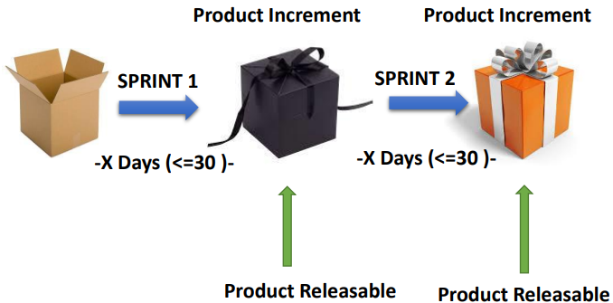

# Sprint

Let see an example. Suppose you are the product owner of the Acme app and you have a meeting with the business team. The business team gives a list of tasks to be done. Based on the list, you estimate that the development time to be 40 days for creating the next releasable version of the app. For the next 40 days, the development team works on that list and you deliver the product. Then, you again have a meeting with the business team. Look at the list, give them your timeline and so on.

Do you think this is an Agile approach for the development team? Do you think they think that this is an efficient way of development?

I have seen organizations work like this and it is just chaotic. It is chaotic for both, the development team as well as for the business team. So, to bring order to this chaos, the major change brought by Scrum is to bring regularity.

So, instead of making a list of tasks first and then deciding the timeline to complete the list, we first set the timeline and we see that a new version of the product will be delivered every `x` days. `x` is usually 15 or, maximum, 30 days. But a new version which is ab improvement over the previous version, must be ready every `x` days because the new version is an improvement, it is called **product increment**.

Another thing to note is that new version must be potentially releasable. That means that technically the product should be ready to go into the production at the end of the `x` days. Whether it is made live or not, it is a business decision and does not impact the work of the Scrum team.

So, this spirit of expertise is called a **sprint** and as soon as one sprint and the next sprint begins.

As you can see in the picture above, the first increment of the product is done through sprint one. The second increment of the product is done through sprint two.

The other 4 sprint events that [sprint planning](../scrum/sprint-planning.md), [daily Scrum](../scrum/daily-scrum.md), [sprint review](../scrum/sprint-review.md) and [retrospective](../scrum/sprint-retrospective.md), all these happen within each sprint.

## Why should a sprint be 15 or 30 days?

If we have a longer time frame, the probability of any requirement changing increases, which may increase the complexity for the development team. The agenda is to have a small timeline during which the development goal is fixed to enhance predictability.

## Cancel a sprint

Suppose your team is working on a set of goals in a sprint and you are already a few days into the sprint. Now, suddenly, the government passed a bill and the regulation in the country has to change accordingly. The business needs to take a new course. So, the goals that the team was working on, now become obsolete. There is no point in working on them anymore.

In such a situation, a product owner has the authority to cancel an ongoing sprint. So, you do change in the market or technology on the regulatory environment. If the sprint goal become useless, it is possible to cancel the sprint. However, as product owner, one must be aware that events such as sprint cancellation can be hard on the development team. 

In fact, the reason for keeping small duration for a sprint is that there will not be any major change during the duration and the development team will be able to work with clarity. If such an event occurs, the team needs to regroup and replan, and the product owner must also let the team knows about the new direction the organization will be taking related to the product.
