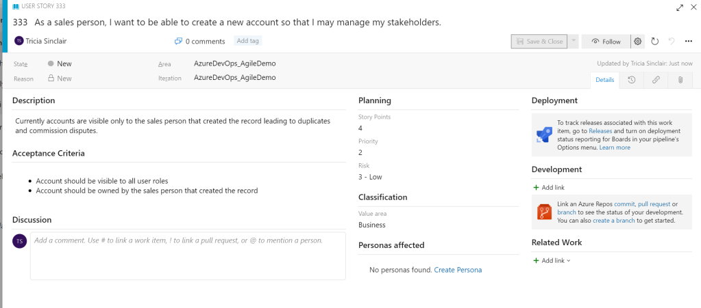
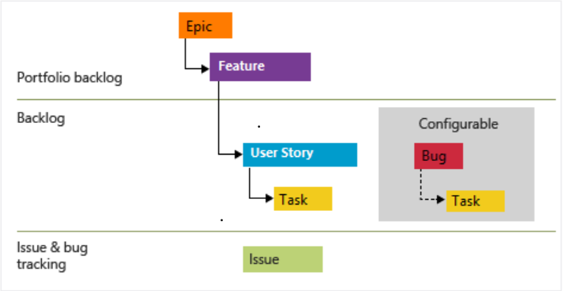

# Agile process

There are two process which are based on the agile methodology within Azure DevOps. The Agile and Scrum processes are similar but there are key differences. This blog specifically aims to provide an overview of the agile process.

The agile process is based on agile principles and allows users to track user stories and tasks at a more granular level than the Scrum process.

The work items of note which are available as a part of the agile process are.

## Epics

Epics within the Agile process are the same as Epics within the Basic and CMMI process. They contain the high level process of what is to be delivered. An example of this would be the delivery of different channels e.g phone or chat within a call centre.

## Feature

Features are a grouping of functionality that provides business value when delivered. The Feature work item is the same as when used in a CMMI process. E.g telephony integration and call verification features would be required in order to deliver an epic related to the delivery of a telephone channel in a call centre.

## User Story

First, user Stories work items are meant to capture the description of what is expected from the end user. User stories are typically captured in the format

> As a [user role], I want [goal] so that [defined reason]. 

The user story work item also prompts for the acceptance criteria to be defined. The acceptance criteria documented in the user story is extremely important, as testers and developers rely on what is documented here to create test cases and solution designs.

## Task

As with the CMMI process, a task defines what needs to be completed in order to complete the user story. An example of a task which could be associated with the above requirement could be to create the credit limit field on the contact record. (Assuming you’re using a CDS database the name, address and date of birth fields should already exist).
Issue

The Issue work item in the agile process has the same purpose as the work item in the CMMI process. It relates to project related problems, allowing a resolution and plan to be available and visible to those within the project that need to have access to the information.

## Useful fields

Some of the key fields to be aware of within the agile process are:

### Story Points

Story Points are associated to user stories to indicates the effort needed to complete the user story. Populating this field allows the velocity to be tracked and enables the standard forecasting functionality.

### Acceptance Criteria

The acceptance criteria attribute available on the user story work item allows users to define what conditions must be met in order for the user story to be accepted.

### Priority

Setting the priority allows product owners to share what is important for the business and ensures that the user stories with the highest priorities are delivered quicker than those with a lower priority.

If you have been following this series of blogs, you may notice that the Agile process shares many work items with the CMMI process. The image below shows how work items are different between the two processes.

