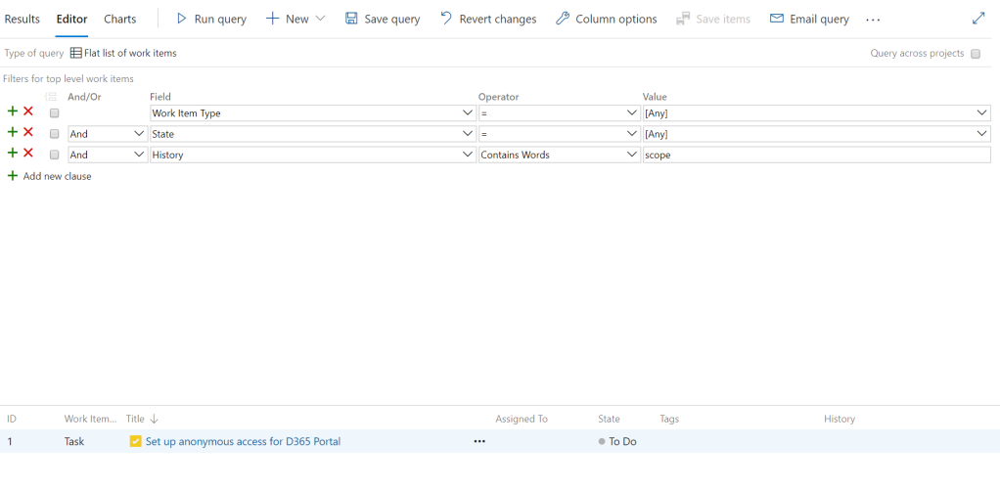
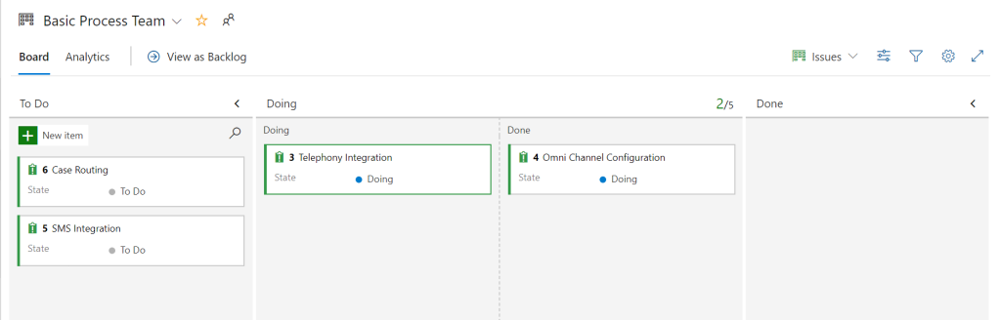
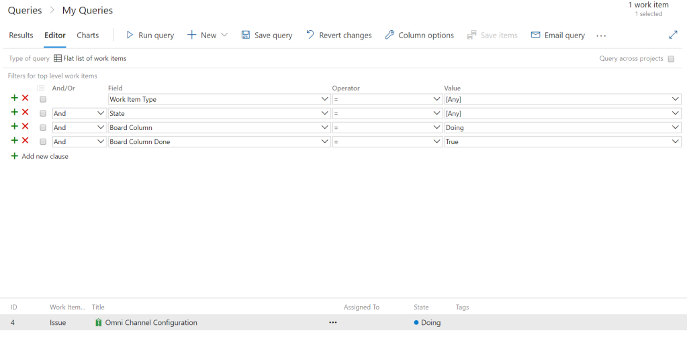
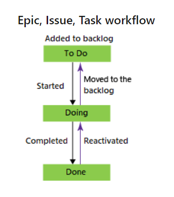

# Basic process

First, each standard process provides different work items which allows users to track work in different ways.

## Epics

Now, epics are considered the top of the hierarchy within Azure DevOps. As such this work item really defines the process at a high level and what features this may include.

## Issues

So, epics can have one or more associated issues. Issues, when using the basic process is not meant in the context of a problem. Instead it is to group at a high level what needs to be accomplished in order to achieve the epic.

## Task

Now, a task is meant to be associated to Issues to define at a low level. A task needs to be done in order to close the defined issues.

Also, each work item has a list of available attributes/fields. Interestingly enough, not all fields which are available are added to the work item form. Therefore, it’s definitely advisable to check that a field exists for what you need before creating another one. Here are the defined lists of fields available for the epic, issue and task work items: [Basic Process Available Fields](https://docs.microsoft.com/en-us/azure/devops/boards/work-items/guidance/basic-field-reference?toc=%2Fazure%2Fdevops%2Fboards%2Ftoc.json&bc=%2Fazure%2Fdevops%2Fboards%2Fbreadcrumb%2Ftoc.json&view=azure-devops).

## Useful fields

### History

Each work item has a discussion area to allow comments related to the work item. The discussion area contains timestamped records of each comment made by each user. The comments are saved in the history field and can be used in queries in Azure DevOps.

### Board Column and Board Column Done

A feature available within the Azure DevOps Kanban boards is the ability to split columns. This allows greater flexibility in team members. Specifying, the work has been completed or that work has begun in the next stage of the process.

Therefore, the Board Column attribute allows us to view work items within the specified board column. However, the Board Column Done attribute shows us work items which have been moved to the done column. This happens when split columns has been activated.

As each work item progresses, they go through different states. The states available by default differ based on the process selected. The basic process has only three states – To Do, Doing and Done.

Each state also has a reason which adds some more clarity about the state of the work item. For e.g a task that has just been added will default to a stage of To Do but will have a reason of Added to Backlog, when the Task is moved to Doing, the reason changes to started. If the task is moved back to a state of to do, the reason will not revert to added to backlog but will instead be moved to the backlog.

The states and workflows, like the work item attributes and forms can be customized. This will be covered in a later blog where we detail how work items can be customized.
