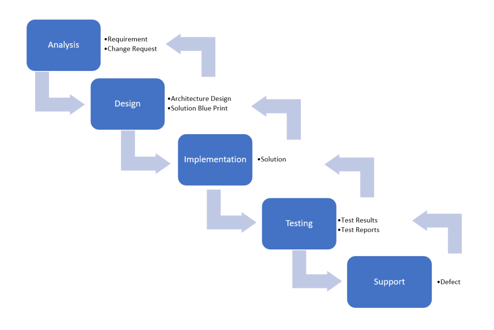
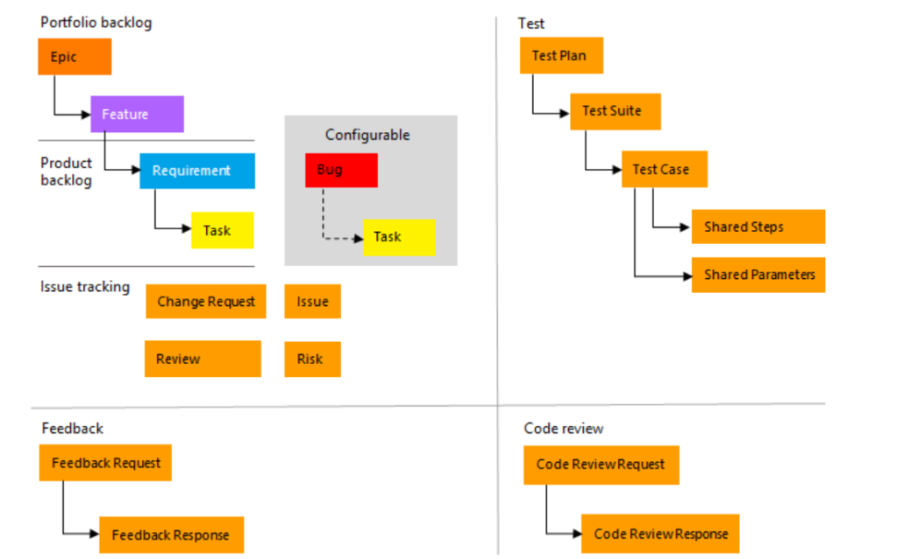
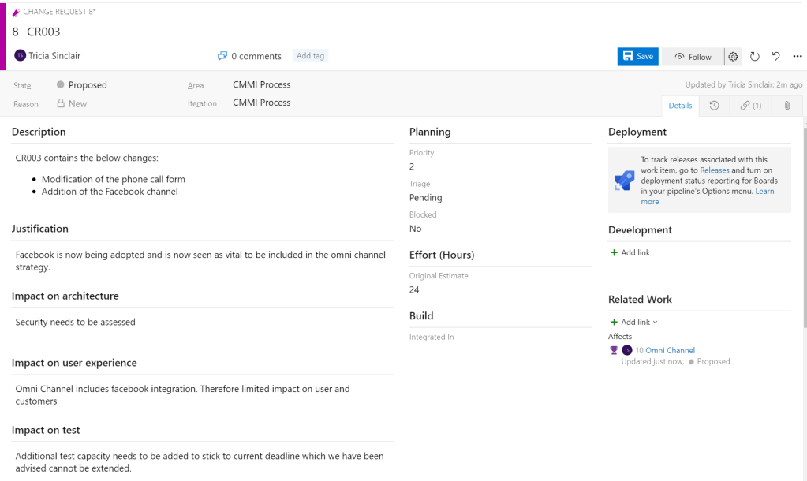
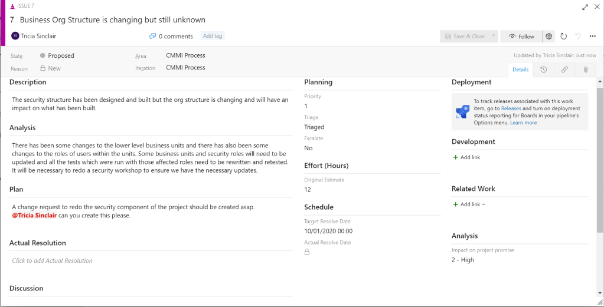

# CMMI process

The CMMI (Capability Maturity Model Index) process closely aligns to the waterfall methodology. The CMMI process within Azure DevOps is based on a guide published by the Software Engineering Institute called CMMI for Development: Guidelines for Process Integration and Product Improvement (SEI Series in Software Engineering).

The below image displays the typical stages and outputs within a standard waterfall project. As you read further into the blog, you will notice that the stages are similar to the states available within key work items in the CMMI process and that the terminology used to describe work items are also a close match to the standard waterfall methodology.

The work items available within the CMMI process are shown in the image below and described further on:

## Epics

Now, epics within the CMMI process are the same as Epics within the Basic process. They contain the high level process of what is to be delivered. An example of this would be the delivery of different channels e.g phone or chat within a call centre.

## Features

I explain how epics contain one or more features. Features allows the definition of different focus points which must be delivered in order for the epic to be delivered. E.g telephony integration and call verification features would be required in order to deliver an epic related to the delivery of a telephone channel in a call centre.

## Requirements

Requirements describe the needs of the business and also defines what is required for the feature to be completed. They can be associated to one or more Features. It should be noted that a requirement is not a feature and should contain enough information for both testers and developers to understand the business need and what the system is expected to do to satisfy the need.

Requirements which define how the system will satisfy the need reduces the flexibility of designing the system and may create issues later in the project as technically and strictly speaking, changing how the requirement is implemented would mean that a change request should be generated.

## Tasks

Tasks provide a breakdown of what needs to be completed in order to complete a requirement. An example of a task which could be associated with the above requirement could be to create the credit limit field on the contact record. (Assuming you’re using a CDS database the name, address and date of birth fields should already exist).

## Change Requests

Deviations from the agreed scope, should be logged as a change request. The CMMI process provides a work item which can be associated to the original requirement/s or feature/s being affected by the change and also allows the impact of the change to be documented. The below image shows an example of the change request work item.

## Review

The review work item allows users to document meetings within Azure DevOps. These could be review meetings, design meetings or even team meetings. Attendees who are also Azure DevOps users can be selected and other work items which was discussed within the meeting associated for reference. This work item is only available by default with the CMMI process template.

## Issue

The issue work item available within the CMMI process template relates to project related problems and is not the same issue work item used within the Basic process template.

The CMMI issue work item allows users to describe the issue as well as detail the corrective actions needed to resolve the issue.

## Risk

No project is without risks. Within the CMMI process, these risks can be logged and tracked associated if necessary to the work items it relates to. Within the risk work item users are able to describe the risk, specify the probability as well as make contingency plans that allows everyone (with access) to know what to do in the event that this risk becomes an issue.

Each of these work items have defined standard fields. However, there are also fields available which may not be on the form. The list of available fields which are available within the CMMI process template can be accessed via [Microsoft’s Work Item field index page](https://docs.microsoft.com/en-us/azure/devops/boards/work-items/guidance/work-item-field?view=azure-devops). Additional information related to specified work items can also be found on the:

- [Review Meeting Field Reference page](https://docs.microsoft.com/en-us/azure/devops/boards/work-items/guidance/cmmi/guidance-review-meeting-field-reference-cmmi?view=azure-devops)
- [Change Request Field Reference page](https://docs.microsoft.com/en-us/azure/devops/boards/work-items/guidance/cmmi/guidance-change-request-field-reference-cmmi?view=azure-devops)
- [Requirement Field Reference page](https://docs.microsoft.com/en-us/azure/devops/boards/work-items/guidance/cmmi/guidance-requirements-field-reference-cmmi?view=azure-devops)

## Useful fields

There are some fields which tend to be under the radar but which are really useful during a project if used correctly.

### Activity

The activity field is available on the Task work item and dictates the type of work being completed. E.g. the activity could relate to design, testing, documentation or development. This field ties closely to assessing the capacity of team members as team members can be assigned an amount of time for each activity. Populating the activity field on the task provides visibility of how much time has is needed for each type of activity. Previously, the activity field could not be modified in Azure DevOps. However, this is no longer the case. Values can be added/removed from this field without affecting the ability to view the capacity as previously described.

### Triage

The triage field is available on the Bug, Change Request, Epic, Feature, Issue, Requirement and Task work item. When the work item is in a state of proposed, this field provides directions on what needs to be done. For e.g. A list of requirements which have been created during analysis may need to be reviewed before the analysis stage is complete. This field allows the team to have visibility of which requirements are pending information or has not yet been reviewed.

### Committed

Requirements are often created in Azure DevOps before a decision is made on whether the business wishes to include them or not as this aids collaboration and allows an informed decision which can be looked back on if necessary. The committed field specifies if the requirement is within the scope of the project.

### Blocked

Blocked is a standard field available on the Bug, Change Request, Requirement, Risk and Task work item and states that no progress can be made on the work item. An issue could be created and associated to the work item at this point. However, this is a suggested business process and not enforced by Azure DevOps.

### Subject Matter Expert

Who are the subject matter experts to refer to in the business if there are questions related to a requirement? The Subject Matter Expert fields allows users to specify one or more team members to be consulted if necessary about the associated requirement. The team members specified must exist as users within Azure DevOps.

### Task Type

The task type field is available on both the task and bug work item. It allows users to track work which was planned within the project vs work which has been added retrospectively to correct or mitigate issues.

There are two additional work item templates available within Azure DevOps. The Agile Process and the Scrum Process.
