# Customization

## Color code for cards

Now, another customization is change the color of the work item based on the priority. So, click on the gear on the top right and Azure DevOps sows a popup window like in the following screenshot.

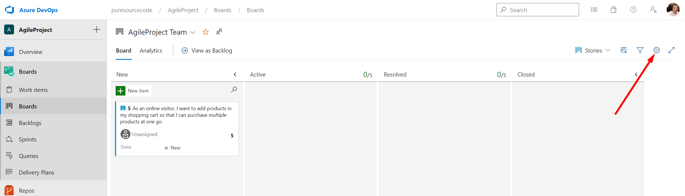

Now, on the left hand-side, click on `Styles` and then click on `+ Styling rule`.

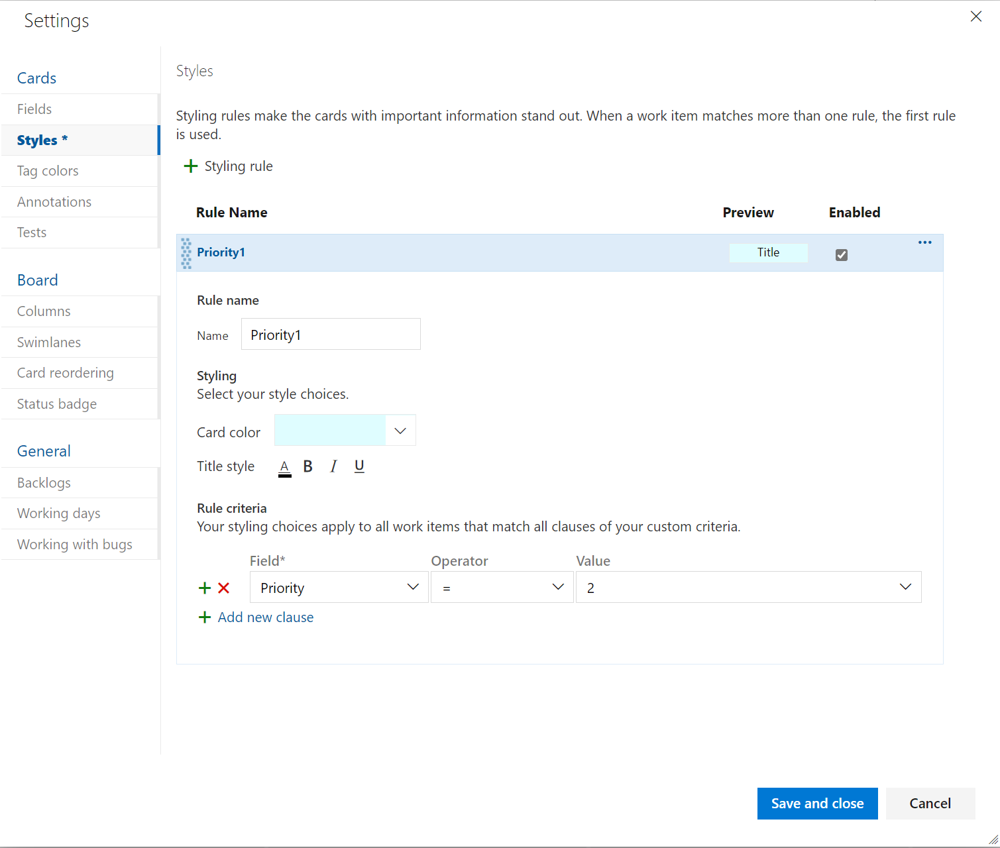

Give a `Name` to the rule, select a color you like and then define the criteria. For example, in the screenshot above, I want to change the background color for the work item with `Priority equals 2`.

## Color code for tags

One common issue is about work item blocked. For that, we can use `Tags` to mark a work item as `Blocked`. Open a task.

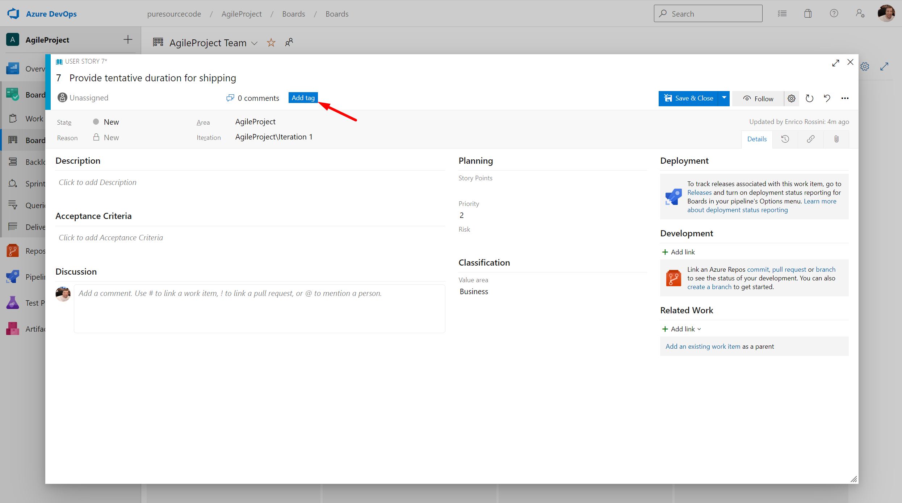

On the top, click on `Add tag` and type, for example, `Blocked`. Them, save. Now, the tag will be available on the general list.

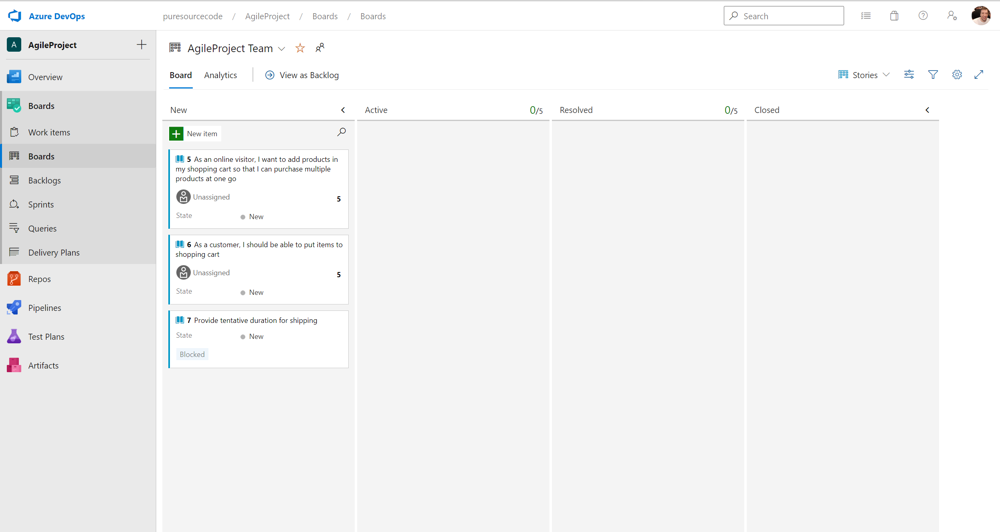

As a result, you see all the work items now but the tag `Blocked` is not very visible. So, click on the gear on the top right and Azure DevOps sows a popup window like in the following screenshot.

Now, on the left hand-side , click on `Tag colors` and then on `+ Tag color`.

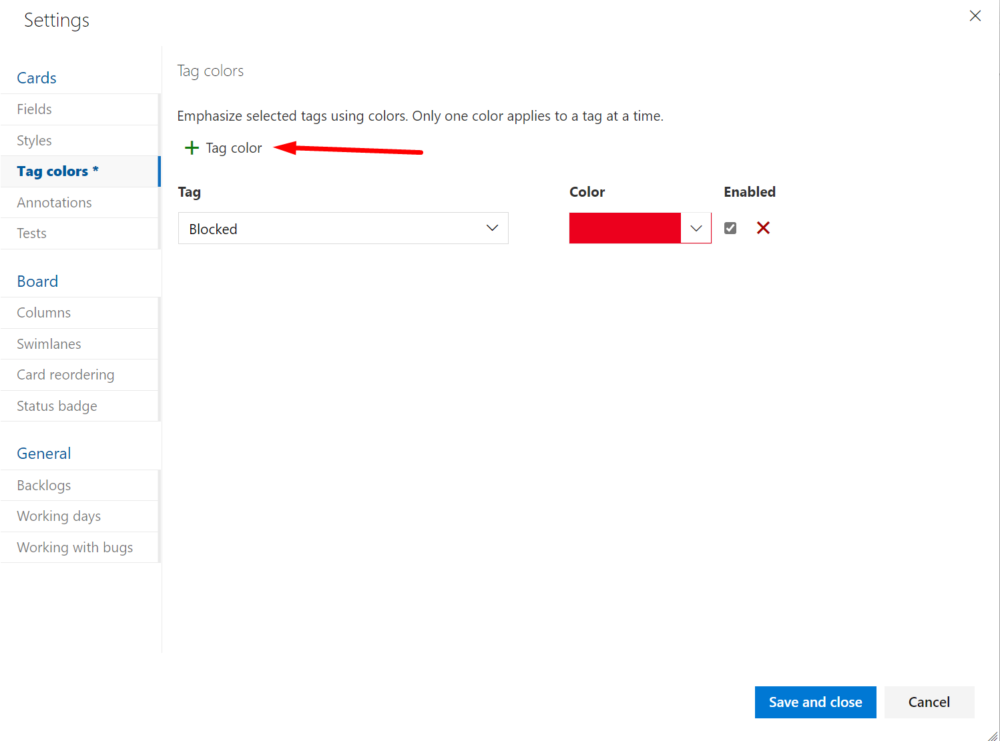

Here, you can select the tag and the color you want to show and then `Save`.

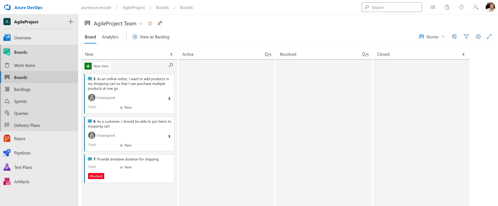

I think now it is much easier to detect what work items are blocked.

## Create a template for a work item

Sometimes you have to write a lot of [user stories](../../agile/user-story.md) (or tasks) but the structure is the same. For this reason, Azure DevOps allows you to create templates for the work items. For example, you have an User Story created in the correct way. Now, you want to use this user story as a template for the new ones.

So, open the User story, click on the dots `...` on the top right, then go to `Templates` and then click on `Capture...` 

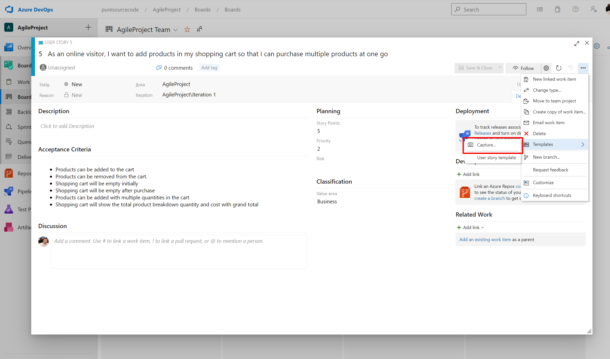

Now, Azure Devops will open a new popup window with all the details of the work item. You have to select the `Team` this template is creating for, the `Name` and an optional description. Then, you can change the list of fields you want to insert in the template and also change the `Value`. When you are happy, click on `Save`.

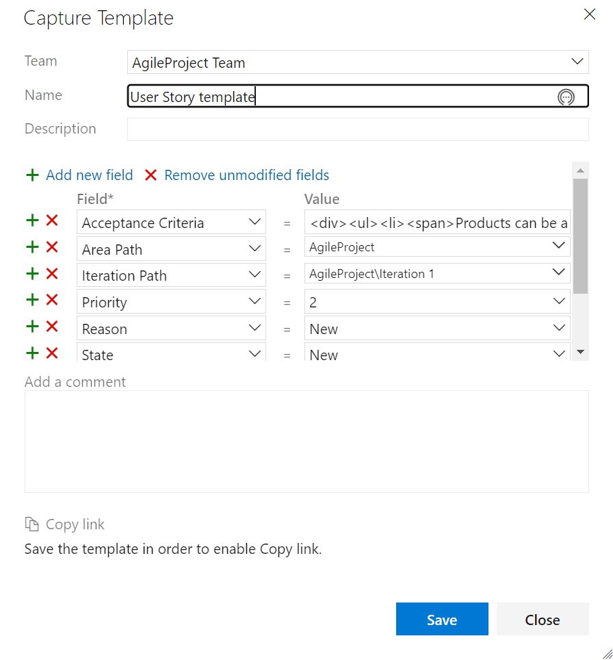

Next is how to use the template. Open a new work item and it is empty. Now, click again on the three dots `...` on the top right, `Templates` and under `Capture...` you see the templates you are available to use (in the screenshot below there is only one called `User Story template`).

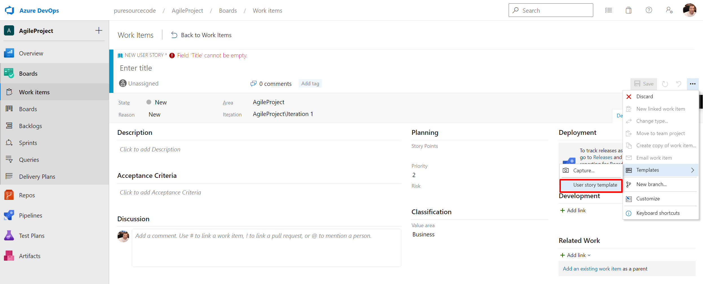

Click on it and all the fields are populated automatically.

## Dashboard columns

Often, we want to customize the columns to add or rename some of them for example. So, click on the gear on the top right and Azure DevOps shows a popup window like in the following screenshot.

In this section, we can add or rename columns. Also, for [Kanban](../../kanban/index.md), we can define the maximum number of tasks (alias [work in progress WIP](../../kanban/kanban-board.md)) for each column and re-order the columns.

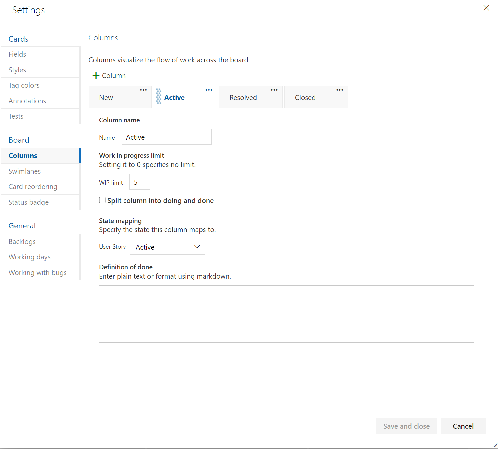

For example, I like to rename the `Active` tab in `In development`. As we spoke in the [Kanban](../../kanban/kanban-board.md) section, we like to have two columns for each step. For example, in the new column `In development`, I like to have `Doing` and `Done` subcolumns. There is an option for it called `Split column into doing and done`. The result is in the following screenshot.

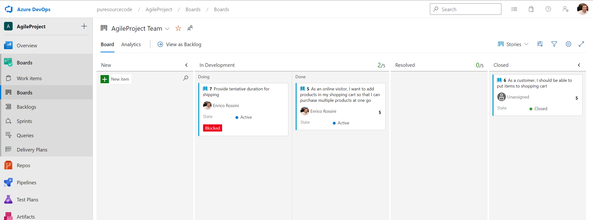

### Add Definition of Done

In the post about [Definition of Done](../../kanban/definition-of-done.md) for [Kanban](../../kanban/index.md), we talked about having the definition we decided for each column easy to read. So, Azure DevOps allows us to add this definition in each column. For that, we can use Markdown.

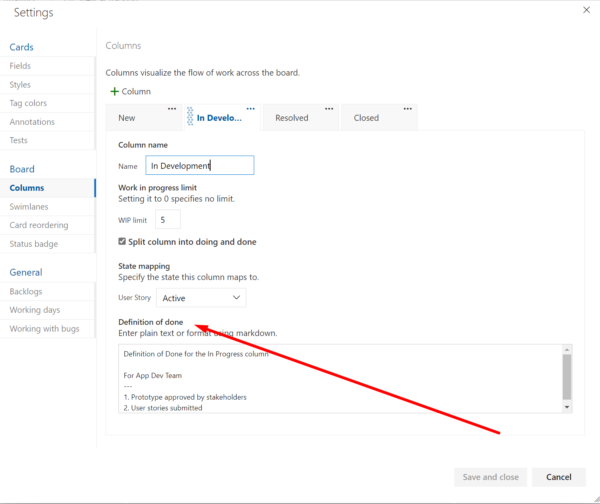

If a Definition Of Done is added to the column, every user can read the text moving the mouse on the `?` in every column.

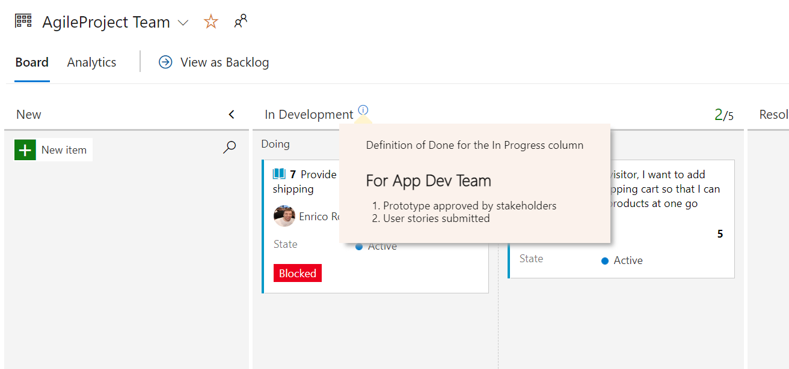

## Display more fields in the Dashboard for User story

Out of the box a User Story is displayed like the following screenshot.

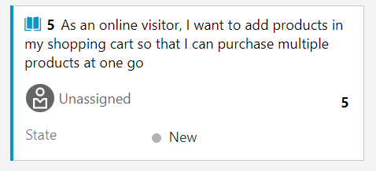

Sometimes it is useful to see more information about a work item. So, it is easy to customize this view. Click on the gear on the top right.

Now, DevOps shows a new popup window with some configurations.

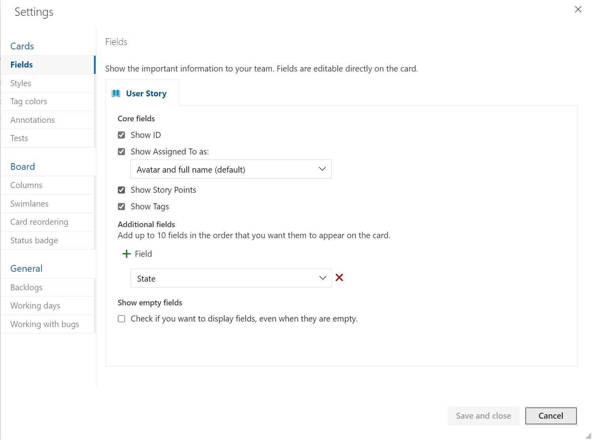

For example, I like to see who created the user story. For that, you can click on the `+ Field` button and select from the list the field ot fields you want to display.

Save your changes and immediately the dashboard will change showing the new details. You can change the details you add with a simple click.

## Swimlane

An example is you want to highlight the work items must be delivered. I want to add a section at the top of the board for those work items. So, click on the gear on the top right and Azure DevOps shows a popup window like in the following screenshot.

In the section `Swimlanes`, we can add one or more of them just adding the name.

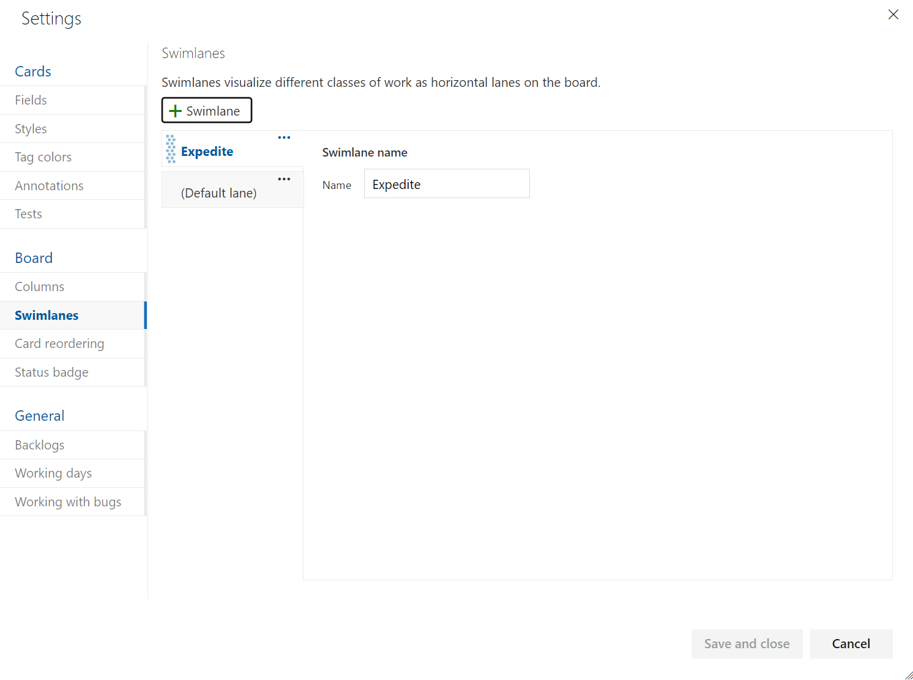

After saving, you see the swimlanes at the top of the dashboard and you can move the most important work items for example.

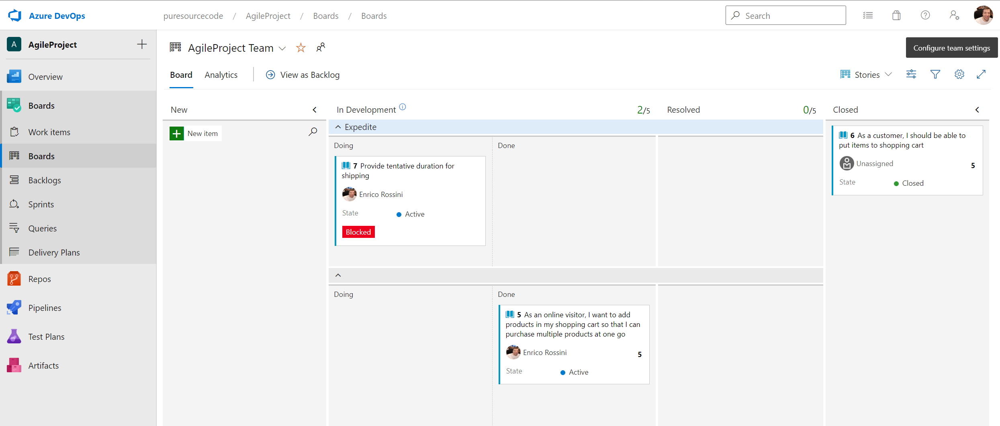