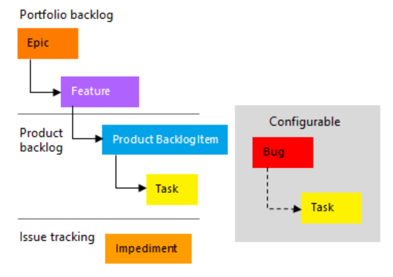
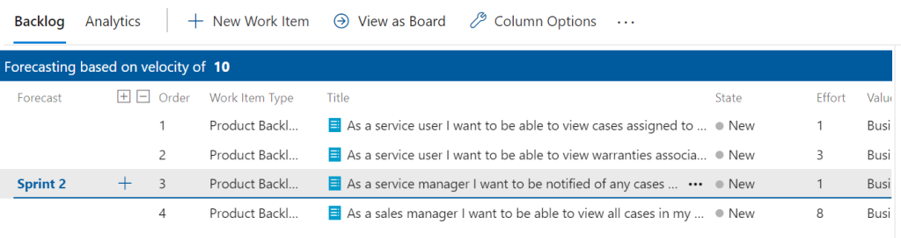

# Scrum process

The final process left to cover in this series of blogs is the Scrum process. In my previous blogs, I’ve detailed the differences between the Scrum and Agile process. This blog will provide an overview of the scrum process template.

The Scrum process in Azure DevOps closely resembles the agile process. However, there are key differences. The Scrum process aligns to the Scrum framework and allows:

- Product Owners to manage their Product Backlog. This includes setting the priority, order and business importance for each product backlog item.
- The Development team to review work to be completed using tools such as the Sprint and Kanban board as well as the Sprint Backlog.
- Having sprint planning and retrospectives using third party add-ons. I find this useful for teams which are not co-located

Information about the scrum framework can be found on the [scrum.org website](https://www.scrum.org/resources/what-is-scrum).

To manage scrum projects, users are able to create different work items provided in the scrum process template. The work items available in the scrum process are.

## Epic

These are meant to contain details of the high level process being delivered. An example of a typical epic could be “Warranty Management”. The development team would be aware that warranty management may be needed but will require detailed requirements (created as product backlog items) in order to estimate and ultimately deliver the epic.

## Feature

Features are a groupings of functionality that provide business value when delivered. Product Backlog Items which are focused on delivering the same functionality would likely belong to a feature. Creating and using available warranties could each by features associated to the epic described previously.

## Product Backlog Item

Product Backlog Items define the detailed needs of a customer. These are typically written using the format:

> As a [user role], I want [goal] so that [defined reason] 

and should have clear and unambiguous acceptance criteria defined. These work items should be created and owned by the product owner.

## Task

A task defines what needs to be completed in order to complete the product backlog item. An example of a task which could be associated with the above product backlog could be to create the create a warranty entity/table.

## Impediment

Impediments in the scrum process allows the team to keep track of anything that is affecting their productivity or efficiency.

## Useful fields

The work items described above contain fields which should be noted. Some of the key fields to be aware of within the Scrum process are:

### Priority

Setting the priority allows product owners to share what is important for the business and ensures that the product backlog items with the highest priorities are delivered quicker than those with a lower priority.

### Effort

The effort of a product backlog item can be defined to allow the scrum team to analyse if an item can be delivered within a sprint or even if the backlog item needs to be broken down further. The effort defined does not tend to relate to time. Instead, other strategies such as planning poker using the Fibonacci sequence can be used to populate the effort field. When the effort is populated, the product backlog will use the velocity, the requested order and the effort to show product backlog items which can naturally fit into the sprint.

### Business Value

The business value field allows the product owner to define how much value the item has to the company. An item that is assigned a higher number should be considered as having more business value than an item that is assigned a lower number.

### Acceptance Criteria

The acceptance criteria attribute available on the product backlog item work item allows users to define what conditions must be met in order for the product backlog item to be accepted.

### Remaining Work

This field displays the timed effort remaining to complete a task. If using the scrum process, the user will not have access to the original estimate and completed work fields. The remaining work field is used on the task board to track progress made by each team member.